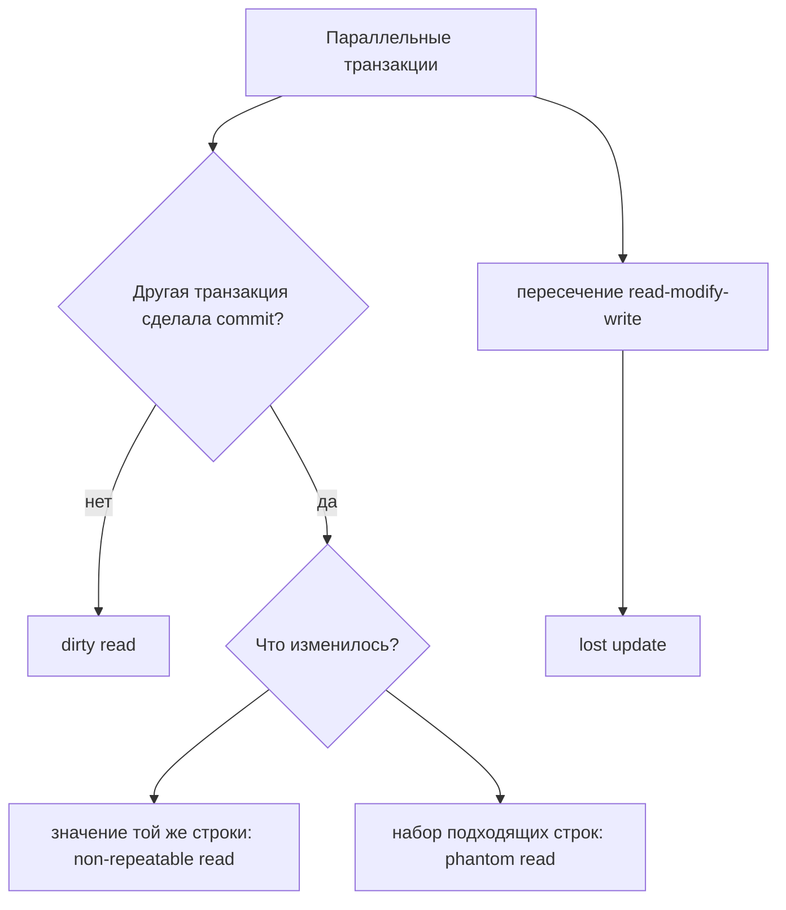
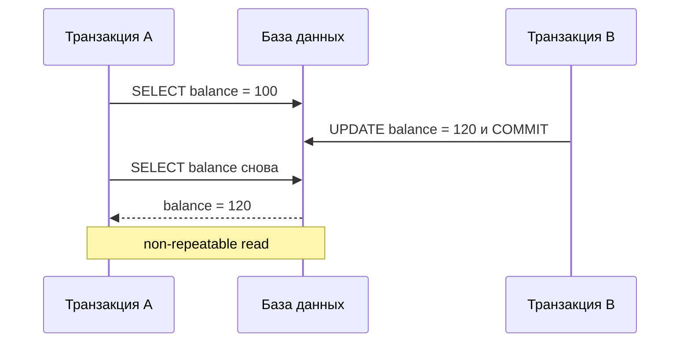

# Аномалии чтения транзакций и lost update

Эти четыре названия описывают, как параллельные транзакции могут небезопасно
видеть или перезаписывать работу друг друга. Они относятся к isolation в
[ACID](topic:acid-principles) и являются словарем для практических
[isolation levels PostgreSQL](topic:postgresql-isolation-levels). Хорошая
подсказка для памяти - загруженная кухня: несколько поваров смотрят на одну
доску заказов, а каждое правило isolation решает, видит ли повар черновики
заказов, свежие заказы или стабильную фотографию доски.

## Быстрая карта

| Аномалия | Что идет не так | Бытовая подсказка |
| --- | --- | --- |
| `dirty read` | Транзакция читает данные, записанные другой транзакцией, которая еще не сделала commit. | Повар начинает готовить по карандашной заметке, которую могут стереть. |
| `non-repeatable read` | Одна и та же строка читается дважды в одной транзакции, а committed update меняет второй результат. | Сотрудник дважды проверяет одну посылочную наклейку и видит, что другой сотрудник исправил ее между проверками. |
| `phantom read` | Один и тот же predicate query выполняется дважды, а committed inserts или deletes меняют, какие строки подходят. | Ты дважды считаешь заказы для стола 7, и между подсчетами на доске появляется новый заказ. |
| `lost update` | Две транзакции читают одно значение, обе вычисляют новое значение, и более поздняя запись перезаписывает раннюю. | Два человека правят один квадрат на доске; второй маркер закрывает первый. |

## Dirty Read

`dirty read` происходит, когда транзакция A читает значение, которое транзакция B
записала, но еще не зафиксировала. Если B делает rollback, A приняла решение на
основе данных, которых официально никогда не существовало. В кухонной аналогии A
готовит по черновому заказу, а затем официант выбрасывает этот заказ.

Пример по шагам:

1. Транзакция B меняет `account.balance` со `100` на `50`, но не делает commit.
2. Транзакция A читает `50`.
3. Транзакция B делает rollback.
4. Транзакция A увидела баланс, который не входит в committed history.

Поэтому многие базы данных избегают dirty reads даже на распространенных
уровнях isolation по умолчанию. У PostgreSQL есть важная деталь для
собеседования: `READ UNCOMMITTED` принимается, но ведет себя как
`READ COMMITTED`, поэтому dirty reads все равно не показываются. Это как почта,
которая отказывается показывать недописанную адресную наклейку, даже если кто-то
просит заглянуть заранее.

## Non-Repeatable Read

`non-repeatable read` происходит, когда одна транзакция читает одну и ту же
строку дважды и получает разные значения, потому что другая транзакция между
чтениями сделала committed update. Первое чтение не было dirty: оно видело
committed data. Проблема в том, что транзакция не получила стабильный вид этой
строки. Представь, что во время смены ты дважды проверяешь одну ценниковую
наклейку на полке: другой работник законно обновил ее между проверками.

Ключевое отличие от dirty read - статус commit. При non-repeatable read второе
значение committed и настоящее; оно просто меняется, пока A еще выполняется. На
кухне это не фальшивый заказ, а корректно обновленный заказ, который появился,
пока один повар еще пользовался прошлой версией.

## Phantom Read

`phantom read` относится к набору строк, а не к значению одной строки.
Транзакция A выполняет predicate query вроде `WHERE status = 'PENDING'`,
транзакция B делает commit вставки или удаления, которое меняет подходящие
строки, а затем транзакция A снова выполняет тот же query. Во втором результате
есть лишняя строка или отсутствует прежняя строка. У почтовой стойки ты считаешь
все посылки для одного маршрута, а затем другой сотрудник добавляет новую
посылку на этот маршрут перед вторым подсчетом.

Отличие от non-repeatable read в форме изменения:

- Non-repeatable read: у той же существующей строки изменилось значение.
- Phantom read: изменился набор строк, подходящих под условие.

Это различие важно, потому что базы данных могут предотвращать эти проблемы
разными техниками. Row lock может защитить одну известную строку, но predicate
вроде "all open orders over $100" может требовать predicate locking, range
locking, serializable checks или stable snapshot. Это как запереть один почтовый
ящик вместо того, чтобы охранять весь маршрут, чтобы новая подходящая посылка не
проскользнула незамеченной.

## Lost Update

`lost update` - это write-write проблема. Две транзакции читают одно старое
значение, обе вычисляют новое значение и обе записывают результат. Более поздняя
запись побеждает, поэтому работа одной транзакции исчезает. Это версия
классической [race condition](topic:race-condition-avoidance) в базе данных: два
сотрудника переписывают одно и то же число остатков с планшета, каждый вычитает
одну штуку, и последний сотрудник записывает результат, который игнорирует
другую продажу.

Пример со `stock = 10`:

1. Транзакция A читает `10` и планирует записать `9`.
2. Транзакция B читает `10` и тоже планирует записать `9`.
3. A записывает `9` и делает commit.
4. B записывает `9` и делает commit.
5. Продали две штуки, но база показывает только одно уменьшение.

Lost update не то же самое, что dirty read. Он может случиться даже когда каждое
чтение видит committed data, потому что ошибка находится в промежутке между
read, calculation и write. В бытовых терминах оба сотрудника использовали
настоящие данные с планшета, но использовали одну и ту же старую копию.

## Как базы данных предотвращают это

Isolation levels определяют, какие аномалии база обещает предотвращать. Точное
поведение зависит от конкретной базы, поэтому на собеседовании стоит отделять
названия SQL standard от реальной реализации, например
[isolation levels PostgreSQL](topic:postgresql-isolation-levels). Ресторан может
называть два процесса "priority service", но фактические правила кухни решают,
что видят официанты.

Частые инструменты предотвращения:

- `READ COMMITTED` предотвращает dirty reads, показывая только committed data.
  Сотрудник видит только финализированные формы.
- Stable transaction snapshots, часто называемые `REPEATABLE READ` или snapshot
  isolation, предотвращают обычные non-repeatable reads. Повар работает по одной
  фотографии доски.
- `SERIALIZABLE` пытается сделать так, чтобы параллельные транзакции выглядели
  как некоторый безопасный последовательный порядок. Регулировщик пропускает
  машины, но отклоняет опасный рисунок пересечения.
- `SELECT ... FOR UPDATE`, optimistic locking с version column, atomic
  `UPDATE account SET balance = balance - 10`, constraints и retry logic могут
  предотвращать lost updates или обнаруживать конфликты. Это похоже на
  резервирование планшета, проверку версии формы или просьбу к сотруднику
  полностью переделать форму, когда очередь изменилась.

## Ответ за 60 секунд

`dirty read` означает чтение uncommitted data другой транзакции. Если та
транзакция делает rollback, читатель использовал значение, которое никогда не
стало настоящим. `non-repeatable read` означает чтение одной и той же строки
дважды внутри одной транзакции и получение разных committed values, потому что
другая транзакция обновила ее между чтениями. `phantom read` означает повторение
одного predicate query и получение другого набора строк, потому что другая
транзакция вставила или удалила подходящие строки. `lost update` означает, что
две транзакции прочитали одно старое значение, обе вычислили новое значение, и
одна запись перезаписала другую. Isolation levels, row locks, predicate или range
locks, optimistic version checks, atomic updates, constraints и transaction
retries - обычные инструменты предотвращения или обработки этих аномалий.

## Практическая важность

Эти аномалии не просто учебные термины. Они объясняют реальные баги в balances,
inventory, bookings, quotas и reporting. Checkout system может потерять
обновления остатков; reporting job может посчитать движущийся набор строк;
workflow может принять решение по значению, которое изменилось на середине
операции. В бытовых терминах кухня может продать больше блюд, чем есть, почта
может направить посылки по устаревшему списку, а движение может позволить двум
машинам занять одну полосу.

Практическое исправление не всегда звучит как "используй самый строгий
isolation". Более строгий isolation может увеличить ожидание, aborts, deadlocks
и retry work. Часто лучший дизайн защищает конкретный invariant: unique
constraint для "only one active booking", atomic update для counters,
`SELECT ... FOR UPDATE` для известной строки или optimistic locking для экранов
редактирования. Это как выбирать между замком на одном ящике, номерком в очереди
или закрытием всей стойки; каждый вариант решает свою задачу координации.

## Частые заблуждения

- "Dirty read означает любое stale read." Нет. Dirty read - это именно
  uncommitted data. Ценник с полки пятиминутной давности может быть stale, но он
  не dirty, если был финализирован.
- "Non-repeatable read и phantom read - одно и то же." Они связаны, но не
  одинаковы. В одном случае меняется значение строки, в другом - какие строки
  подходят. Изменилась одна посылочная наклейка против появления новой посылки в
  маршруте.
- "Lost update - это только проблема Java threads." Он также бывает в базах
  данных, когда транзакции делают read-modify-write без conflict control. Та же
  ошибка с планшетом может случиться в памяти или в SQL.
- "`READ COMMITTED` решает все важное." Он предотвращает dirty reads, но обычно
  все еще допускает non-repeatable reads и phantoms, а lost update зависит от
  того, как написаны updates. Кухня обслуживает только финализированные заказы,
  но доска все еще может измениться между двумя взглядами.
- "Higher isolation бесплатен." Он покупает safety ценой большего blocking,
  aborts, retries или поддержки snapshots. Более строгий регулировщик
  предотвращает аварии, но некоторым машинам придется ждать или ехать на новый
  круг.
