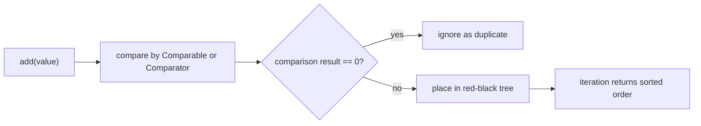
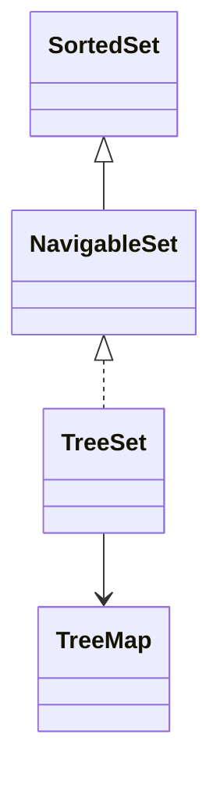

# TreeSet: Sorted Unique Set

## Intuition

`TreeSet` is a `Set` that keeps its elements sorted. It is like a post office rack where every letter is placed by address number immediately, not in the order in which the letters arrived.

The order comes from either natural ordering (`Comparable`) or a supplied `Comparator`. Think of a kitchen shelf: one cook sorts jars alphabetically, another sorts them by expiration date; `TreeSet` follows the rule you give it.

Internally, `TreeSet` is backed by a `TreeMap`, which is implemented as a red-black tree in the JDK. That gives `add`, `remove`, and `contains` typical `O(log n)` behavior. The practical analogy is a balanced filing cabinet: you open a few labeled drawers instead of checking every paper one by one.

Iteration is always sorted, not insertion order. If you add `42`, `7`, `19`, iteration returns `7`, `19`, `42`. Like traffic lanes sorted by destination, cars do not stay in arrival order once the dispatcher has arranged them.

## How Uniqueness Works

`TreeSet` does not decide duplicates primarily through `equals()`. It treats two elements as the same set element when `compareTo()` or `Comparator.compare(...)` returns `0`. In a post office analogy, two parcels with the same sorting code go into the same slot even if their labels have different text.

This is the most important interview trap. A `Comparator<String>` that compares only string length will keep `"go"` and reject `"up"` because both have length `2`. In a kitchen, if the shelf rule is "one jar per height", two different spices with the same height compete for the same place.

For production code, make the comparator consistent with `equals()` unless you intentionally want that collapsing behavior. Otherwise `contains`, `add`, and debugging output can surprise people. It is like writing one rule for the cashier receipt and another rule for the warehouse shelf.

## NavigableSet Features

`TreeSet` implements `NavigableSet`, so it can answer neighbor questions: `lower(x)`, `floor(x)`, `ceiling(x)`, and `higher(x)`. Imagine a ticket counter: if ticket `26` is missing, the clerk can tell you the nearest open windows before or after it.

It also has range views such as `subSet`, `headSet`, and `tailSet`. These are useful for "all values from 10 to 50" style questions. Like taking only the mailboxes between house numbers 10 and 50, the set can focus on a sorted slice.

Those JDK range views are backed by the original set, so changes through the view affect the original and vice versa. The analogy is a kitchen tray that shows only the middle shelf: moving a jar on the tray still moves the real jar.

## 60-Second Interview Answer

`TreeSet` is a sorted `Set`. It stores unique elements ordered by natural ordering or by a `Comparator`. It is backed by a `TreeMap`/red-black tree, so `add`, `remove`, and `contains` are usually `O(log n)`, and iteration returns elements in sorted order. The key trap is that uniqueness is based on comparison returning `0`, not strictly on `equals()`, so an inconsistent comparator can make different objects collapse into one element. `TreeSet` also implements `NavigableSet`, giving operations like `lower`, `floor`, `ceiling`, `higher`, `subSet`, `headSet`, and `tailSet`.

## Production Relevance

Use `TreeSet` when you need sorted unique values and efficient range or nearest-value queries. Examples: active price thresholds, scheduled times, allowed numeric limits, or sorted usernames. It is like keeping a post office index sorted all day so the clerk can jump to a neighborhood quickly.

Do not use `TreeSet` when you only need membership checks and do not care about order; `HashSet` is usually faster on average. The same hash-table idea is covered in [HashMap basics](topic:hashmap-basics) and [HashMap internals](topic:hashmap). The everyday version: if all you need is "is this parcel here?", a bin with labels is cheaper than a carefully sorted rack.

Do not expect index-based access like `list.get(5)`. `TreeSet` is not an `ArrayList`; it is sorted by comparison, not by numeric slots. For list tradeoffs, compare it with [ArrayList vs LinkedList](topic:arraylist-vs-linkedlist). Analogy: a filing cabinet can find a name by order, but it does not promise "the fifth paper" as a cheap operation.

`TreeSet` is not thread-safe. If multiple threads modify it, protect it externally or choose a concurrent sorted structure such as `ConcurrentSkipListSet`; for the broader collection choice, see [Concurrent vs Synchronized Collections](topic:concurrent-synchronized-collections). Like two clerks rearranging the same shelf, unsynchronized edits can leave the rack confusing.

## Common Misconceptions

- "TreeSet preserves insertion order." No. It preserves sorted order. The post office rack ignores arrival time and sorts by address.
- "TreeSet uses `equals()` for duplicates." Not directly. It uses comparison result `0`. The shelf rule decides whether two jars occupy the same spot.
- "`Comparator` can be arbitrary without consequences." It must define a stable, transitive order. A traffic rule that changes by the minute creates jams.
- "`null` always works." With natural ordering, `null` usually causes `NullPointerException`; a custom comparator can allow it only if it explicitly handles `null`. A mailbox without a number cannot be sorted unless the clerk has a special rule.
- "Mutable elements are fine." If fields used by comparison change after insertion, the tree can no longer find the element reliably. It is like changing a house number after the mail has already been sorted.
- "TreeSet gives constant-time lookup." No. It is usually `O(log n)`, not average `O(1)`. The filing cabinet is orderly, but you still open drawers.
