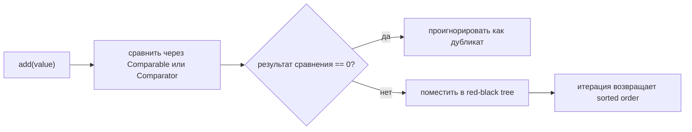
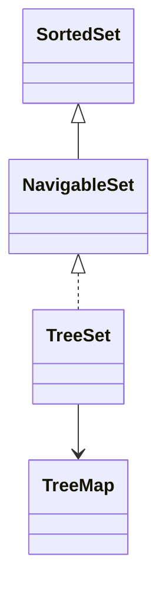

# TreeSet: отсортированное множество

## Интуиция

`TreeSet` — это `Set`, который хранит элементы отсортированными. Он похож на почтовую стойку: каждое письмо сразу кладут по номеру адреса, а не в порядке прихода писем.

Порядок задаётся либо natural ordering (`Comparable`), либо переданным `Comparator`. Представь кухонную полку: один повар сортирует банки по алфавиту, другой — по сроку годности; `TreeSet` следует правилу, которое ты ему дал.

Внутри `TreeSet` опирается на `TreeMap`, а в JDK он реализован как red-black tree. Поэтому `add`, `remove` и `contains` обычно работают за `O(log n)`. Практическая аналогия — сбалансированный шкаф с папками: ты открываешь несколько подписанных ящиков, а не проверяешь каждую бумагу подряд.

Итерация всегда идёт в отсортированном порядке, а не в порядке вставки. Если добавить `42`, `7`, `19`, итерация вернёт `7`, `19`, `42`. Как на дороге с полосами по направлениям: машины не остаются в порядке прибытия, когда диспетчер их распределил.

## Как работает уникальность

`TreeSet` определяет дубликаты не главным образом через `equals()`. Он считает два элемента одним элементом множества, когда `compareTo()` или `Comparator.compare(...)` возвращает `0`. В почтовой аналогии две посылки с одинаковым сортировочным кодом попадают в одну ячейку, даже если текст на наклейках разный.

Это главная ловушка на собеседовании. `Comparator<String>`, который сравнивает только длину строки, сохранит `"go"` и отвергнет `"up"`, потому что обе строки имеют длину `2`. На кухне, если правило полки — «одна банка на каждую высоту», две разные специи одинаковой высоты будут спорить за одно место.

В production-коде делай comparator согласованным с `equals()`, если только тебе намеренно не нужно такое схлопывание. Иначе `contains`, `add` и вывод при отладке могут удивлять. Это как одно правило для кассового чека и другое правило для складской полки.

## Возможности NavigableSet

`TreeSet` реализует `NavigableSet`, поэтому умеет отвечать на вопросы о соседях: `lower(x)`, `floor(x)`, `ceiling(x)` и `higher(x)`. Представь окно выдачи талонов: если талона `26` нет, сотрудник может назвать ближайшие открытые окна до или после него.

Ещё есть диапазонные представления: `subSet`, `headSet` и `tailSet`. Они полезны для задач вида «все значения от 10 до 50». Как если взять только почтовые ящики между номерами домов 10 и 50, множество может сфокусироваться на отсортированном срезе.

В JDK такие range views связаны с исходным множеством: изменения через view влияют на оригинал и наоборот. Аналогия — кухонный поднос, на котором видна только средняя полка: переставить банку на подносе всё равно значит переставить настоящую банку.

## Ответ за 60 секунд

`TreeSet` — это отсортированный `Set`. Он хранит уникальные элементы в порядке natural ordering или по `Comparator`. В основе лежит `TreeMap`/red-black tree, поэтому `add`, `remove` и `contains` обычно работают за `O(log n)`, а итерация возвращает элементы в отсортированном порядке. Главная ловушка: уникальность основана на том, что сравнение возвращает `0`, а не строго на `equals()`, поэтому несогласованный comparator может схлопнуть разные объекты в один элемент. `TreeSet` также реализует `NavigableSet`, давая операции `lower`, `floor`, `ceiling`, `higher`, `subSet`, `headSet` и `tailSet`.

## Значение в production

Используй `TreeSet`, когда нужны отсортированные уникальные значения и эффективные запросы диапазона или ближайшего значения. Примеры: активные ценовые пороги, времена расписания, допустимые числовые лимиты или отсортированные имена пользователей. Это как весь день держать почтовый индекс отсортированным, чтобы сотрудник быстро переходил к нужному району.

Не используй `TreeSet`, если тебе нужна только проверка наличия и порядок не важен; `HashSet` обычно быстрее в среднем. Та же идея hash-table разобрана в [HashMap basics](topic:hashmap-basics) и [HashMap internals](topic:hashmap). Бытовая версия: если нужно только «есть ли эта посылка здесь?», коробка с наклейками дешевле аккуратно отсортированной стойки.

Не ожидай доступа по индексу вроде `list.get(5)`. `TreeSet` — не `ArrayList`; он отсортирован по сравнению, а не по числовым ячейкам. Компромиссы списков смотри в [ArrayList vs LinkedList](topic:arraylist-vs-linkedlist). Аналогия: шкаф с папками умеет искать имя по порядку, но не обещает дешёвую операцию «пятая бумага».

`TreeSet` не потокобезопасен. Если несколько потоков изменяют его, защищай его снаружи или выбирай конкурентную отсортированную структуру, например `ConcurrentSkipListSet`; общий выбор коллекций смотри в [Concurrent vs Synchronized Collections](topic:concurrent-synchronized-collections). Как два сотрудника, которые одновременно переставляют одну полку: без синхронизации стойка быстро становится непонятной.

## Частые заблуждения

- «TreeSet сохраняет порядок вставки». Нет. Он сохраняет отсортированный порядок. Почтовая стойка игнорирует время прихода и сортирует по адресу.
- «TreeSet использует `equals()` для дубликатов». Не напрямую. Он использует результат сравнения `0`. Правило полки решает, займут ли две банки одно место.
- «`Comparator` может быть любым без последствий». Он должен задавать стабильный транзитивный порядок. Правило движения, которое меняется каждую минуту, создаёт пробки.
- «`null` всегда работает». При natural ordering `null` обычно приводит к `NullPointerException`; custom comparator может разрешить его только если явно обрабатывает `null`. Почтовый ящик без номера нельзя отсортировать, если у сотрудника нет специального правила.
- «Изменяемые элементы безопасны». Если поля, участвующие в сравнении, меняются после вставки, дерево может перестать надёжно находить элемент. Это как поменять номер дома после того, как почта уже отсортирована.
- «TreeSet даёт constant-time lookup». Нет. Обычно это `O(log n)`, а не average `O(1)`. Шкаф с папками упорядочен, но ящики всё равно нужно открывать.
