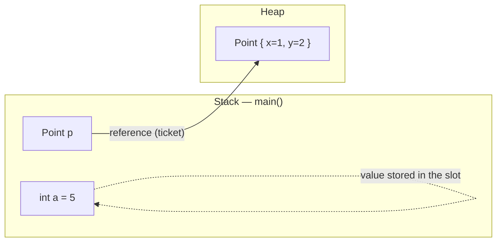
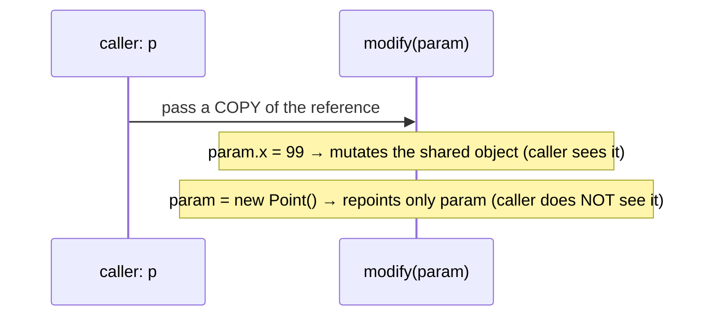

# What a Variable Stores and Where

## The one idea

A Java variable is a small, named slot. **What it stores depends on its type:**

- A **primitive** variable (`int`, `long`, `double`, `boolean`, …) stores **the
  value itself**, right there in the slot.
- A **reference** variable (any object type — `String`, `Point`, `List`, …) stores
  **a reference** — a handle to an object that lives somewhere else, on the **heap**.

> **Real-world picture — the theatre cloakroom.** Think of the front desk as the
> stack: a row of little pigeonholes, one per variable. For a primitive you write
> the actual number on the note in the pigeonhole — the value is *right there*. For
> an object you don't stuff the whole coat into the tiny pigeonhole; you hang the
> coat in the big cloakroom (the heap) and keep only a **numbered ticket** in the
> pigeonhole. The variable holds the ticket, not the coat.



The local variables themselves (the slots) live in the current method's **stack
frame**; the objects they may point to live on the **heap**, which is shared across
the whole program and cleaned up by the garbage collector. (Field variables of an
object live *inside that object* on the heap, but the rule is the same: a primitive
field holds a value, a reference field holds a handle.)

## 60-second interview answer

A variable holds a value of its type in a slot. For a primitive, that value *is*
the data — `int a = 5` stores the bits `5`. For a reference type, the value is a
reference to an object on the heap; the object is not stored in the variable. Local
variables (and the reference values themselves) sit in the method's stack frame;
objects always live on the heap. So `int b = a` copies the value `5`, while
`Point q = p` copies the *reference* — now `p` and `q` point at the *same* object,
and a change made through one is visible through the other. Reassigning a variable
only changes that slot, not the object; when no reference points at an object any
more, it becomes eligible for garbage collection. This is also why Java is strictly
**pass-by-value**: a method receives a copy of the value — for objects, a copy of
the reference.

## Copying: value vs reference

```java
int a = 5;
int b = a;     // copies the VALUE 5
b = 99;        // a is still 5 — independent slots

Point p = new Point(1, 2);
Point q = p;   // copies the REFERENCE — same object
q.x = 99;      // p.x is now 99 too — one shared object
```

> **Cloakroom again.** Copying a primitive is photocopying a *number* onto a second
> note — scribble on one note and the other is untouched. Copying a reference is
> photocopying the *ticket*: two tickets, one coat. If you spill coffee on the coat,
> both ticket-holders find it stained.

This is the classic trap behind "two variables, one object" (aliasing). It is the
same mechanism that makes [String immutability](topic:string-immutability) safe to
share: many references can point at one `String`, and because the object never
changes, sharing is harmless.

## Java is pass-by-value (even for objects)



People often say objects are "passed by reference" — they are not. The method gets
its **own copy of the reference**. Through that copy it can reach and *mutate* the
shared object (the caller sees those changes), but **reassigning the parameter**
only repoints the callee's slot; the caller's variable still points at the original.

> **Mailing a parcel.** You hand the post office a *photocopy* of your cloakroom
> ticket. They can fetch the coat and sew on a button (you'll see the button), but
> if they tear up their photocopy and grab a different coat's ticket, your original
> ticket still points at your coat.

## null and garbage

- `p = null` leaves the slot in place but makes it reference **no object** — an empty
  ticket holder. Dereferencing it (`p.x`) throws `NullPointerException`.
- Reassigning or nulling the last reference to an object makes that object
  **unreachable** — garbage. The collector reclaims its space on the heap later;
  see [JVM Heap Generations](topic:heap-generations) for how that space is organized.

> The lost-and-found: once no ticket anywhere points at a coat, the cloakroom can
> clear it out — you can't ask for it back.

## Common traps and misconceptions

- **"Objects are passed by reference."** No — Java is always pass-by-value; the
  *reference* is what gets copied. Reassigning a parameter never affects the caller.
- **"`q = p` copies the object."** It copies the reference. There is still **one**
  object; `q` and `p` are two names for it. Use a copy constructor / `clone()` for a
  real second object.
- **"Primitives live on the heap."** A local primitive lives in the stack frame.
  (A primitive *field* lives inside its object on the heap — but as a value, not a
  reference.)
- **"`==` compares contents."** For references, `==` compares *handles* (same
  object?), not contents. Use `equals` for content.
- **"Setting a variable to `null` deletes the object."** It only drops *this* slot's
  reference. The object lives until **no** reference points at it.
- **The wrapper/autoboxing subtlety.** `Integer x = 5` is a reference to an object;
  caching of small `Integer` values means `==` can surprise you. Compare wrappers
  with `equals`.
