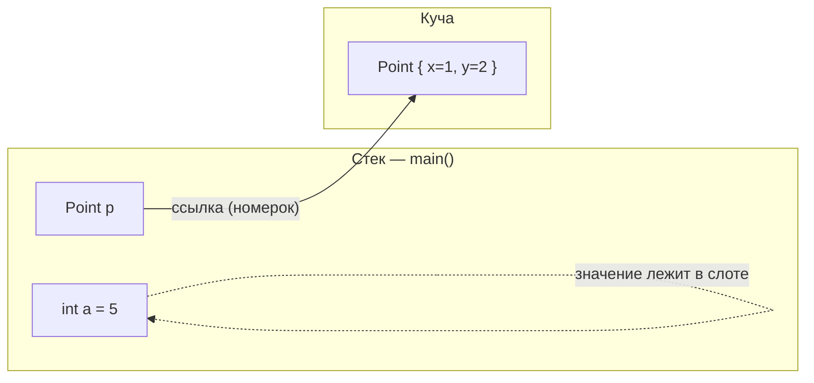
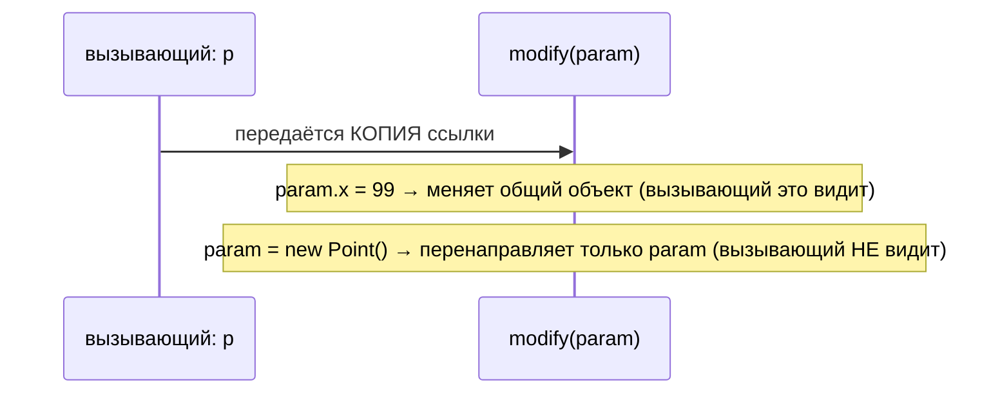

# Что хранит переменная и где

## Главная мысль

Переменная в Java — это небольшой именованный слот. **Что в нём лежит, зависит от
типа:**

- **Примитивная** переменная (`int`, `long`, `double`, `boolean`, …) хранит **само
  значение**, прямо в слоте.
- **Ссылочная** переменная (любой объектный тип — `String`, `Point`, `List`, …)
  хранит **ссылку** — указатель на объект, который живёт в другом месте, в **куче**.

> **Образ из жизни — театральный гардероб.** Представь стойку гардероба как стек:
> ряд маленьких ячеек, по одной на переменную. Для примитива ты пишешь на записке в
> ячейке само число — значение *прямо здесь*. Для объекта ты не запихиваешь всё
> пальто в крошечную ячейку: пальто вешают в большой гардероб (куча), а в ячейке
> остаётся лишь **номерок**. Переменная держит номерок, а не пальто.



Сами локальные переменные (слоты) живут в **кадре стека** текущего метода; объекты,
на которые они могут указывать, живут в **куче**, общей для всей программы и
очищаемой сборщиком мусора. (Поля-переменные объекта живут *внутри этого объекта* в
куче, но правило то же: поле-примитив хранит значение, поле-ссылка — указатель.)

## Ответ за 60 секунд

Переменная хранит значение своего типа в слоте. Для примитива это значение и *есть*
данные — `int a = 5` хранит биты `5`. Для ссылочного типа значение — это ссылка на
объект в куче; сам объект в переменной не хранится. Локальные переменные (и сами
значения ссылок) лежат в кадре стека метода; объекты всегда живут в куче. Поэтому
`int b = a` копирует значение `5`, а `Point q = p` копирует *ссылку* — теперь `p` и
`q` указывают на *один и тот же* объект, и изменение через одну видно через другую.
Переприсваивание переменной меняет только этот слот, а не объект; когда на объект
больше не указывает ни одна ссылка, он становится кандидатом на сборку мусора.
Именно поэтому Java строго **передаёт по значению**: метод получает копию значения —
для объектов это копия ссылки.

## Копирование: значение против ссылки

```java
int a = 5;
int b = a;     // копирует ЗНАЧЕНИЕ 5
b = 99;        // a по-прежнему 5 — независимые слоты

Point p = new Point(1, 2);
Point q = p;   // копирует ССЫЛКУ — тот же объект
q.x = 99;      // p.x теперь тоже 99 — один общий объект
```

> **Снова гардероб.** Копирование примитива — это фотокопия *числа* на вторую
> записку: черкни на одной — другая не изменится. Копирование ссылки — это
> фотокопия *номерка*: два номерка, одно пальто. Прольёшь кофе на пальто — оба
> владельца номерков найдут его в пятнах.

Это классическая ловушка «две переменные, один объект» (алиасинг). Тот же механизм
делает безопасным разделение в [String immutability](topic:string-immutability):
много ссылок могут указывать на одну `String`, и раз объект не меняется, делить его
безвредно.

## Java передаёт по значению (даже объекты)



Часто говорят, что объекты «передаются по ссылке» — это не так. Метод получает
**свою копию ссылки**. Через эту копию он может добраться до общего объекта и
*изменить* его (вызывающий увидит изменения), но **переприсваивание параметра**
перенаправляет лишь слот метода; переменная вызывающего по-прежнему указывает на
исходный объект.

> **Отправка посылки.** Ты отдаёшь на почту *фотокопию* своего гардеробного
> номерка. Они могут достать пальто и пришить пуговицу (пуговицу ты увидишь), но
> если они порвут свою фотокопию и возьмут номерок от другого пальто, твой исходный
> номерок всё так же указывает на твоё пальто.

## null и мусор

- `p = null` оставляет слот на месте, но он не ссылается **ни на какой объект** —
  пустой держатель номерка. Обращение к нему (`p.x`) бросает `NullPointerException`.
- Переприсваивание или обнуление последней ссылки на объект делает объект
  **недостижимым** — мусором. Сборщик позже освобождает его место в куче; о том, как
  это место устроено, см. [JVM Heap Generations](topic:heap-generations).

> Бюро находок: как только ни один номерок нигде не указывает на пальто, гардероб
> может его убрать — обратно уже не попросишь.

## Частые ловушки и заблуждения

- **«Объекты передаются по ссылке».** Нет — Java всегда передаёт по значению;
  копируется *ссылка*. Переприсваивание параметра никогда не влияет на вызывающего.
- **«`q = p` копирует объект».** Копируется ссылка. Объект по-прежнему **один**; `q`
  и `p` — два его имени. Для настоящего второго объекта нужен копирующий конструктор
  или `clone()`.
- **«Примитивы живут в куче».** Локальный примитив живёт в кадре стека. (Поле-примитив
  живёт внутри своего объекта в куче — но как значение, а не ссылка.)
- **«`==` сравнивает содержимое».** Для ссылок `==` сравнивает *указатели* (тот же
  объект?), а не содержимое. Для содержимого используй `equals`.
- **«Присвоить переменной `null` — значит удалить объект».** Это лишь убирает ссылку
  *этого* слота. Объект жив, пока на него указывает **хоть одна** ссылка.
- **Тонкость с обёртками/автобоксингом.** `Integer x = 5` — это ссылка на объект;
  из-за кэширования маленьких значений `Integer` сравнение `==` может удивить.
  Сравнивай обёртки через `equals`.
