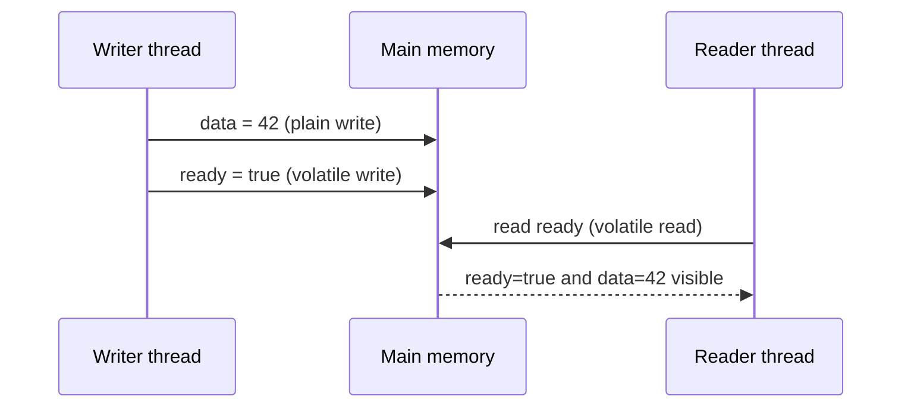
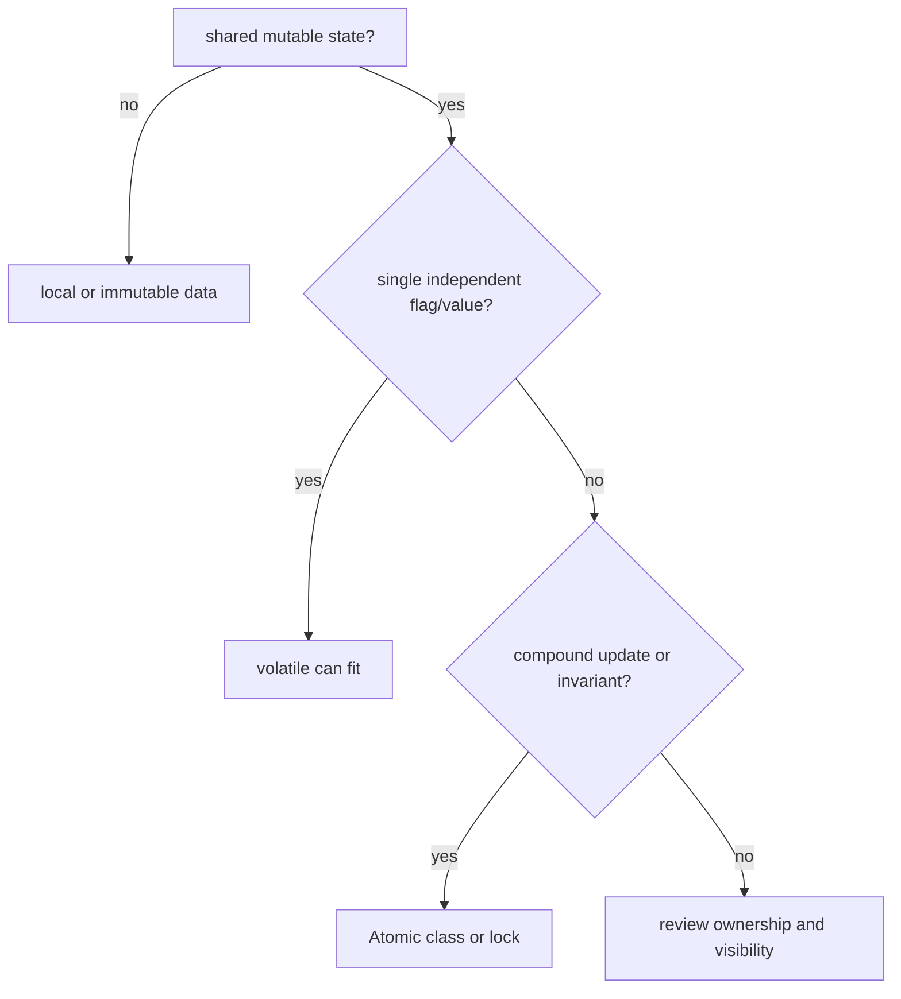

# The volatile Keyword

`volatile` is a field modifier that tells Java: reads and writes of this variable
must be visible across threads using the Java Memory Model rules. It is most
useful when one thread writes a simple signal and other threads read it. Think of
it like a clear sign at a post office window: when the clerk flips the sign, every
visitor who checks that sign must see the current message, not an old note in a
side drawer.

For general thread basics, connect this topic with [Java Multithreading](topic:java-multithreading).
For multi-step shared updates, compare it with [Critical Section](topic:critical-section),
[Thread Safety of Numeric Addition](topic:thread-safe-addition), and
[Avoiding Race Conditions](topic:race-condition-avoidance).

## The core idea

Without coordination, a thread may keep a stale view of a shared field. The Java
Memory Model does not promise that a plain read in one thread immediately sees a
plain write from another thread. It is like a kitchen where each cook has a
personal copy of the order slip: unless there is a shared board with a clear
update rule, one cook may keep working from the old slip.

`volatile` gives two practical guarantees:

- **Visibility.** A volatile read sees volatile writes in a single global order,
  and it is forced to refresh that variable. This is like everyone checking the
  same traffic light instead of guessing from memory.
- **Ordering.** A write to a volatile field has release semantics, and a later
  read of the same volatile field has acquire semantics. Ordinary writes before
  the volatile write become visible after the volatile read. This is like putting
  the parcels on the counter before switching the "ready" sign; a customer who
  sees the sign also sees the parcels.

The important phrase is **happens-before**. A write to a volatile variable
happens-before every later read of that same volatile variable. That does not mean
the code runs on one CPU core or that caches disappear. It means Java gives a
specified memory-ordering contract. The traffic rules matter more than the exact
shape of the road.

## What volatile is not

`volatile` is not a lock. It does not make a block of code mutually exclusive, and
it does not protect an invariant across several fields. If two cooks both read
the same stock count, each subtracts one, and each writes back the result, the
visible notice board did not stop them from overwriting each other.

`volatile int count` does not make `count++` atomic. The operation still expands
to read, compute, and write. The volatile read is visible and the volatile write
is visible, but another thread can interleave between them. Use `AtomicInteger`,
`LongAdder`, `synchronized`, or a lock when the update itself must be indivisible.

`volatile` on a reference publishes the reference and the writes that happened
before publication. It does not magically make all future mutations inside that
object thread-safe. A post office can publish the current shelf layout, but if
clerks keep rearranging shelves afterward, readers still need a rule for those
later changes.

## When it fits

Good volatile use cases are small and simple:

- a stop flag such as `volatile boolean running`;
- one-writer, many-reader status flags;
- publishing a fully prepared object reference when later mutation is controlled;
- double-checked locking, where the instance field must be volatile. See
  [Thread-Safe Singleton](topic:singleton-thread-safe).

The rule of thumb: use volatile when the shared state is one independent value and
readers only need the latest published value. Use a lock or atomic class when the
operation combines several steps. It is like choosing between a clear traffic
light and a traffic officer: the light is enough for one simple signal; the
officer is needed when several cars must coordinate a maneuver.

## 60-second interview answer

`volatile` in Java is a field modifier for shared variables. A volatile write is
visible to other threads that perform a later volatile read of the same variable,
and that volatile write also publishes ordinary writes that happened before it.
This creates a happens-before relationship. It is useful for simple flags and
safe publication patterns. It is not a replacement for `synchronized`: it does
not provide mutual exclusion and does not make compound operations like
`count++` atomic. For counters use atomics or locks; for multi-field invariants
use one synchronization mechanism around the whole invariant.

## Production relevance

Volatile fields appear inside many concurrency utilities and low-level state
machines. They keep status flags, cancellation signals, and published references
visible without taking a lock on every read. In production code, the hard part is
not writing the keyword. The hard part is proving that the state really is a
single independent signal. A kitchen order lamp works well for "order ready"; it
does not manage the whole kitchen schedule.

## Common misconceptions

- **"`volatile` makes code thread-safe."** It fixes visibility and ordering for
  that field. It does not guard every related operation.
- **"`volatile` makes `count++` safe."** The read and write are visible, but the
  read-compute-write sequence can still interleave.
- **"`volatile` is the same as `synchronized`."** `synchronized` gives mutual
  exclusion plus visibility at monitor enter/exit. `volatile` gives visibility
  and ordering for a field, without mutual exclusion.
- **"Only the volatile field is affected."** The volatile read/write forms a
  happens-before edge, so ordinary writes before the volatile write can become
  visible after the volatile read.
- **"A volatile reference makes the whole object safe forever."** It safely
  publishes the reference and earlier writes, but later object mutations still
  need their own thread-safety plan.
