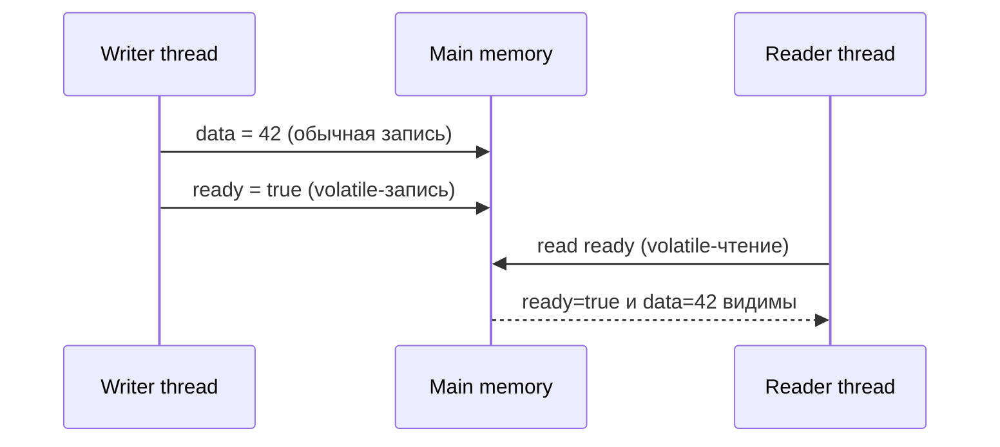
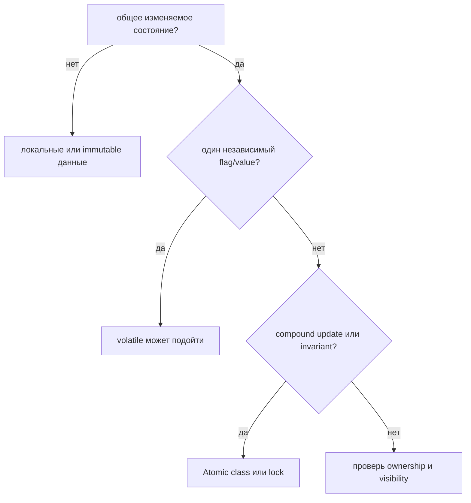

# Ключевое слово volatile

`volatile` — это модификатор field, который говорит Java: чтения и записи этой
переменной должны быть видимы между threads по правилам Java Memory Model. Он
лучше всего подходит, когда один thread записывает простой сигнал, а другие
threads его читают. Представь прозрачную табличку у окна на почте: когда оператор
переворачивает табличку, каждый посетитель, который смотрит на неё, должен видеть
текущее сообщение, а не старую записку в боковом ящике.

Для базовых идей про threads свяжи эту тему с [Java Multithreading](topic:java-multithreading).
Для многошаговых общих обновлений сравни её с [Critical Section](topic:critical-section),
[Thread Safety of Numeric Addition](topic:thread-safe-addition) и
[Avoiding Race Conditions](topic:race-condition-avoidance).

## Главная идея

Без координации thread может держать устаревший вид общего field. Java Memory
Model не обещает, что обычное чтение в одном thread сразу увидит обычную запись
из другого thread. Это похоже на кухню, где у каждого повара своя копия заказа:
если нет общей доски с понятным правилом обновления, один повар может продолжать
работать по старому листку.

`volatile` даёт две практические гарантии:

- **Visibility.** Volatile-чтение видит volatile-записи в едином глобальном
  порядке и принудительно обновляет эту переменную. Это как общий светофор:
  все смотрят на текущий сигнал, а не угадывают по памяти.
- **Ordering.** Запись в volatile field имеет release-семантику, а последующее
  чтение того же volatile field имеет acquire-семантику. Обычные записи до
  volatile-записи становятся видимыми после volatile-чтения. Это как сначала
  поставить посылки на стойку, а потом переключить табличку «готово»: клиент,
  который увидел табличку, видит и посылки.

Важная фраза — **happens-before**. Запись в volatile переменную happens-before
каждого последующего чтения этой же volatile переменной. Это не означает, что код
выполняется на одном CPU core или что caches исчезают. Это означает, что Java
даёт определённый memory-ordering contract. Правила движения важнее, чем точная
форма дороги.

## Чем volatile не является

`volatile` не является lock. Он не делает block кода взаимоисключающим и не
защищает invariant между несколькими fields. Если два повара оба прочитали один
и тот же остаток продуктов, каждый вычел единицу и каждый записал результат,
видимая доска не помешала им перезаписать друг друга.

`volatile int count` не делает `count++` atomic. Операция всё равно разворачивается
в read, compute и write. Volatile-чтение видимо и volatile-запись видима, но
другой thread может вклиниться между ними. Используй `AtomicInteger`, `LongAdder`,
`synchronized` или lock, когда само обновление должно быть неделимым.

`volatile` на reference публикует reference и записи, которые произошли до
публикации. Он не делает все будущие изменения внутри объекта thread-safe
автоматически. Почта может опубликовать текущую раскладку полок, но если
операторы потом продолжают переставлять посылки, readers всё равно нужен порядок
для этих последующих изменений.

## Когда он подходит

Хорошие сценарии для volatile маленькие и простые:

- stop flag вроде `volatile boolean running`;
- status flags с одним writer и многими readers;
- публикация полностью подготовленного object reference, когда дальнейшие
  изменения контролируются;
- double-checked locking, где field instance должен быть volatile. Смотри
  [Thread-Safe Singleton](topic:singleton-thread-safe).

Практическое правило: используй volatile, когда общее состояние — одно
независимое значение и readers нужен только последний опубликованный value.
Используй lock или atomic class, когда операция объединяет несколько шагов. Это
как выбор между понятным светофором и регулировщиком: светофора хватает для
одного простого сигнала; регулировщик нужен, когда нескольким машинам надо
согласовать манёвр.

## Ответ за 60 секунд

`volatile` в Java — это модификатор field для общих переменных. Volatile-запись
видима другим threads, которые позже выполняют volatile-чтение той же переменной,
и эта volatile-запись также публикует обычные записи, которые произошли до неё.
Так создаётся happens-before relationship. Это полезно для простых flags и
паттернов safe publication. Это не замена `synchronized`: volatile не даёт mutual
exclusion и не делает compound operations вроде `count++` атомарными. Для
counters используй atomics или locks; для invariants из нескольких fields —
один synchronization mechanism вокруг всего invariant.

## Значение в production

Volatile fields встречаются внутри многих concurrency utilities и низкоуровневых
state machines. Они делают status flags, cancellation signals и published
references видимыми без lock на каждом чтении. В production сложность не в том,
чтобы написать keyword. Сложность в том, чтобы доказать: состояние действительно
является одним независимым сигналом. Лампа заказа на кухне хорошо работает для
«заказ готов»; она не управляет всем расписанием кухни.

## Частые заблуждения

- **«`volatile` делает код thread-safe».** Он чинит visibility и ordering для
  этого field. Он не защищает каждую связанную операцию.
- **«`volatile` делает `count++` безопасным».** Read и write видимы, но
  последовательность read-compute-write всё ещё может перемешаться.
- **«`volatile` — это то же самое, что `synchronized`».** `synchronized` даёт
  mutual exclusion плюс visibility на monitor enter/exit. `volatile` даёт
  visibility и ordering для field, без mutual exclusion.
- **«Затрагивается только volatile field».** Volatile read/write образует
  happens-before связь, поэтому обычные записи до volatile-записи могут стать
  видимыми после volatile-чтения.
- **«Volatile reference делает весь object безопасным навсегда».** Он безопасно
  публикует reference и предыдущие записи, но последующим изменениям object всё
  равно нужен свой план thread-safety.
