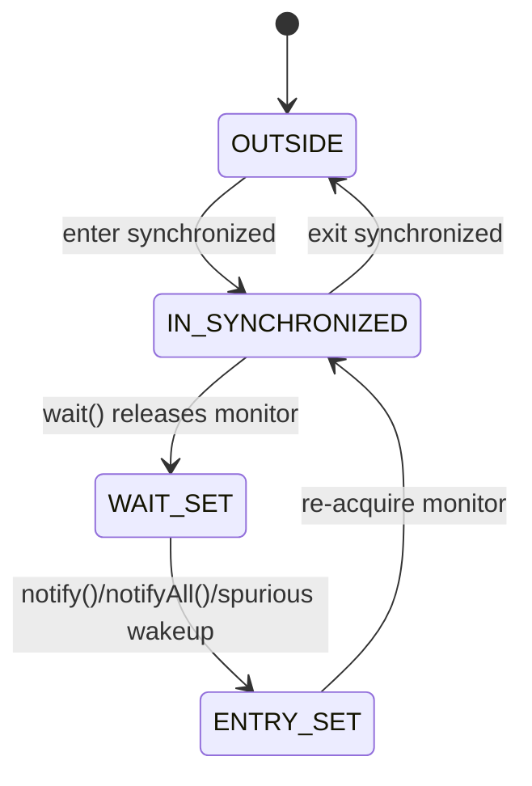

# wait(), notify(), notifyAll() inside synchronized

## Core idea

Every Java object can act as a monitor. A `synchronized (lock)` block is a critical section protected by that monitor: one thread owns it, other threads trying to enter wait in the entry set. Think of a small kitchen with one door key. The cook holding the key can work at the stove; everyone else waits outside the door.

`wait()`, `notify()` and `notifyAll()` are monitor operations, so the current thread must own that exact monitor. Calling them outside the matching `synchronized` block throws `IllegalMonitorStateException`. In the kitchen analogy, only the cook who currently holds the kitchen key is allowed to use the bell attached to that kitchen.

```mermaid
sequenceDiagram
  participant C as Consumer thread
  participant M as Monitor
  participant P as Producer thread
  C->>M: enter synchronized
  C->>M: wait()
  Note over C,M: C releases monitor and enters wait set
  P->>M: enter synchronized
  P->>M: notify()
  Note over C,M: C is woken but must re-acquire monitor
  P->>M: exit synchronized
  M-->>C: monitor re-acquired; wait() returns
```

## What wait() does

When a thread calls `lock.wait()` while owning `lock`, Java atomically puts that thread into the monitor's wait set and releases the monitor for `lock`. Yes, `wait()` releases the monitor. It does not release unrelated locks the thread may also hold. In the kitchen, the cook steps away from the stove and hands back the kitchen key, but keeps any other keys in their pocket.

After `wait()` releases the monitor, another thread can enter `synchronized (lock)`, change the shared state, and call `notify()` or `notifyAll()`. A notified thread does not instantly continue. It first moves toward the entry set and must win the monitor again; only then does `wait()` return. Like a customer called from a post office waiting chair, the customer still cannot speak until the service window is free.



## notify() and notifyAll()

`notify()` picks one arbitrary thread from the wait set. The JVM does not promise FIFO order and does not promise the "right" waiter when different conditions share the same monitor. In a post office, the clerk says "next", but if several queues are mixed together, the wrong kind of customer may stand up.

`notify()` does not release the monitor. The notifying thread keeps running inside `synchronized` until it exits the block or calls `wait()` itself. The woken thread is only eligible to continue after it re-acquires the monitor. In traffic terms, the light may turn green for a waiting car, but the intersection is still occupied until the current car leaves.

`notifyAll()` wakes every thread in the wait set. They still re-acquire the monitor one by one. It can cause extra wakeups, but it is often safer when multiple predicates are guarded by the same monitor. Like announcing all parcel numbers at a post office, more people stand up, then each checks whether the parcel is actually theirs.

## Guard condition and while

The notification itself is not the state. Real code waits for a guard condition, for example `queue.isEmpty() == false`, and `notify()` only tells waiters to check again. If `notify()` happens before a thread starts waiting, the notification is not stored for later. A kitchen bell ring is not a sandwich; the sandwich must still be on the counter.

Use a `while` loop, not `if`:

```java
synchronized (lock) {
    while (!ready) {
        lock.wait();
    }
    useReadyState();
}
```

The loop is needed because of spurious wakeups, interrupted waits, timeouts, `notifyAll()`, and notifications meant for another condition. The waiter must re-check the shared state after re-acquiring the monitor. At a traffic light, you do not drive just because someone shouted "go"; you look at the actual light again.

## 60-second interview answer

`wait()`, `notify()` and `notifyAll()` are methods on `Object` and operate on that object's monitor. They must be called only while the current thread owns the same monitor, usually inside `synchronized (lock)`. `wait()` atomically releases the monitor and puts the thread into the monitor's wait set. When the thread is notified, interrupted, times out, or wakes spuriously, it must re-acquire the monitor before `wait()` returns. `notify()` wakes one arbitrary waiter but does not release the monitor; the notifier keeps ownership until it exits synchronized. `notifyAll()` wakes all waiters, and they compete to re-acquire the monitor one by one. Correct code protects a real condition and waits in a `while` loop.

## Production relevance

This is the low-level foundation behind many higher-level concurrency tools. Understanding it helps when reading older code, debugging a stuck [critical section](topic:critical-section), or explaining why a thread is in `WAITING` versus `BLOCKED` in a dump. It is the basement plumbing of [Java Multithreading](topic:java-multithreading): you rarely want to touch every pipe, but you must know which valve controls pressure.

In production, prefer higher-level APIs when they fit: `BlockingQueue`, `CountDownLatch`, `Condition`, `CompletableFuture`, or [Semaphore](topic:semaphore). They package the same coordination ideas with clearer names and fewer traps. It is like using a numbered post office system instead of asking customers to remember every bell ring.

`synchronized` gives mutual exclusion and visibility at monitor enter/exit. `volatile` solves a different problem: visibility for a variable without making compound actions atomic. If that distinction is fuzzy, revisit [volatile](topic:volatile) and [race-condition avoidance](topic:race-condition-avoidance). A traffic sign can be visible to every driver, but it does not reserve the whole intersection.

## Common misconceptions

- "`wait()` keeps the lock." False. It releases the monitor for the object you called it on. The kitchen key is returned while the cook waits.
- "`notify()` lets the waiter run immediately." False. The notifier still owns the monitor until it exits synchronized. The service window is still busy.
- "`notify()` is stored if nobody waits." False. Notifications are not queued messages. A bell ring with no listener is gone.
- "`if` is enough before wait." False. Use `while` because wakeups do not prove the condition is true. Always check the actual counter, queue or flag again.
- "`notify()` is always better than `notifyAll()`." False. `notify()` is efficient only when one condition and one kind of waiter are involved. Mixed waiters often need `notifyAll()`.
- "`wait()` and `sleep()` are similar." Not for monitors. `wait()` releases the monitor and depends on notification; `sleep()` does not release a monitor it happens to hold.
