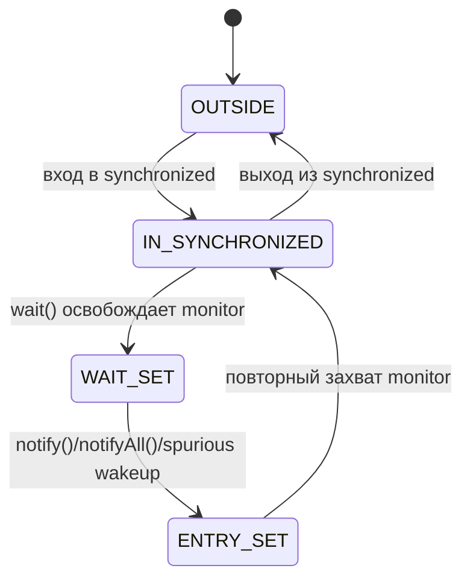

# wait(), notify(), notifyAll() внутри synchronized

## Главная идея

Любой объект Java может быть monitor. Блок `synchronized (lock)` - это critical section, защищённая этим monitor: один thread владеет им, остальные threads, которые пытаются войти, ждут в entry set. Представь маленькую кухню с одним ключом от двери. Повар с ключом работает у плиты; остальные ждут снаружи.

`wait()`, `notify()` и `notifyAll()` - это операции monitor, поэтому текущий thread должен владеть именно этим monitor. Вызов вне подходящего блока `synchronized` приводит к `IllegalMonitorStateException`. В кухонной аналогии только повар, который прямо сейчас держит ключ от этой кухни, может пользоваться звонком этой кухни.

```mermaid
sequenceDiagram
  participant C as Поток consumer
  participant M as Monitor
  participant P as Поток producer
  C->>M: входит в synchronized
  C->>M: wait()
  Note over C,M: C освобождает monitor и попадает в wait set
  P->>M: входит в synchronized
  P->>M: notify()
  Note over C,M: C разбужен, но должен заново захватить monitor
  P->>M: выходит из synchronized
  M-->>C: monitor захвачен заново; wait() возвращается
```

## Что делает wait()

Когда thread вызывает `lock.wait()`, владея `lock`, Java атомарно помещает этот thread в wait set monitor и освобождает monitor для `lock`. Да, `wait()` освобождает monitor. Он не освобождает другие, не связанные locks, которые thread мог держать. На кухне повар отходит от плиты и возвращает ключ от кухни, но другие ключи оставляет в кармане.

После того как `wait()` освободил monitor, другой thread может войти в `synchronized (lock)`, изменить shared state и вызвать `notify()` или `notifyAll()`. Разбуженный thread не продолжает мгновенно. Сначала он движется к entry set и должен снова выиграть monitor; только после этого `wait()` возвращается. Как клиент, которого позвали со стула ожидания на почте, он всё равно не может говорить с оператором, пока окно занято.



## notify() и notifyAll()

`notify()` выбирает один произвольный thread из wait set. JVM не обещает FIFO и не обещает выбрать "правильного" waiter, если разные conditions используют один monitor. На почте оператор говорит "следующий", но если несколько очередей смешаны, может встать клиент не с тем типом задачи.

`notify()` не освобождает monitor. Thread, который вызвал notify, продолжает работать внутри `synchronized`, пока не выйдет из блока или сам не вызовет `wait()`. Разбуженный thread сможет продолжить только после повторного захвата monitor. В дорожной аналогии waiting car может получить зелёный свет, но перекрёсток всё ещё занят, пока текущая машина не уедет.

`notifyAll()` будит все threads в wait set. Они всё равно захватывают monitor по одному. Это может дать лишние wakeups, но часто безопаснее, когда один monitor защищает несколько predicates. Как объявить на почте все номера посылок: больше людей встанет, а затем каждый проверит, его ли это посылка.

## Guard condition и while

Само уведомление не является состоянием. Настоящий код ждёт guard condition, например `queue.isEmpty() == false`, а `notify()` только говорит waiters проверить состояние снова. Если `notify()` случился до того, как thread начал ждать, уведомление не сохраняется на потом. Звонок на кухне не является сэндвичем; сэндвич всё ещё должен лежать на столе.

Используй цикл `while`, а не `if`:

```java
synchronized (lock) {
    while (!ready) {
        lock.wait();
    }
    useReadyState();
}
```

Цикл нужен из-за spurious wakeups, interrupted waits, timeouts, `notifyAll()` и уведомлений, предназначенных для другой condition. Waiter должен заново проверить shared state после повторного захвата monitor. На светофоре ты не едешь только потому, что кто-то крикнул "поехали"; ты снова смотришь на реальный свет.

## Ответ за 60 секунд

`wait()`, `notify()` и `notifyAll()` - это методы `Object`, которые работают с monitor этого объекта. Их можно вызывать только когда текущий thread владеет тем же monitor, обычно внутри `synchronized (lock)`. `wait()` атомарно освобождает monitor и помещает thread в wait set этого monitor. Когда thread уведомили, прервали, истёк timeout или случился spurious wakeup, он должен заново захватить monitor до того, как `wait()` вернётся. `notify()` будит одного произвольного waiter, но не освобождает monitor; notifier сохраняет ownership, пока не выйдет из synchronized. `notifyAll()` будит всех waiters, и они по одному конкурируют за повторный захват monitor. Правильный код защищает настоящую condition и ждёт в цикле `while`.

## Зачем это в production

Это низкоуровневая основа многих более высокоуровневых инструментов concurrency. Понимание помогает читать старый код, разбирать зависшую [critical section](topic:critical-section) или объяснять, почему thread в dump находится в `WAITING`, а не в `BLOCKED`. Это как сантехника подвала в [многопоточности Java](topic:java-multithreading): не всегда хочется трогать каждую трубу, но нужно знать, какой вентиль управляет давлением.

В production лучше использовать более высокоуровневые API, если они подходят: `BlockingQueue`, `CountDownLatch`, `Condition`, `CompletableFuture` или [Semaphore](topic:semaphore). Они упаковывают те же идеи координации в более понятные имена и дают меньше ловушек. Это как система номеров на почте вместо просьбы к клиентам запоминать каждый звонок.

`synchronized` даёт mutual exclusion и visibility на входе и выходе из monitor. `volatile` решает другую задачу: visibility для переменной без atomicity для составных действий. Если это различие неочевидно, стоит повторить [volatile](topic:volatile) и [избежание race condition](topic:race-condition-avoidance). Дорожный знак может быть виден всем водителям, но он не резервирует весь перекрёсток.

## Частые заблуждения

- "`wait()` держит lock." Неверно. Он освобождает monitor того объекта, на котором его вызвали. Ключ от кухни возвращается, пока повар ждёт.
- "`notify()` сразу запускает waiter." Неверно. Notifier всё ещё владеет monitor, пока не выйдет из synchronized. Окно обслуживания всё ещё занято.
- "`notify()` сохраняется, если никто не ждёт." Неверно. Notifications не являются очередью сообщений. Звонок без слушателя исчезает.
- "`if` перед wait достаточно." Неверно. Используй `while`, потому что wakeup не доказывает, что condition стала true. Всегда проверяй реальный counter, queue или flag снова.
- "`notify()` всегда лучше `notifyAll()`." Неверно. `notify()` эффективен только когда есть одна condition и один тип waiter. Смешанным waiters часто нужен `notifyAll()`.
- "`wait()` и `sleep()` похожи." Не для monitor. `wait()` освобождает monitor и зависит от notification; `sleep()` не освобождает monitor, который thread случайно держит.
