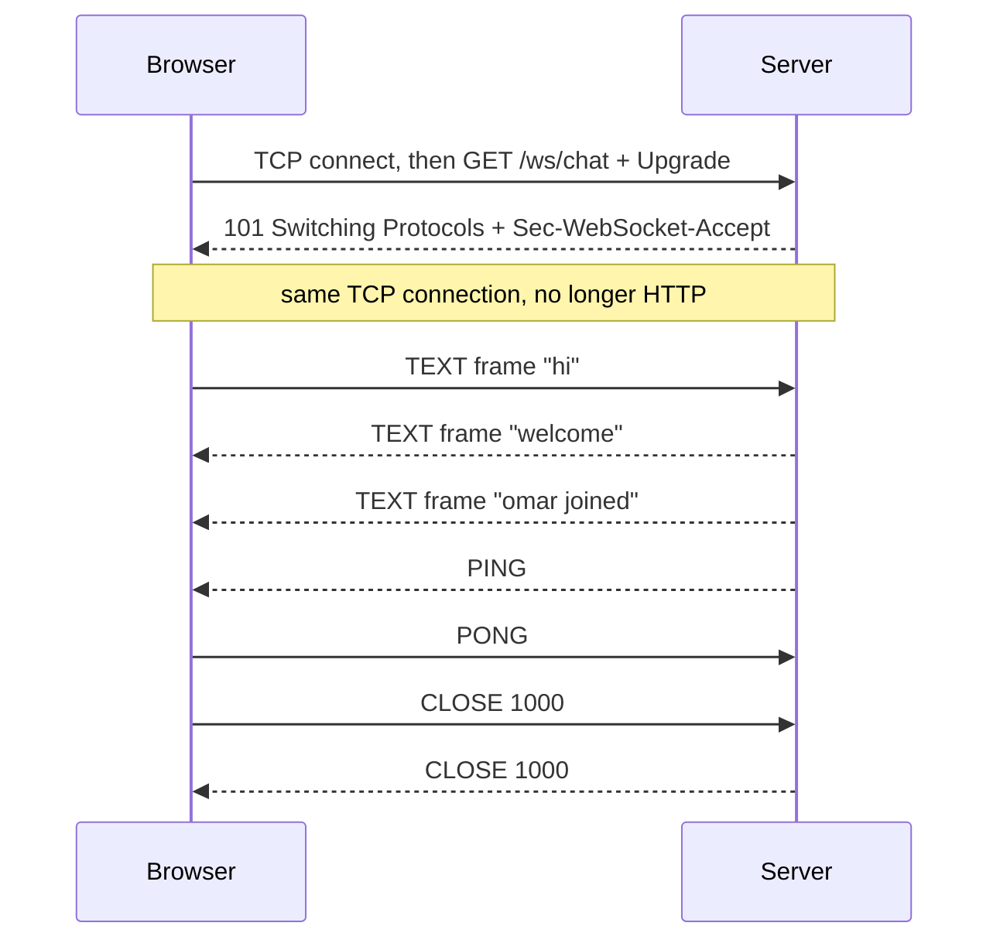
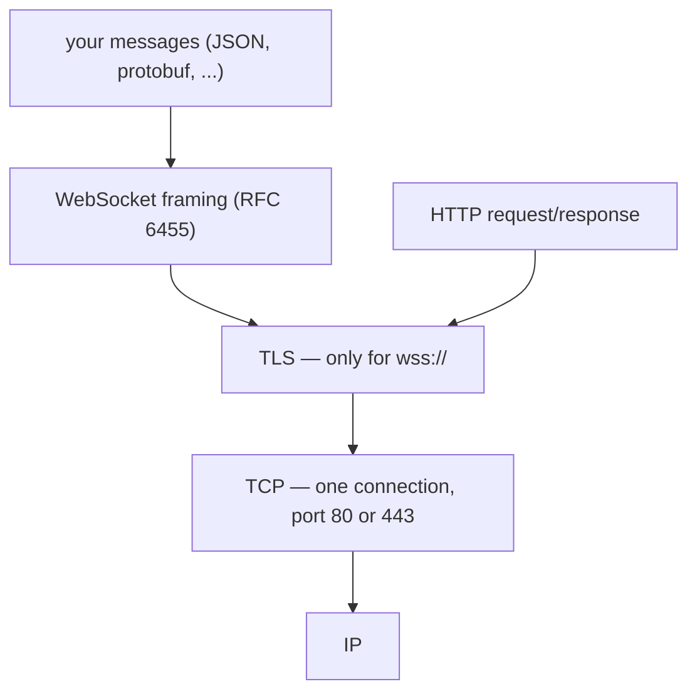
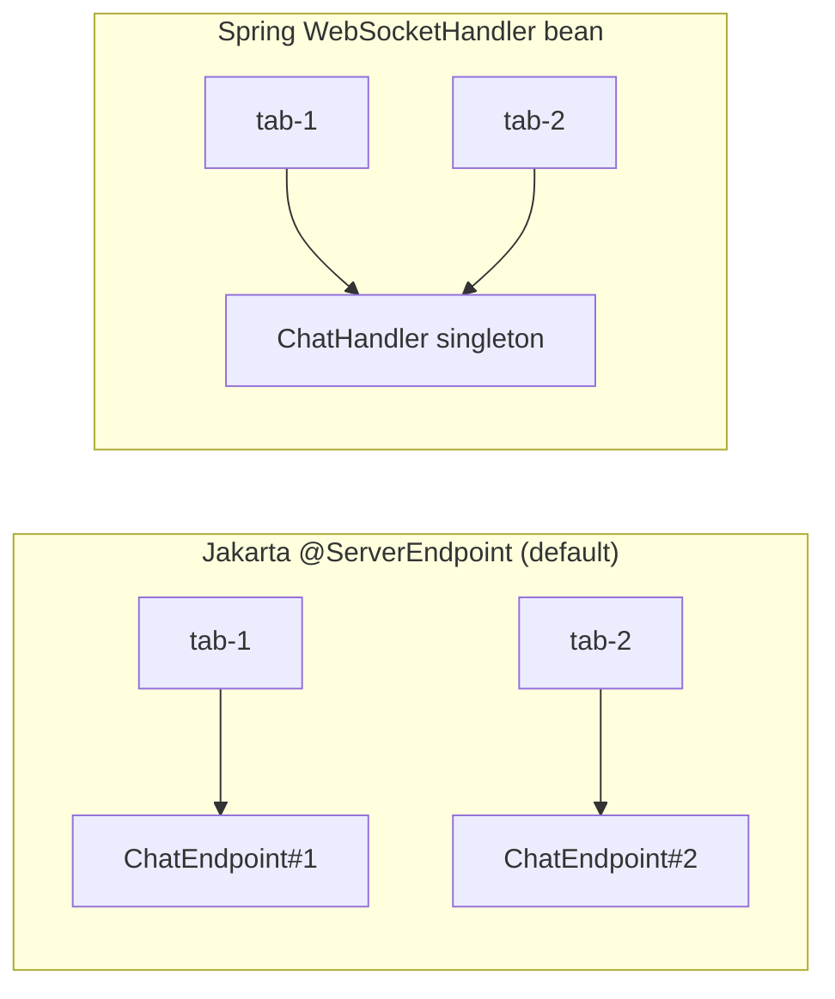

# How a WebSocket Connection Works

## The question is really three questions

Interviewers ask this one as a single sentence, but it has three separable
answers, and people usually have only two of them:

1. **How is the connection established?** With an ordinary HTTP GET that asks to
   be upgraded, answered with `101 Switching Protocols`.
2. **What does it run on?** One TCP connection. Never UDP.
3. **Who serves it — a new endpoint object per connection, or one shared?** It
   depends on which API you are using, and getting this wrong is a production
   incident rather than a style issue.

The third one is the interesting part, so do not spend all your time on the
first. This topic is the focused answer for WebSockets; for how it compares with
polling and SSE, see [notifying a browser in real
time](topic:realtime-server-push).

## Part 1 — it starts as an HTTP request

A WebSocket does not begin as a WebSocket. The browser opens a normal TCP
connection to the host and sends a normal HTTP GET on it — same request line,
same headers, same cookies as any other request. Three headers make it an
upgrade request:

```
GET /ws/chat HTTP/1.1
Host: chat.example.com
Upgrade: websocket
Connection: Upgrade
Sec-WebSocket-Key: dGhlIHNhbXBsZSBub25jZQ==
Sec-WebSocket-Version: 13
Origin: https://app.example.com
```

The server, if it agrees, answers:

```
HTTP/1.1 101 Switching Protocols
Upgrade: websocket
Connection: Upgrade
Sec-WebSocket-Accept: s3pPLMBiTxaQ9kYGzzhZRbK+xOo=
```

`Sec-WebSocket-Key` is 16 random bytes in base64. It is **not** authentication
and **not** a secret — it is a proof of understanding. The server must return
`base64(SHA-1(key + "258EAFA5-E914-47DA-95CA-C5AB0DC85B11"))`, using a GUID
written into RFC 6455, so a cache or a proxy that merely echoes headers cannot
accidentally be treated as a WebSocket server. (The values above are the
example from the RFC; you can verify the hash yourself.)



### What 101 actually means

`101` does not mean "here is your response". It means **"this connection stops
being HTTP now"**. That single fact explains most of what follows:

- **The same TCP connection continues.** There is no second connection and no
  second port. `ws://` is port 80, `wss://` is 443 — the ports HTTP already uses,
  chosen precisely so existing firewalls let it through.
- **The handshake is the last moment a status code exists.** You can refuse an
  upgrade with `403` or `401`, but once you have sent `101` there is no way to
  send a status code into an open socket. Authentication, authorization and
  origin checking all have to happen there. See [designing a security scheme for
  your endpoints](topic:endpoint-security-design).
- **Everything per-request is gone.** No method, no URL, no cookies, no
  `Content-Type`, no caching, no REST semantics — and no framework-level
  per-message security either.

### Bidirectional, precisely

After the upgrade both ends write **frames** into the pipe whenever they like,
including at the same time. There is no request/response pairing left: if a
frame is a reply to something, that is a convention your application invented.
A frame carries a 2-byte header (a FIN bit, a 4-bit opcode, a length field that
grows for larger payloads), a 4-byte masking key on client-to-server frames,
and the payload. Opcodes worth knowing: `0x1` text, `0x2` binary, `0x8` close,
`0x9` ping, `0xA` pong.

So a two-character message costs **8 bytes going up and 4 coming down** —
compare that with an HTTP request re-sending several hundred bytes of headers
and cookies every time ([HTTP and its methods](topic:http-methods)). That is the
real advantage over [long polling](topic:long-polling): not just latency, but
the cost per message when messages are frequent and small.

Client frames **must** be masked and server frames **must not** be. Masking is
not encryption — the key travels in the frame. It exists so that an attacker
cannot craft page content that a broken intermediary would misread as a valid
HTTP request. For confidentiality you use `wss://`, which is
[TLS](topic:http-vs-https) in the same place it sits under HTTP.

## Part 2 — the transport is TCP, and only TCP



There is no UDP mode and no API to ask for one: `new WebSocket(url)` gives you
TCP. When you genuinely want UDP semantics — a game, live audio, anything where
a late packet is worse than a lost one — the browser API for that is WebRTC data
channels.

**What you inherit from TCP:**

- Frames arrive **in order, exactly once, uncorrupted**. You never write
  sequence numbers or de-duplication for the socket itself.
- **Head-of-line blocking** comes with it. One lost segment stalls everything
  queued behind it, so a large message delays the small ones after it.
- A **silent TCP connection can be dead for minutes** without either side
  noticing — you only learn a peer vanished when you write to it. That is why
  `PING`/`PONG` frames exist, and why every real deployment sends heartbeats.

One refinement worth having ready: over HTTP/2 and HTTP/3 the handshake is
tunnelled through a stream instead of taking over the connection (RFC 8441 and
RFC 9220, using extended `CONNECT`). HTTP/3 rides QUIC, which is built on UDP —
but QUIC re-adds reliable, ordered streams, so **the guarantees your code is
written against never change**. "TCP" is the right answer; "reliable ordered
stream transport" is the precise one.

## Part 3 — one endpoint object, or one per connection?

This is where the same code behaves differently depending on the API, and where
the bug does not exist on your laptop.



### Jakarta WebSocket: a new instance per connection

With `@ServerEndpoint("/ws/chat")` on a POJO, the container calls the no-arg
constructor **once per connection** and keeps that object for the life of the
socket. So an instance field really is per-connection state:

```java
@ServerEndpoint("/ws/chat")
public class ChatEndpoint {
    private String user;                       // safe: this object is mine alone

    @OnOpen  public void open(Session s)  { user = authenticate(s); }
    @OnMessage public void onMessage(String text, Session s) { post(user, text); }
}
```

Two consequences travel with that:

- **The container built the object, not Spring.** `@Autowired` fields are `null`
  unless you install a configurator (`SpringConfigurator`, or your own
  `ServerEndpointConfig.Configurator`). This is the most common first bug in
  this shape.
- **"Per connection" covers instance fields only.** A `static` field — the usual
  way people keep the set of open sessions — is shared by every connection and
  written from every connection's thread, so it must be concurrent
  ([concurrent vs synchronized collections](topic:concurrent-synchronized-collections)).

### Spring: one shared handler

A `WebSocketHandler` is an ordinary [singleton bean](topic:spring-bean-scopes).
**One object handles every connection and every callback.** That is exactly why
every method takes the session as a parameter — the handler cannot know who it
is talking to otherwise:

```java
@Component
public class ChatHandler extends TextWebSocketHandler {
    private String user;                       // BUG: shared by every connection

    @Override protected void handleTextMessage(WebSocketSession s, TextMessage m) {
        post(user, m.getPayload());            // whose user? the last one to connect
    }
}
```

That field is global mutable state written from every client's thread. Nothing
throws, nothing is logged, and with one user it works perfectly — then a second
person connects and the chat starts attributing messages to the wrong name.
It is a plain [race condition](topic:race-condition-avoidance) hiding behind an
innocent-looking assignment. The same applies to `@MessageMapping` controllers
in the STOMP stack, and to `@ServerEndpoint` classes wired through
`SpringConfigurator` to a singleton bean.

Spring's opt-out is `PerConnectionWebSocketHandler`, which creates one handler
instance per connection — the Jakarta default, on request.

### The answer that survives both

**Keep per-connection state on the session, not on the endpoint object.** The
container creates a `Session` / `WebSocketSession` per connection in *both*
models, so this is correct regardless of how your endpoint is instantiated, and
the handler stays stateless and injectable:

```java
session.getAttributes().put("user", user);         // Spring
session.getUserProperties().put("user", user);     // Jakarta
```

When someone asks "per connection or shared?", the answer that scores is:
*"`@ServerEndpoint` is per connection by default, a Spring `WebSocketHandler` is
a shared singleton, and either way I keep connection state on the session so it
does not matter."*

## The 60-second interview answer

> A WebSocket starts as an ordinary HTTP GET carrying `Upgrade: websocket` and a
> `Sec-WebSocket-Key`. The server replies `101 Switching Protocols` with a
> `Sec-WebSocket-Accept` derived from that key, and from that moment the same TCP
> connection is no longer HTTP: both sides write frames whenever they like, with
> no status codes, no cookies per message and no request/response pairing. The
> transport is TCP — always, there is no UDP option — so frames are ordered,
> reliable and delivered once, and head-of-line blocking comes with that; `wss://`
> just adds TLS. Because the handshake is the only HTTP moment, authentication,
> authorization and the `Origin` check must happen there — CORS does not apply to
> WebSockets. As for the endpoint: with Jakarta `@ServerEndpoint` the container
> creates a new instance per connection, so a field is per-client state but
> injection needs a configurator; with a Spring `WebSocketHandler` one singleton
> serves every connection, so a field is shared mutable state and that is the
> classic "users see each other's data" bug. I keep per-connection state on the
> session, which is correct in both models, and I remember that an open
> connection is state pinned to one process — with more than one instance I need
> sticky routing and a shared bus.

## What actually breaks in production

- **Idle timeouts.** Every box in the path — nginx, a load balancer, an [API
  gateway](topic:api-gateway), a corporate proxy, a NAT table — closes quiet
  connections on its own schedule, often 30–60 seconds. Heartbeats keep the path
  warm; without them your sockets die after a minute in production and never
  locally. See [timeouts, fallbacks and circuit
  breakers](topic:service-timeouts-fallbacks).
- **Fan-out across instances.** An open socket lives in exactly one process.
  Deploy a second instance and an event handled by B cannot reach a client
  attached to A — no error, just a screen that stays wrong. You need sticky
  routing plus a shared bus (Redis pub/sub, [Kafka or
  RabbitMQ](topic:kafka-vs-rabbitmq)).
- **Concurrent sends on one session.** Two threads calling `sendText` on the same
  session at once is an error, not a queue — Tomcat throws
  `IllegalStateException` about the remote endpoint's state. Serialize sends
  (Spring ships `ConcurrentWebSocketSessionDecorator` for exactly this).
- **Auth that outlives its token.** A token is checked once at handshake time and
  then the connection lives for hours. Browsers cannot set headers on
  `new WebSocket(...)`, so people pass tokens in the query string, where they
  land in access logs. Give the connection a server-side deadline and let the
  client reconnect with a fresh token.
- **`Origin` is your job.** Browsers send `Origin` on the handshake, but
  WebSockets are **not** covered by [CORS](topic:cors) — there is no preflight
  and no `Access-Control-Allow-Origin` negotiation. Any page can open a socket to
  your URL and the browser will attach your cookies. That is cross-site WebSocket
  hijacking; check `Origin` and prefer a token that is not a cookie.
- **Message size.** There is no protocol limit, but containers set one (Tomcat's
  text buffer defaults to 8 KB); oversized messages close the socket with 1009.
- **Reconnection is yours.** After a drop it is a new connection: new handshake,
  new session, empty state. There is no `Last-Event-ID` equivalent as SSE has, so
  the client must resubscribe and re-fetch — treat a pushed message as a hint and
  key your state by id, the same reasoning as the [Inbox
  pattern](topic:inbox-pattern).
- **Connection count.** Idle sockets are cheap but not free: each pins a file
  descriptor plus buffers. Tens of thousands per node is normal on a
  non-blocking stack and impossible on thread-per-connection ([Java thread
  pool](topic:java-thread-pool)).

## Common traps and misconceptions

- **"WebSocket is a different protocol from the start."** It is not — it begins
  as an HTTP request, which is why it works through firewalls that only know
  ports 80 and 443.
- **"The handshake opens a second connection for the data."** No. The upgraded
  connection *is* the handshake's connection.
- **"`Sec-WebSocket-Key` authenticates the client."** It is a random nonce with a
  fixed transformation. It proves the peer implements the protocol; it proves
  nothing about identity.
- **"It might use UDP for speed."** It never does. Browser UDP is WebRTC.
- **"WebSockets are always faster."** For a request/response call over an
  existing HTTP/2 connection, a WebSocket adds a handshake, a protocol and a
  reconnect problem for no gain. It wins when messages are frequent, small, and
  server-initiated.
- **"The socket is open, so my message was delivered."** An open socket only
  means TCP has not noticed a failure yet. Writes into a dying connection vanish
  silently; anything that must survive lives in a database or a broker.
- **"Storing the user in a handler field works — I tested it."** With one user,
  yes. The bug appears on the second connection, and it looks like a data leak,
  not like a crash.
- **"Spring's handler is per connection because it feels request-scoped."** It is
  a singleton by default. If you want per-connection instances, ask for them with
  `PerConnectionWebSocketHandler`.
- **"CORS protects my socket."** It does not apply. Check `Origin` yourself.
- **"A WebSocket keeps my HTTP session."** The handshake had cookies; the frames
  do not. Whatever you need after `101`, you designed — the same trade-off as
  choosing between [synchronous and asynchronous
  communication](topic:sync-vs-async-communication) anywhere else.
