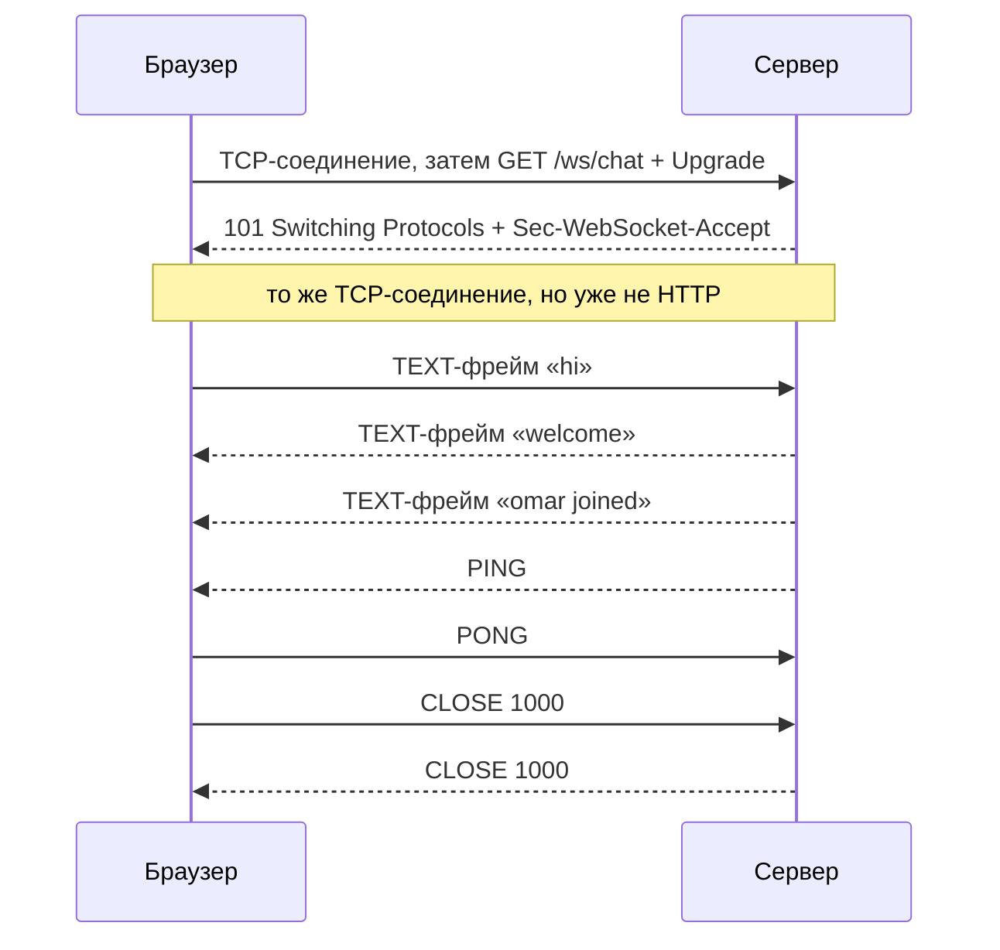
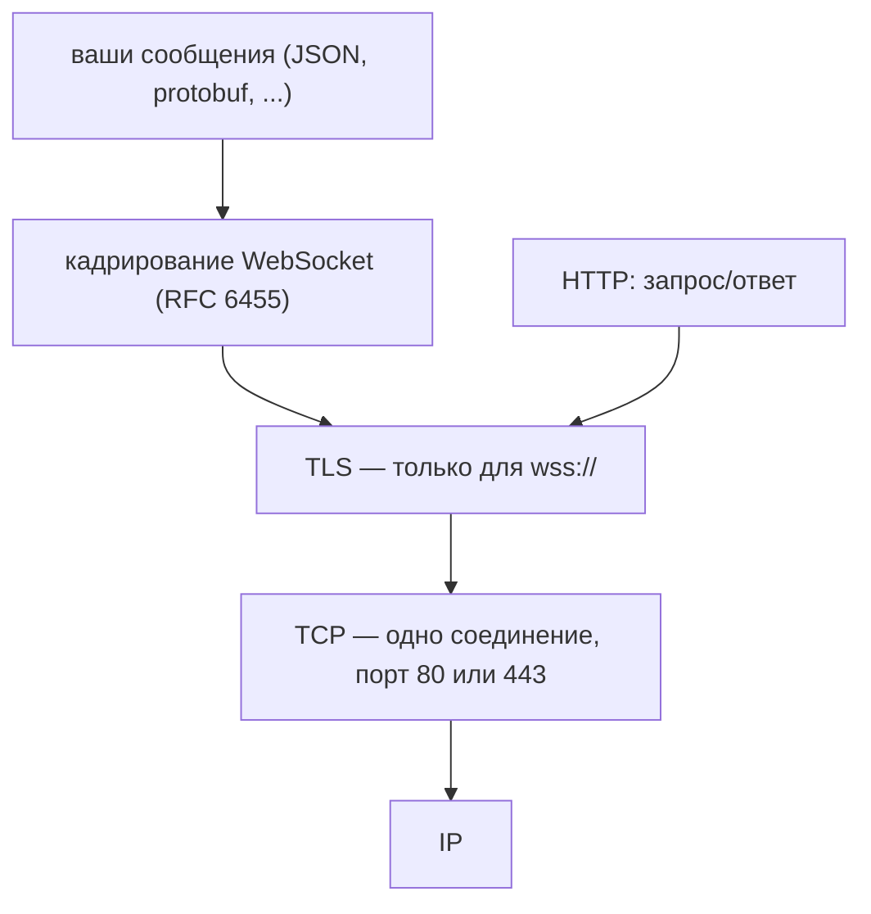
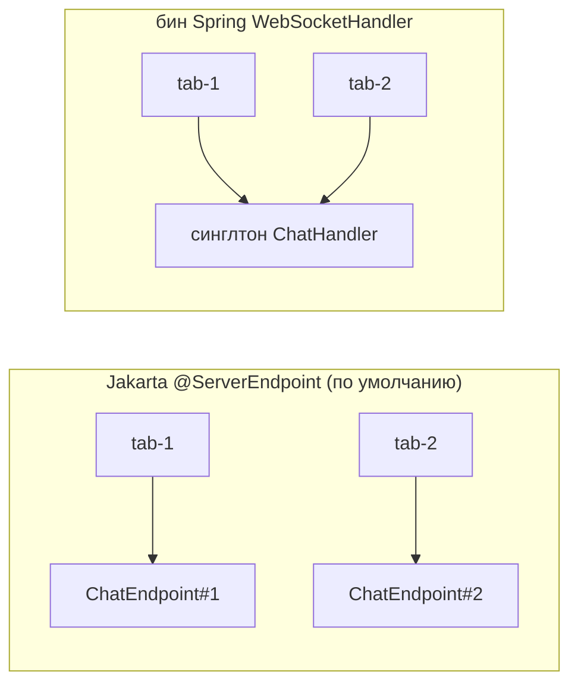

# Как работает WebSocket-соединение

## На самом деле это три вопроса

Собеседующие задают его одним предложением, но у него три отдельных ответа, и
обычно люди знают только два из них:

1. **Как устанавливается соединение?** Обычным HTTP-запросом GET, который просит
   апгрейд и получает в ответ `101 Switching Protocols`.
2. **По чему оно работает?** По одному TCP-соединению. Никогда не по UDP.
3. **Кто его обслуживает — новый объект эндпоинта на каждое соединение или один
   общий?** Зависит от того, каким API вы пользуетесь, и ошибка здесь — это
   инцидент в продакшене, а не вопрос стиля.

Третий пункт — самый интересный, поэтому не тратьте всё время на первый. Этот
топик — сфокусированный ответ про WebSocket; сравнение с опросом и SSE есть в
топике [как уведомить браузер в реальном времени](topic:realtime-server-push).

## Часть 1 — всё начинается с HTTP-запроса

WebSocket начинается не как WebSocket. Браузер открывает обычное TCP-соединение
к хосту и отправляет по нему обычный HTTP-запрос GET — та же строка запроса, те
же заголовки, те же куки, что и у любого другого запроса. Запросом на апгрейд его
делают три заголовка:

```
GET /ws/chat HTTP/1.1
Host: chat.example.com
Upgrade: websocket
Connection: Upgrade
Sec-WebSocket-Key: dGhlIHNhbXBsZSBub25jZQ==
Sec-WebSocket-Version: 13
Origin: https://app.example.com
```

Сервер, если он согласен, отвечает:

```
HTTP/1.1 101 Switching Protocols
Upgrade: websocket
Connection: Upgrade
Sec-WebSocket-Accept: s3pPLMBiTxaQ9kYGzzhZRbK+xOo=
```

`Sec-WebSocket-Key` — это 16 случайных байт в base64. Это **не** аутентификация и
**не** секрет, а доказательство понимания протокола. Сервер обязан вернуть
`base64(SHA-1(key + "258EAFA5-E914-47DA-95CA-C5AB0DC85B11"))`, где GUID прописан
прямо в RFC 6455, — чтобы кэш или прокси, который просто повторяет заголовки, не
мог случайно сойти за WebSocket-сервер. (Значения выше — пример из RFC, хеш можно
проверить самостоятельно.)



### Что на самом деле означает 101

`101` означает не «вот твой ответ», а **«это соединение с этого момента
перестаёт быть HTTP»**. Из одного этого факта следует почти всё остальное:

- **То же TCP-соединение продолжается.** Ни второго соединения, ни второго
  порта. `ws://` — это порт 80, `wss://` — 443: те же порты, что у HTTP, и
  выбраны они именно для того, чтобы существующие межсетевые экраны пропускали
  трафик.
- **Рукопожатие — последний момент, когда существует код состояния.** Отказать в
  апгрейде можно кодом `403` или `401`, но после отправленного `101` отправить
  код состояния в открытый сокет уже невозможно. Аутентификация, авторизация и
  проверка Origin обязаны происходить именно там. См. [проектирование схемы
  безопасности эндпоинтов](topic:endpoint-security-design).
- **Всё, что было «на запрос», исчезает.** Ни метода, ни URL, ни кук, ни
  `Content-Type`, ни кэширования, ни REST-семантики — и никакой безопасности на
  уровне фреймворка на каждое сообщение.

### Что такое «двусторонний», если точно

После апгрейда оба конца пишут в трубу **фреймы** когда захотят, в том числе
одновременно. Никакой привязки ответа к запросу не остаётся: если фрейм и
является ответом на что-то, то это соглашение, придуманное вашим приложением.
Фрейм несёт 2-байтный заголовок (бит FIN, 4-битный opcode, поле длины, которое
растёт для больших нагрузок), 4-байтный ключ маски на фреймах от клиента к
серверу и полезную нагрузку. Опкоды, которые стоит знать: `0x1` — текст, `0x2` —
двоичные данные, `0x8` — закрытие, `0x9` — ping, `0xA` — pong.

Поэтому сообщение из двух символов стоит **8 байт наверх и 4 вниз** — сравните с
HTTP-запросом, который каждый раз заново пересылает несколько сотен байт
заголовков и кук ([HTTP и его методы](topic:http-methods)). Вот в чём настоящее
преимущество перед [длинным опросом](topic:long-polling): не только в задержке, а
в цене одного сообщения, когда сообщения частые и мелкие.

Фреймы клиента **обязаны** маскироваться, а фреймы сервера — **обязаны нет**.
Маскирование — не шифрование: ключ едет в самом фрейме. Оно нужно, чтобы
атакующий не смог сформировать содержимое страницы, которое сломанный
промежуточный узел принял бы за корректный HTTP-запрос. За конфиденциальность
отвечает `wss://`, то есть [TLS](topic:http-vs-https) ровно на том же месте, где
он находится под HTTP.

## Часть 2 — транспорт TCP, и только TCP



Режима UDP нет, и попросить его через API нельзя: `new WebSocket(url)` даёт вам
TCP. Когда действительно нужна семантика UDP — игра, живой звук, всё, где
опоздавший пакет хуже потерянного, — браузерный API для этого называется WebRTC
data channels.

**Что наследуется от TCP:**

- Фреймы приходят **по порядку, ровно один раз и неиспорченными**. Вам никогда не
  придётся писать порядковые номера или дедупликацию для самого сокета.
- Вместе с этим приходит и **head-of-line blocking**. Один потерянный сегмент
  задерживает всё, что стоит за ним в очереди, поэтому большое сообщение
  задерживает мелкие, идущие следом.
- **Молчащее TCP-соединение может быть мёртвым минутами**, и ни одна сторона
  этого не заметит: об исчезновении собеседника узнаёшь, только когда попробуешь
  ему написать. Именно поэтому существуют фреймы `PING`/`PONG` и поэтому любое
  реальное развёртывание шлёт heartbeat.

Одно уточнение, которое стоит держать наготове: в HTTP/2 и HTTP/3 рукопожатие
туннелируется через поток, а не забирает соединение себе (RFC 8441 и RFC 9220,
через расширенный `CONNECT`). HTTP/3 едет на QUIC, который построен поверх UDP,
— но QUIC возвращает надёжные упорядоченные потоки, поэтому **гарантии, под
которые написан ваш код, не меняются**. «TCP» — правильный ответ; «надёжный
упорядоченный потоковый транспорт» — точный.

## Часть 3 — один объект эндпоинта или по одному на соединение?

Здесь один и тот же код ведёт себя по-разному в зависимости от API, и здесь
ошибка не воспроизводится на вашем ноутбуке.



### Jakarta WebSocket: новый экземпляр на каждое соединение

Если `@ServerEndpoint("/ws/chat")` стоит на POJO, контейнер вызывает конструктор
без аргументов **по разу на соединение** и держит этот объект всё время жизни
сокета. Поэтому поле экземпляра действительно является состоянием соединения:

```java
@ServerEndpoint("/ws/chat")
public class ChatEndpoint {
    private String user;                       // safe: this object is mine alone

    @OnOpen  public void open(Session s)  { user = authenticate(s); }
    @OnMessage public void onMessage(String text, Session s) { post(user, text); }
}
```

Вместе с этим приходят два следствия:

- **Объект создал контейнер, а не Spring.** Поля с `@Autowired` будут `null`,
  пока вы не поставите конфигуратор (`SpringConfigurator` или свой собственный
  `ServerEndpointConfig.Configurator`). Это самая частая первая ошибка в такой
  форме.
- **«На соединение» касается только полей экземпляра.** Поле `static` — обычный
  способ хранить набор открытых сессий — общее для всех соединений и пишется из
  потоков всех соединений, поэтому оно обязано быть конкурентным
  ([конкурентные и синхронизированные
  коллекции](topic:concurrent-synchronized-collections)).

### Spring: один общий обработчик

`WebSocketHandler` — обычный [singleton-бин](topic:spring-bean-scopes). **Один
объект обслуживает все соединения и все колбэки.** Именно поэтому каждый метод
принимает сессию параметром: иначе обработчик просто не может знать, с кем он
говорит:

```java
@Component
public class ChatHandler extends TextWebSocketHandler {
    private String user;                       // BUG: shared by every connection

    @Override protected void handleTextMessage(WebSocketSession s, TextMessage m) {
        post(user, m.getPayload());            // whose user? the last one to connect
    }
}
```

Это поле — глобальное изменяемое состояние, в которое пишут потоки всех клиентов.
Ничего не падает, ничего не логируется, и с одним пользователем всё работает
идеально — а потом подключается второй, и чат начинает приписывать сообщения не
тому имени. Это обычное [состояние гонки](topic:race-condition-avoidance),
спрятанное за невинно выглядящим присваиванием. То же самое касается контроллеров
с `@MessageMapping` в стеке STOMP и классов с `@ServerEndpoint`, подключённых
через `SpringConfigurator` к синглтон-бину.

Способ Spring отказаться от этого — `PerConnectionWebSocketHandler`, который
создаёт по экземпляру обработчика на соединение: поведение Jakarta по умолчанию,
но по запросу.

### Ответ, который верен в обоих случаях

**Держите состояние соединения в сессии, а не на объекте эндпоинта.** Контейнер
создаёт `Session` / `WebSocketSession` на каждое соединение в *обеих* моделях,
поэтому такой код корректен независимо от того, как создан ваш эндпоинт, а сам
обработчик остаётся без состояния и пригодным для внедрения зависимостей:

```java
session.getAttributes().put("user", user);         // Spring
session.getUserProperties().put("user", user);     // Jakarta
```

Когда спрашивают «на соединение или общий?», выигрышный ответ звучит так:
*«`@ServerEndpoint` по умолчанию создаётся на каждое соединение, Spring
`WebSocketHandler` — общий синглтон, и в любом случае я держу состояние
соединения в сессии, поэтому разница перестаёт иметь значение»*.

## Ответ на собеседовании за 60 секунд

> WebSocket начинается как обычный HTTP-запрос GET с `Upgrade: websocket` и
> `Sec-WebSocket-Key`. Сервер отвечает `101 Switching Protocols` со значением
> `Sec-WebSocket-Accept`, выведенным из этого ключа, и с этого момента то же самое
> TCP-соединение больше не HTTP: обе стороны пишут фреймы когда захотят, без кодов
> состояния, без кук на каждое сообщение и без привязки ответа к запросу.
> Транспорт — TCP, всегда, варианта с UDP нет, поэтому фреймы упорядочены, надёжны
> и доставляются один раз, а вместе с этим приходит head-of-line blocking; `wss://`
> лишь добавляет TLS. Поскольку рукопожатие — единственный HTTP-момент,
> аутентификация, авторизация и проверка `Origin` должны происходить именно там:
> CORS на WebSocket не распространяется. Что до эндпоинта: в Jakarta
> `@ServerEndpoint` контейнер создаёт новый экземпляр на каждое соединение,
> поэтому поле является состоянием клиента, но для внедрения зависимостей нужен
> конфигуратор; в Spring `WebSocketHandler` один синглтон обслуживает все
> соединения, поэтому поле становится общим изменяемым состоянием — это и есть
> классический баг «пользователи видят чужие данные». Я держу состояние соединения
> в сессии, что корректно в обеих моделях, и помню, что открытое соединение — это
> состояние, привязанное к одному процессу: при нескольких экземплярах нужны
> липкая маршрутизация и общая шина.

## Что реально ломается в продакшене

- **Таймауты простоя.** Каждый узел по пути — nginx, балансировщик, [API-шлюз](topic:api-gateway),
  корпоративный прокси, таблица NAT — закрывает тихие соединения по своему
  расписанию, часто через 30–60 секунд. Heartbeat держит путь тёплым; без него
  ваши сокеты умирают через минуту в продакшене и никогда локально. См.
  [таймауты, фолбэки и circuit breaker](topic:service-timeouts-fallbacks).
- **Фан-аут между экземплярами.** Открытый сокет живёт ровно в одном процессе.
  Разверните второй экземпляр — и событие, обработанное на B, не дойдёт до
  клиента, подключённого к A: ни ошибки, ни лога, просто экран остаётся
  неправильным. Нужны липкая маршрутизация плюс общая шина (Redis pub/sub,
  [Kafka или RabbitMQ](topic:kafka-vs-rabbitmq)).
- **Одновременная отправка в одну сессию.** Два потока, вызывающие `sendText` на
  одной сессии одновременно, — это ошибка, а не очередь: Tomcat бросает
  `IllegalStateException` о состоянии удалённого эндпоинта. Отправки надо
  сериализовать (в Spring для этого есть `ConcurrentWebSocketSessionDecorator`).
- **Авторизация, которая переживает свой токен.** Токен проверяется один раз на
  рукопожатии, а соединение живёт часами. Браузер не может задать заголовки
  для `new WebSocket(...)`, поэтому токены передают в строке запроса, где они
  оседают в логах доступа. Задайте соединению серверный дедлайн и дайте клиенту
  переподключиться со свежим токеном.
- **`Origin` — ваша забота.** Браузеры присылают `Origin` в рукопожатии, но на
  WebSocket **не** распространяется [CORS](topic:cors): ни preflight, ни
  согласования `Access-Control-Allow-Origin`. Любая страница может открыть сокет
  к вашему URL, и браузер приложит ваши куки. Это и есть cross-site WebSocket
  hijacking: проверяйте `Origin` и предпочитайте токен, который не является кукой.
- **Размер сообщения.** В протоколе ограничения нет, но контейнеры его задают (в
  Tomcat текстовый буфер по умолчанию 8 КБ); слишком большое сообщение закрывает
  сокет кодом 1009.
- **Переподключение пишете вы.** После обрыва это новое соединение: новое
  рукопожатие, новая сессия, пустое состояние. Аналога `Last-Event-ID`, который
  есть у SSE, здесь нет, поэтому клиент обязан переподписаться и перезапросить
  данные — считайте пришедшее сообщение подсказкой и держите состояние по
  идентификаторам, ровно как в [паттерне Inbox](topic:inbox-pattern).
- **Количество соединений.** Простаивающие сокеты дёшевы, но не бесплатны: каждый
  удерживает файловый дескриптор и буферы. Десятки тысяч на узел — норма для
  неблокирующего стека и невозможны при потоке на соединение ([пул потоков в
  Java](topic:java-thread-pool)).

## Типичные ловушки и заблуждения

- **«WebSocket — это отдельный протокол с самого начала».** Нет: он начинается
  как HTTP-запрос, и именно поэтому проходит через межсетевые экраны, знающие
  только порты 80 и 443.
- **«Рукопожатие открывает второе соединение для данных».** Нет. Апгрейженное
  соединение — это и есть соединение рукопожатия.
- **«`Sec-WebSocket-Key` аутентифицирует клиента».** Это случайный nonce с
  фиксированным преобразованием. Он доказывает, что собеседник реализует
  протокол, и ничего не говорит о личности.
- **«Возможно, он использует UDP ради скорости».** Никогда. UDP в браузере — это
  WebRTC.
- **«WebSocket всегда быстрее».** Для вызова «запрос-ответ» по уже открытому
  HTTP/2-соединению WebSocket добавляет рукопожатие, протокол и проблему
  переподключения без всякой выгоды. Он выигрывает, когда сообщения частые,
  мелкие и инициируются сервером.
- **«Сокет открыт, значит сообщение доставлено».** Открытый сокет означает лишь,
  что TCP ещё не заметил сбоя. Записи в умирающее соединение исчезают молча; всё,
  что должно выжить, лежит в базе или в брокере.
- **«Хранить пользователя в поле обработчика работает — я проверял».** С одним
  пользователем да. Ошибка появляется на втором соединении и выглядит как утечка
  данных, а не как падение.
- **«Обработчик Spring создаётся на соединение, он же похож на request-scoped».**
  По умолчанию это синглтон. Нужны экземпляры на соединение — попросите их через
  `PerConnectionWebSocketHandler`.
- **«CORS защищает мой сокет».** Он к нему не применяется. Проверяйте `Origin`
  сами.
- **«WebSocket сохраняет мою HTTP-сессию».** Куки были у рукопожатия, у фреймов
  их нет. Всё, что нужно после `101`, вы проектируете сами — тот же компромисс,
  что и при выборе между [синхронной и асинхронной
  коммуникацией](topic:sync-vs-async-communication) где угодно ещё.
