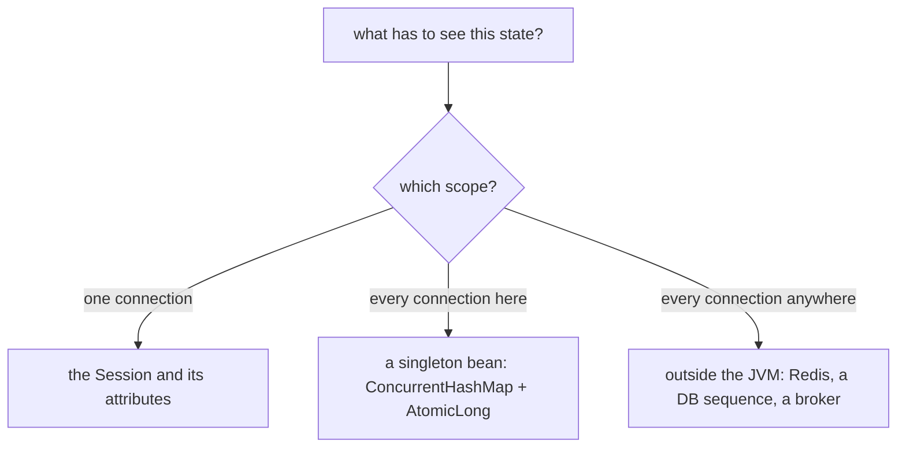
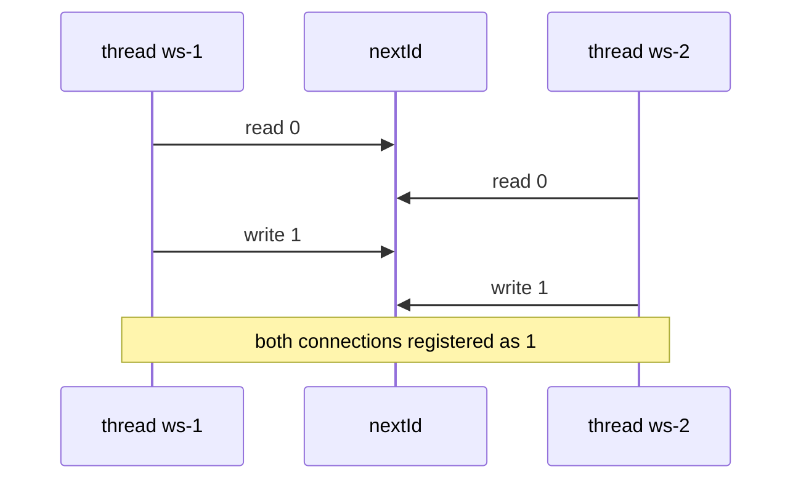
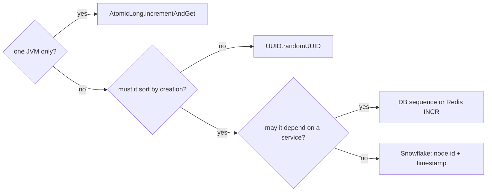

# Shared state across WebSocket connections, and a value that is unique everywhere

The question is really two questions, and candidates usually answer only one of
them. **Where does state that every connection must see actually live, and what
does it have to be to survive many threads?** And **where does a value that must
never repeat come from, given that "many threads" eventually means "many
processes"?**

Everything else follows from one fact about the container: there is a thread per
connection, not a thread per application. Your handler method is being executed
by as many threads as you have open sockets. Anything it touches that is not a
local variable and not that connection's own session is shared mutable state —
whether you designed it that way or not. (How a socket gets there is
[How a WebSocket Connection Works](topic:websocket-connection).)

## Step 1: pick the scope before you pick the collection

State on a WebSocket server lives in exactly one of three scopes, and choosing
the wrong one is the mistake that no amount of `synchronized` repairs.



- **Per connection** — the user, the subscribed symbols, the last id sent. This
  belongs on the session (`session.getAttributes()` in Spring,
  `getUserProperties()` in Jakarta), never in a field of a shared handler.
- **Per process** — the registry of open sessions, a counter, a cache. This
  belongs on one object every connection reaches: a Spring singleton bean
  (see [Spring Bean Scopes](topic:spring-bean-scopes)) or a `static` field
  (see [static in Java](topic:java-static-keyword)). A `static` field and a
  singleton bean are the same scope; the bean is testable and injectable, so
  prefer it.
- **Per cluster** — anything that must still hold when the app runs twice.
  Nothing inside the JVM can provide this. Ever.

The classic wrong turn is putting the registry in an instance field of a
`@ServerEndpoint` class. That class is instantiated **once per connection**, so
each connection gets its own copy of the "registry" and the broadcast reaches one
person. Note the symmetry with the opposite bug: in Spring, `WebSocketHandler` is
a singleton, so a field there is shared by everybody and one user sees another
user's data.

## Step 2: pick the collection

The registry is written by every connection's thread on open and close, and read
by whichever thread is broadcasting. Four candidates, three of them wrong:

| choice | what actually happens |
| --- | --- |
| `HashMap` | Two concurrent `put`s can drop an entry; a concurrent resize can leave the table circular and a later `get` spins forever at 100% CPU. |
| `Collections.synchronizedMap` | Each call is atomic; **iteration is not**, and its javadoc tells you to synchronize on the map while traversing — see [ConcurrentModificationException and Safe Collection Changes](topic:concurrent-modification). Broadcasting is iteration. |
| `CopyOnWriteArrayList` | Safe, but every registration copies the whole array — fine for 50 sockets, quadratic pain for 50 000. |
| `ConcurrentHashMap` | Writes lock one bin, reads never block, and the iterator is weakly consistent, so a broadcast can never throw. This is the answer. |

The reasoning behind that table is
[Concurrent vs Synchronized Collections](topic:concurrent-synchronized-collections)
and [ConcurrentHashMap vs synchronized HashMap](topic:concurrenthashmap-vs-synchronized-map).

## Step 3: the value that must be unique

Now the interesting half. Two shapes look correct and are not:

```java
long id = ++nextId;                 // read, add, write - three steps
long id = sessions.size() + 1;      // reads a number nothing reserved
```

Both are **read-then-write**, and two threads can be inside the gap at once:



Two things are worth saying out loud about this. First, **a thread-safe map does
not fix it.** A thread-safe collection promises that *one call* is atomic, never
that your *sequence of calls* is — `if (!sessions.containsKey(id)) sessions.put(id, s)`
has exactly the same hole, and the fix is a single atomic operation
(`putIfAbsent`, `computeIfAbsent`, `merge`), not a bigger lock. Second,
`sessions.size() + 1` is broken even with **one** thread: the map shrinks when
somebody disconnects, so it starts reissuing numbers it already gave away.

The repair for one process is to make read-modify-write indivisible — a
`synchronized` block (see [Critical Section](topic:critical-section)) or, better,
`AtomicLong.incrementAndGet()`, which is one hardware compare-and-set with no
lock at all (see [Compare-And-Set (CAS)](topic:compare-and-set) and
[Thread Safety of Numeric Addition](topic:thread-safe-addition)). And note that
`volatile` is *not* the fix: it gives visibility, not atomicity — `volatile
long n; n++` is still a race ([The volatile Keyword](topic:volatile),
[Problems in the Java Memory Model](topic:jmm-problems)).

## Step 4: "thread-safe" is not "globally unique"

`AtomicLong` is correct — and its correctness stops precisely at the edge of the
JVM, because a lock or a CAS only coordinates threads that share the same memory.
Deploy the same faultless code twice behind a load balancer and both processes
hand out `1` to their first connection. Nothing raced; each counter is right;
the value is still duplicated. That is what the word *globally* in the question
is doing.

Past that edge there are only two shapes: **generate a value so wide that nobody
has to be asked**, or **ask the one authority everybody shares**.



- **`UUID.randomUUID()`** — 122 random bits, no coordination with anybody, safe
  from any number of threads. Costs 16 unordered bytes, which makes a poor
  clustered primary key; `UUID` v7 puts a timestamp in the high bits and gets
  the ordering back.
- **A database sequence or `Redis INCR`** — small, ordered, and unique for the
  whole cluster, at the cost of a round trip per connection and a dependency
  that can be down ([Redis vs PostgreSQL for Unique Generated Values](topic:redis-vs-postgresql-uniqueness)).
- **Snowflake-style ids** — timestamp plus a *unique node id* plus a per-node
  counter. No coordination at runtime; the coordination moved to deployment,
  where each process must be given an id that is genuinely its own.

If the value must be unique in a way you can prove after a crash, the last word
belongs to a **unique constraint in the database**, not to anything in memory:
in-memory uniqueness dies with the process.

## Step 5: the trap a perfect registry does not cover

Make the registry a `ConcurrentHashMap` and the counter an `AtomicLong`, and one
bug is still waiting: **two threads writing into the same session**. A scheduled
push and a reply to an incoming message do it constantly. A WebSocket message is
a sequence of frames, so the writes either interleave into a message nobody sent
or the container refuses with `IllegalStateException: TEXT_PARTIAL_WRITING`.

The registry needs *concurrency*; an individual session needs *mutual
exclusion*. Wrap it — Spring's `ConcurrentWebSocketSessionDecorator`, or your own
lock per session ([Alternatives to synchronized: Locks](topic:lock-alternatives)).

And registration has a mirror image: **removal on close**. A registry is a GC
root that only shrinks when your code shrinks it, so a missed `remove` in
`@OnClose` is a textbook leak — the map grows for days, every broadcast iterates
more dead sockets ([Memory Leaks in Java](topic:memory-leaks)). Removal must also
run for abnormal closes (1006), because that is how most connections end.

## The 60-second interview answer

> Per-connection state goes on the session. State every connection must see goes
> on one object they all reach — a singleton bean holding a `ConcurrentHashMap`
> of sessions — because the container runs a thread per connection, so a plain
> `HashMap` there can lose entries and a `synchronizedMap` throws while you
> iterate it to broadcast. For the unique value, `nextId++` and `size() + 1` are
> read-then-write and hand the same number to two threads; a thread-safe map does
> not help, because a thread-safe collection makes one call atomic, not a
> sequence of calls. `AtomicLong.incrementAndGet()` fixes it for one process —
> and only for one process: with two instances behind a load balancer both start
> at 1. For global uniqueness you either generate something wide enough that no
> coordination is needed, like a UUID, or you ask the one thing both nodes share,
> like a database sequence or `Redis INCR`; Snowflake ids are the middle road.
> Two footnotes: a concurrent registry still does not make one session safe for
> two writers — that needs a per-session lock — and every registration needs a
> matching removal on close or the map is a memory leak.

## Common traps and misconceptions

- **"Each connection gets its own handler, so a field is fine."** True for a
  Jakarta `@ServerEndpoint` POJO, false for a Spring `WebSocketHandler`, and the
  code looks identical. Check how yours is instantiated instead of assuming.
- **"ConcurrentHashMap makes my code thread-safe."** It makes each *call* atomic.
  `containsKey` then `put`, or `get` then `put`, is still a race
  ([Avoiding Race Conditions](topic:race-condition-avoidance)).
- **"`volatile` makes `n++` safe."** It does not. Visibility, not atomicity.
- **"`sessions.size() + 1` is fine, I only have one thread."** It reissues
  numbers as soon as anybody disconnects.
- **"It works on my machine."** With one user there is no concurrency and one
  instance; both halves of this bug need a second of something.
- **"UUIDs might collide."** At 122 random bits this is not a risk you manage.
  The real UUID trade-off is size and lack of ordering.
- **"Sticky sessions fix it."** They keep one *client* on one node; they do not
  give two nodes a shared counter, and they do not let node A push to a socket
  held by node B ([A Single Server Is Overwhelmed](topic:scaling-an-overloaded-server)).
- **"Broadcast is a protocol feature."** It is a loop over a collection you
  maintain yourself, inside one process
  ([Notifying a Browser in Real Time](topic:realtime-server-push)).
- **"Synchronize everything and move on."** Holding one lock across a broadcast
  to 10 000 sockets serialises the whole server behind the slowest client.
- **"Thread-safe means the other thread sees my write."** Only if there is a
  happens-before edge — a lock, a volatile write, an atomic operation
  ([Happens-Before in Java](topic:happens-before)).
