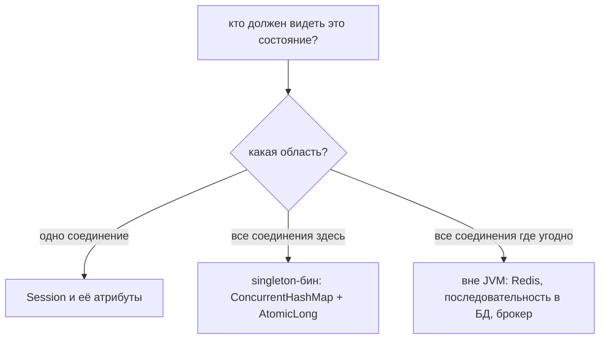
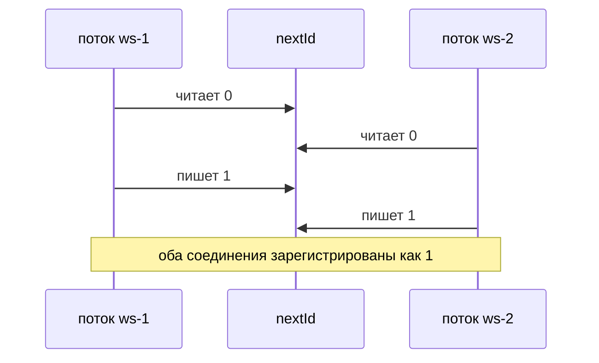
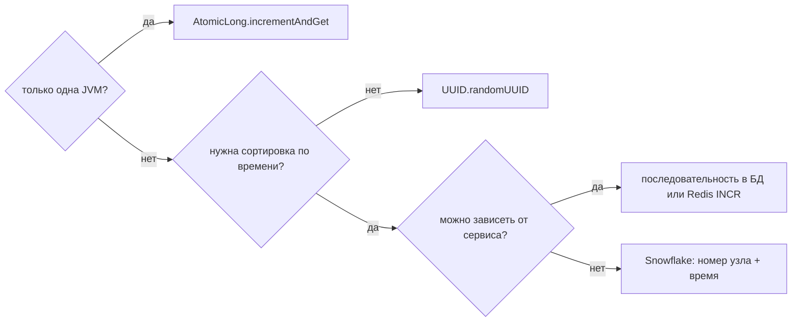

# Общее состояние на все WebSocket-соединения и значение, уникальное везде

На самом деле это два вопроса, и кандидаты обычно отвечают только на один из них.
**Где действительно живёт состояние, которое должно быть видно каждому
соединению, и чем оно обязано быть, чтобы пережить множество потоков?** И
**откуда берётся значение, которое не должно повторяться никогда, если «множество
потоков» рано или поздно означает «множество процессов»?**

Всё остальное следует из одного факта про контейнер: поток приходится на
соединение, а не на приложение. Метод вашего обработчика выполняют столько
потоков, сколько у вас открытых сокетов. Всё, к чему он прикасается и что не
является локальной переменной и не принадлежит сессии этого соединения, — общее
изменяемое состояние, спроектировали вы его так или нет. (Как сокет вообще
появляется — в теме
[Как работает WebSocket-соединение](topic:websocket-connection).)

## Шаг 1: сначала выбирают область видимости, а не коллекцию

Состояние на WebSocket-сервере живёт ровно в одной из трёх областей, и
неправильный выбор — это та ошибка, которую не чинит никакое количество
`synchronized`.



- **На соединение** — пользователь, набор подписок, последний отправленный id.
  Этому место в сессии (`session.getAttributes()` в Spring,
  `getUserProperties()` в Jakarta), но никогда не в поле общего обработчика.
- **На процесс** — реестр открытых сессий, счётчик, кэш. Этому место на одном
  объекте, до которого дотягивается каждое соединение: singleton-бин Spring
  (см. [Области видимости бинов Spring](topic:spring-bean-scopes)) или поле
  `static` (см. [static в Java](topic:java-static-keyword)). Поле `static` и
  singleton-бин — это одна и та же область; бин тестируем и внедряем, поэтому
  выбирают его.
- **На кластер** — всё, что должно оставаться верным, когда приложение запущено
  дважды. Ничто внутри JVM этого дать не может. Никогда.

Классический неверный поворот — положить реестр в поле экземпляра класса с
`@ServerEndpoint`. Этот класс создаётся **по экземпляру на соединение**, поэтому
у каждого соединения появляется своя копия «реестра», и рассылка доходит до
одного человека. Обратите внимание на симметрию с противоположной ошибкой: в
Spring `WebSocketHandler` — синглтон, поэтому поле на нём общее для всех, и один
пользователь видит данные другого.

## Шаг 2: выбор коллекции

В реестр пишет поток каждого соединения при открытии и закрытии, а читает тот
поток, который в этот момент делает рассылку. Кандидатов четыре, три из них
неверные:

| вариант | что происходит на самом деле |
| --- | --- |
| `HashMap` | Два одновременных `put` могут выбросить запись; конкурентный resize способен замкнуть таблицу в кольцо, и последующий `get` будет вечно крутиться на 100% CPU. |
| `Collections.synchronizedMap` | Атомарен каждый вызов; **обход — нет**, и в javadoc сказано синхронизироваться по карте во время обхода — см. [ConcurrentModificationException и безопасное изменение коллекций](topic:concurrent-modification). А рассылка — это обход. |
| `CopyOnWriteArrayList` | Безопасен, но каждая регистрация копирует весь массив: нормально для 50 сокетов, квадратичная боль для 50 000. |
| `ConcurrentHashMap` | Запись блокирует одну корзину, чтения не ждут никогда, а итератор слабо согласован, поэтому рассылка не может бросить исключение. Это и есть ответ. |

Обоснование этой таблицы — в темах
[Конкурентные и синхронизированные коллекции](topic:concurrent-synchronized-collections)
и [ConcurrentHashMap против synchronized HashMap](topic:concurrenthashmap-vs-synchronized-map).

## Шаг 3: значение, которое обязано быть уникальным

Теперь интересная половина. Две формы выглядят правильными и таковыми не
являются:

```java
long id = ++nextId;                 // read, add, write - three steps
long id = sessions.size() + 1;      // reads a number nothing reserved
```

Обе — это **«прочитать, потом записать»**, и два потока могут оказаться в
промежутке одновременно:



Про это стоит проговорить вслух две вещи. Во-первых, **потокобезопасная карта
этого не чинит.** Потокобезопасная коллекция обещает атомарность *одного вызова*,
а не вашей *последовательности вызовов*: у
`if (!sessions.containsKey(id)) sessions.put(id, s)` ровно та же дыра, и лечится
она одной атомарной операцией (`putIfAbsent`, `computeIfAbsent`, `merge`), а не
блокировкой побольше. Во-вторых, `sessions.size() + 1` сломан даже в **один**
поток: карта уменьшается, когда кто-то отключается, поэтому схема начинает заново
выдавать уже розданные номера.

Починка для одного процесса — сделать «прочитать-изменить-записать» неделимым:
блок `synchronized` (см. [Критическая секция](topic:critical-section)) или, лучше,
`AtomicLong.incrementAndGet()`, то есть один аппаратный compare-and-set вообще без
блокировки (см. [Compare-And-Set (CAS)](topic:compare-and-set) и
[Потокобезопасность сложения чисел](topic:thread-safe-addition)). И заметьте, что
`volatile` — *не* решение: он даёт видимость, а не атомарность, и
`volatile long n; n++` по-прежнему гонка
([Ключевое слово volatile](topic:volatile),
[Проблемы модели памяти Java](topic:jmm-problems)).

## Шаг 4: «потокобезопасно» — это не «глобально уникально»

`AtomicLong` верен — и его верность заканчивается ровно на границе JVM, потому что
блокировка или CAS координируют только потоки, разделяющие одну и ту же память.
Разверните тот же безупречный код дважды за балансировщиком, и оба процесса
выдадут своему первому соединению `1`. Никакой гонки не было, каждый счётчик прав,
а значение всё равно продублировано. Именно за это в вопросе отвечает слово
*глобально*.

За этой границей форм всего две: **сгенерировать значение настолько широкое, что
спрашивать не у кого**, либо **спросить у единственного авторитета, общего для
всех**.



- **`UUID.randomUUID()`** — 122 случайных бита, никакой координации ни с кем,
  безопасен из любого количества потоков. Цена — 16 неупорядоченных байт, из-за
  чего это плохой кластерный первичный ключ; `UUID` v7 кладёт время в старшие
  биты и возвращает порядок.
- **Последовательность в базе или `Redis INCR`** — компактно, упорядоченно и
  уникально для всего кластера ценой сетевого похода на каждое соединение и
  зависимости, которая может быть недоступна
  ([Redis против PostgreSQL для уникальных генерируемых значений](topic:redis-vs-postgresql-uniqueness)).
- **Идентификаторы в стиле Snowflake** — время плюс *уникальный номер узла* плюс
  счётчик внутри узла. Во время работы координации нет; координация переехала на
  развёртывание, где каждому процессу обязаны выдать действительно свой номер.

Если значение должно быть уникальным так, чтобы это можно было доказать после
падения, последнее слово остаётся за **уникальным индексом в базе**, а не за
чем-либо в памяти: уникальность в памяти умирает вместе с процессом.

## Шаг 5: ловушка, которую идеальный реестр не закрывает

Сделайте реестр `ConcurrentHashMap`, а счётчик `AtomicLong` — и одна ошибка всё
ещё ждёт: **два потока пишут в одну и ту же сессию**. Запланированная отправка и
ответ на входящее сообщение делают это постоянно. Сообщение WebSocket — это
последовательность фреймов, поэтому записи либо перемешаются в сообщение, которого
никто не отправлял, либо контейнер откажет с
`IllegalStateException: TEXT_PARTIAL_WRITING`.

Реестру нужна *конкурентность*, отдельной сессии — *взаимное исключение*.
Оберните её: `ConcurrentWebSocketSessionDecorator` из Spring или своя блокировка
на сессию ([Альтернативы synchronized: Lock](topic:lock-alternatives)).

И у регистрации есть зеркальная половина: **удаление при закрытии**. Реестр — это
GC root, который уменьшается только тогда, когда его уменьшает ваш код, поэтому
пропущенный `remove` в `@OnClose` — хрестоматийная утечка: карта растёт сутками, а
каждая рассылка обходит всё больше мёртвых сокетов
([Утечки памяти в Java](topic:memory-leaks)). Удаление обязано срабатывать и при
аварийных закрытиях (1006), потому что именно так заканчивается большинство
соединений.

## Ответ на собеседовании за 60 секунд

> Состояние соединения кладут в сессию. Состояние, которое должно быть видно всем
> соединениям, кладут на один объект, до которого они все дотягиваются, — в
> singleton-бин с `ConcurrentHashMap` сессий, — потому что контейнер запускает
> поток на соединение, и обычный `HashMap` там может терять записи, а
> `synchronizedMap` бросает исключение, когда его обходят для рассылки. Что до
> уникального значения: `nextId++` и `size() + 1` — это «прочитать, потом
> записать», и они выдают один номер двум потокам; потокобезопасная карта тут не
> помогает, потому что такая коллекция делает атомарным один вызов, а не
> последовательность вызовов. `AtomicLong.incrementAndGet()` чинит это для одного
> процесса — и только для одного: на двух экземплярах за балансировщиком оба
> начнут с единицы. Для глобальной уникальности либо генерируют нечто достаточно
> широкое, чтобы координация была не нужна, — например UUID, — либо спрашивают то
> единственное, что у обоих узлов общее: последовательность в базе или
> `Redis INCR`; Snowflake-идентификаторы посередине. Две сноски: конкурентный
> реестр всё равно не делает одну сессию безопасной для двух писателей — для
> этого нужна блокировка на сессию, — и у каждой регистрации обязано быть парное
> удаление при закрытии, иначе карта превращается в утечку памяти.

## Частые ловушки и заблуждения

- **«У каждого соединения свой обработчик, значит поле подойдёт».** Верно для
  POJO с `@ServerEndpoint` из Jakarta, неверно для `WebSocketHandler` из Spring,
  а код выглядит одинаково. Проверьте, как создаётся именно ваш, вместо того
  чтобы предполагать.
- **«ConcurrentHashMap делает мой код потокобезопасным».** Он делает атомарным
  каждый *вызов*. `containsKey` и следом `put` или `get` и следом `put` —
  по-прежнему гонка ([Как избежать состояния гонки](topic:race-condition-avoidance)).
- **«`volatile` делает `n++` безопасным».** Нет. Это видимость, а не атомарность.
- **«`sessions.size() + 1` нормально, у меня всего один поток».** Он начинает
  переиспользовать номера сразу же, как только кто-нибудь отключится.
- **«У меня на машине работает».** С одним пользователем нет ни конкурентности,
  ни второго экземпляра, а обеим половинам этой ошибки нужен кто-то второй.
- **«UUID могут совпасть».** При 122 случайных битах это не тот риск, которым
  управляют. Настоящий компромисс UUID — размер и отсутствие порядка.
- **«Sticky sessions решают проблему».** Они удерживают одного *клиента* на одном
  узле; они не дают двум узлам общий счётчик и не позволяют узлу A отправить
  сообщение в сокет, который держит узел B
  ([Один сервер не справляется: как масштабировать](topic:scaling-an-overloaded-server)).
- **«Рассылка — это возможность протокола».** Это цикл по коллекции, которую вы
  ведёте сами, внутри одного процесса
  ([Как уведомить браузер в реальном времени](topic:realtime-server-push)).
- **«Синхронизировать всё и жить дальше».** Удержание одной блокировки на всё
  время рассылки по 10 000 сокетов выстраивает весь сервер в очередь за самым
  медленным клиентом.
- **«Потокобезопасно означает, что другой поток видит мою запись».** Только если
  есть отношение happens-before — блокировка, запись в volatile, атомарная
  операция ([Happens-Before в Java](topic:happens-before)).
