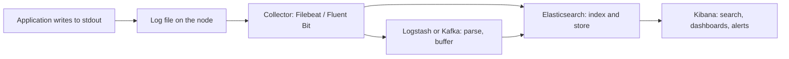
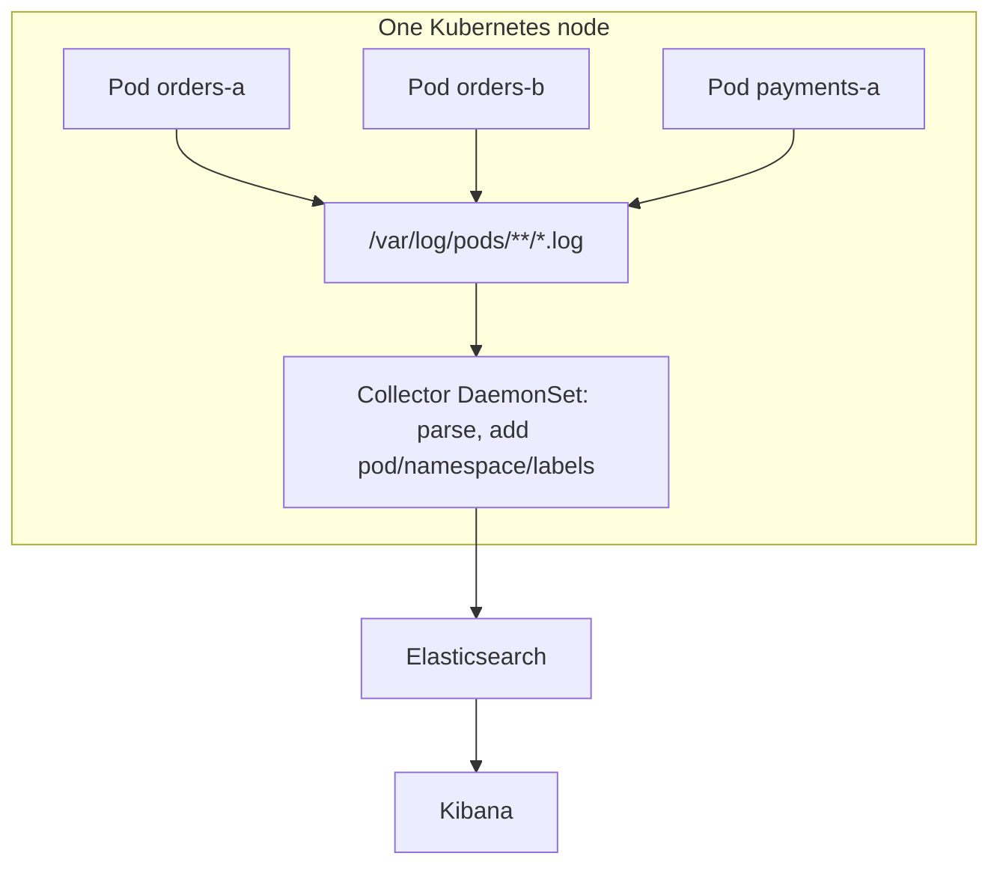
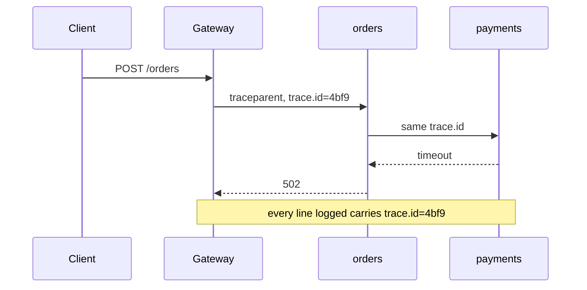

# Why Kibana Is Needed and Where Its Logs Come From

On one server, a log is a file. Something looks wrong, you `ssh` in, `tail -f
app.log`, `grep ERROR`, and you are done. That workflow is genuinely good, and it
survives exactly until the moment there is more than one machine.

Then it breaks in a specific way:

- Six services, twelve replicas. Which of the twelve handled *this* request?
- A pod restarted after the crash. The container's filesystem went with it — the
  stack trace you need no longer exists anywhere.
- The failure crossed four services. You now need four `grep`s with four terminals
  and correct clocks, correlated by hand.
- Support asks "was this failing yesterday too?" Yesterday's file has been rotated
  away.
- The people who most need to read the logs — QA, support, an on-call developer —
  are the ones who should not have shell access to production.

Kibana exists because searching a distributed system's logs is a different problem
from reading a file, and because production access and log access should not be
the same permission.

## Kibana Is a Window, Not a Warehouse

The single most common mistake in this answer is saying "the application sends its
logs to Kibana." It never does. Kibana stores nothing and collects nothing. It is
a browser UI that issues queries to **Elasticsearch** and draws the results.

Four separate jobs, four separate pieces:

| Job | Who does it |
| --- | --- |
| Produce the line | your application, nginx, the database, the ingress |
| Collect, parse, enrich, ship | Filebeat, Fluent Bit, Fluentd, Vector, Logstash |
| Store and index | Elasticsearch (or OpenSearch) |
| Search and visualize | Kibana |

That is the "ELK stack" (Elasticsearch, Logstash, Kibana), nowadays more often
"Elastic Stack" with Beats instead of a Logstash on every host.



The optional middle box matters in interviews: a collector can ship straight to
Elasticsearch, and many setups do. Logstash is added when you need heavier parsing
or enrichment; [Kafka](topic:kafka-vs-rabbitmq) is added as a buffer so a burst of
logs, or an Elasticsearch upgrade, does not lose data or push back on the nodes.

## Where the Logs Actually Come From

Follow one line from `log.error(...)` to your browser.

**1. The application writes to stdout, not to a file.** In a container this is the
rule, not a preference: a file inside the container is invisible from outside,
disappears when the pod is replaced, and quietly fills the writable layer. So the
Logback/Log4j2 configuration in a
[containerized Spring Boot app](topic:spring-boot-docker-image) uses a console
appender, and the process's only job is to print a line.

**2. The container runtime captures stdout to a file on the node.** containerd or
Docker writes each line, wrapped in its own JSON envelope with a timestamp and the
stream (`stdout`/`stderr`), to something like
`/var/log/pods/<ns>_<pod>_<uid>/<container>/0.log`. This is also exactly what
`kubectl logs` reads — which is why it can only show you the current and previous
container of a pod that still exists.

**3. A collector tails those files.** In [Kubernetes](topic:why-kubernetes) it runs
as a DaemonSet: one agent per node, mounting the host's log directory. It does the
work that turns a text line into a searchable document — parses the JSON envelope,
optionally parses your own JSON message, stitches multiline stack traces back into
one event, and enriches each record with pod name, namespace, container, node and
the pod's labels. That enrichment is why you can later filter by
`kubernetes.labels.app: orders` without your application knowing anything about
Kubernetes.

**4. It ships to Elasticsearch**, directly or through Logstash/Kafka.

**5. Elasticsearch indexes it** into a time-based index or data stream
(`logs-orders-2026.07.28`), building an inverted index over the fields so that a
full-text query over a day of logs returns in milliseconds instead of scanning.

**6. Kibana points at those indices** through a data view and gives you Discover,
KQL queries, filters, dashboards and alerts.



Two things this picture makes obvious. First, the same node agent picks up
*everything* on the node — your services, the ingress controller's access logs,
sidecars — which is why an ingress access log and an application error end up
side by side in one search. Second, sources outside the cluster (a managed
database's logs, a cloud load balancer, journald on a VM) reach the same
Elasticsearch through their own shippers; Kibana does not care where a document
came from.

**The direct-appender alternative.** A Logstash TCP/HTTP appender can push from
inside the JVM with no file involved. It is tempting and occasionally right, but
it couples your request threads to the logging backend: when the socket blocks or
the buffer fills you either block the application or drop logs, and anything not
yet flushed dies with the process. The file-tail path decouples the two, which is
why it is the default.

## Structured Logs Are What Make Kibana Useful

A line like `2026-07-28 14:03:11 ERROR Order 42 failed for user 7` is fine for a
human and poor for a search engine — everything is one `message` string, and
finding "all errors of the orders service" means a brittle grok regex somewhere in
the pipeline.

Log JSON instead (`logstash-logback-encoder`, or an ECS layout) and each line
arrives as fields:

```json
{"@timestamp":"2026-07-28T14:03:11.412Z","log.level":"ERROR","service.name":"orders",
 "trace.id":"4bf92f3577b34da6","message":"Order 42 failed","error.type":"TimeoutException",
 "error.stack_trace":"..."}
```

Now Kibana filters are exact and cheap: `log.level: ERROR and service.name:
orders`. Anything you put in the MDC — user id, tenant, order id — becomes a
field you can pivot on.

The classic trap here is the **multiline stack trace**. Every newline is a
separate line on stdout, so an unconfigured collector turns one
[exception](topic:exception-basics) into forty documents, thirty-nine of which
have no level, no service and no timestamp of their own. Either configure the
collector's multiline rule or, better, log the stack trace as a single JSON field
so the problem cannot arise.

## Correlation IDs: One Request Across Services

Centralized search alone is not enough — you still have to know *which* lines
belong together. That is what a correlation/trace id is for: generated at the
edge (typically the [API gateway](topic:api-gateway) or the first service),
propagated on every outgoing call as a `traceparent` header, and put into the MDC
so every log line of every service carries the same `trace.id`.



One filter — `trace.id: "4bf9..."` — then returns the whole story across all
three services in timestamp order. Without it, distributed logs are centralized
but not correlated, and you are back to guessing. This is the log-aggregation and
distributed-tracing side of [microservice patterns](topic:microservice-patterns),
and it is the practical answer to "how do you debug across
[microservices](topic:why-microservices)".

## What You Actually Do in Kibana

- **Discover** — the ad-hoc query view: a time range, a KQL expression, a set of
  field filters, and the matching documents. This is 90% of incident work, and the
  reason [an endpoint that broke only in production](topic:endpoint-broken-in-prod)
  is investigable at all.
- **Dashboards** — error rate per service, slow-request counts, deploy markers;
  something to open when the pager fires rather than a query to compose under
  pressure.
- **Alerts** — a saved query with a threshold ("more than 50 `ERROR` from
  `payments` in 5 minutes → Slack").
- **Sharing** — a URL that reproduces someone else's exact query and time window;
  the reason support and QA can answer their own questions without production
  shell access.

Note what Kibana is *not* for. Logs are events with high cardinality and high
cost. Rates, latencies and saturation belong in metrics (Prometheus/Grafana);
per-request timing belongs in traces. A memory problem, for instance, is diagnosed
with metrics and a heap dump, not by reading log lines — see
[diagnosing memory growth and leaks](topic:diagnosing-memory-leaks). Logs, metrics
and traces are complements, not substitutes.

## Costs and Traps

**Volume and retention.** Every DEBUG line is stored, indexed and billed forever
unless you say otherwise. Index Lifecycle Management (hot → warm → cold → delete)
and a sane production log level are not optional refinements; they are what keeps
the cluster from becoming the most expensive component you own.

**Secrets and PII.** Logs are read by more people than your database and are
retained for months. A logged `Authorization` header leaks a
[session token or JWT](topic:jwt-vs-session-token) to everyone with Kibana access;
logged card numbers or personal data create a compliance problem. Masking belongs
in the application, before the line is written — this is the
"Security Logging and Monitoring Failures" corner of the
[OWASP Top 10](topic:owasp-top-ten).

**Log injection.** Concatenating unescaped user input into a log line lets an
attacker embed newlines and forge entries, or inject markup that a viewer renders
— the same class of thinking as
[other injection attacks](topic:injection-attacks). Structured logging with the
value in its own field removes the whole category.

**Delivery is best-effort.** A collector can be down, a buffer can overflow, a
node can die before the last lines are read, a mapping conflict can make
Elasticsearch reject a document. Logs are for diagnosis, never a system of record:
anything that must not be lost belongs in a database and, if it must reach another
system, in an [outbox](topic:outbox-pattern), not in a log line.

**Timestamps.** `@timestamp` should be when the event happened, not when it was
ingested; clock skew between nodes and a collector that stamps ingest time are the
usual reasons a trace looks like it went backwards in time.

**Field explosion.** Every distinct JSON key becomes a mapping in the index. Put a
unique id in a *key* instead of a value and you get thousands of fields and a
cluster in trouble; keep the schema stable and put variability in values.

**Synchronous appenders.** A logging call that blocks on I/O is on your request
path. Async appenders with a bounded queue keep a slow log sink from turning into
slow requests.

## 60-Second Interview Answer

> Kibana is the search and visualization UI over Elasticsearch. It is needed
> because once you have many replicas of many services in containers, `ssh` plus
> `grep` stops working: the instance that logged the error may already be gone, a
> single request touches several services, and the people who need the logs should
> not have production shell access. Kibana itself stores nothing. The logs get
> there through a pipeline: the app writes to stdout, ideally as JSON with the
> level, service name and MDC fields; the container runtime captures stdout to a
> file on the node; a collector like Filebeat or Fluent Bit — a DaemonSet, one per
> node — tails those files, joins multiline stack traces, enriches each record
> with pod, namespace and labels, and ships it to Elasticsearch, sometimes via
> Logstash or Kafka for parsing and buffering; Elasticsearch indexes it into a
> daily index, and Kibana queries that. In practice the two things that make it
> usable are structured JSON logging and a correlation id propagated across
> services, so one filter shows a whole request. And the two things to be careful
> with are retention cost and secrets in log lines.

## Common Misconceptions

- **"The application sends logs to Kibana."** The application writes to stdout. A
  collector ships to Elasticsearch. Kibana only reads. Nothing ever writes to
  Kibana.
- **"Kibana stores the logs."** Delete Kibana and no data is lost; delete
  Elasticsearch and everything is. Kibana holds only saved searches, dashboards
  and alert rules.
- **"`kubectl logs` and Kibana show the same thing."** `kubectl logs` reads the
  node file for a pod that still exists, current or previous container only. Once
  the pod is deleted, that file is gone, and Kibana is the only place with the
  history. Conversely, if the shipper is broken, `kubectl logs` may show lines
  Kibana never received.
- **"If it is not in Kibana, it did not happen."** It may never have been shipped,
  or been dropped, or been rejected on a mapping conflict, or aged out of
  retention, or simply be outside your selected time range or index pattern.
- **"Log everything at DEBUG, just in case."** You pay for storage and indexing,
  you slow the application down, and you make the useful lines harder to find. Log
  levels are a design decision, not a leftover.
- **"ELK is the only way."** Loki with Grafana, OpenSearch with OpenSearch
  Dashboards, Datadog, Splunk, and cloud-native log services solve the same
  problem; only the parts change. Kibana is one UI over one store, not the
  concept.
- **"Centralized logs mean observability."** Without a correlation id you have all
  the lines and no story; without metrics and traces you have events but no rates
  and no latencies.
- **"Writing to a file inside the container is fine, the agent will find it."**
  Only if you mount a volume and point the agent at it. By default it fills the
  container's writable layer and vanishes with the pod.
