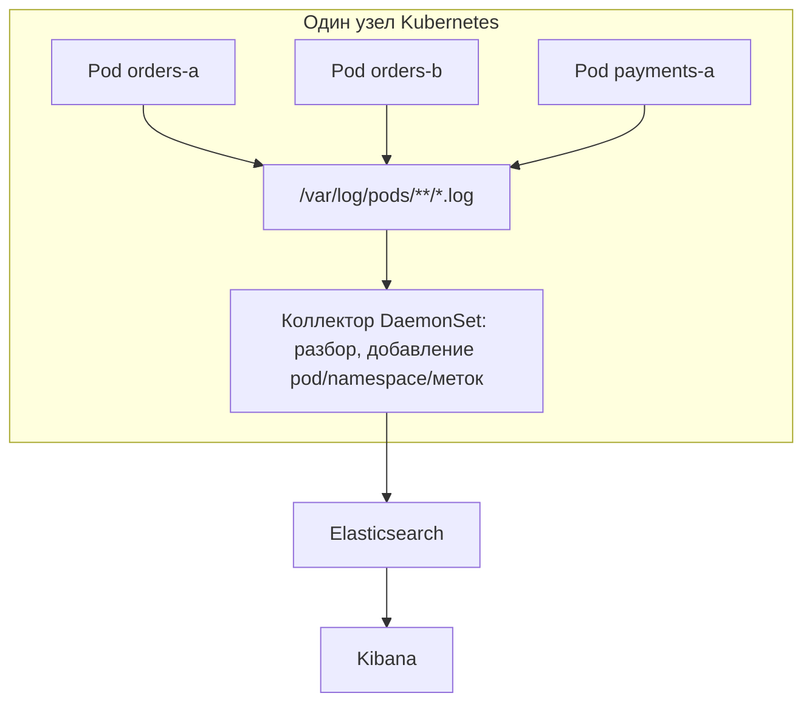
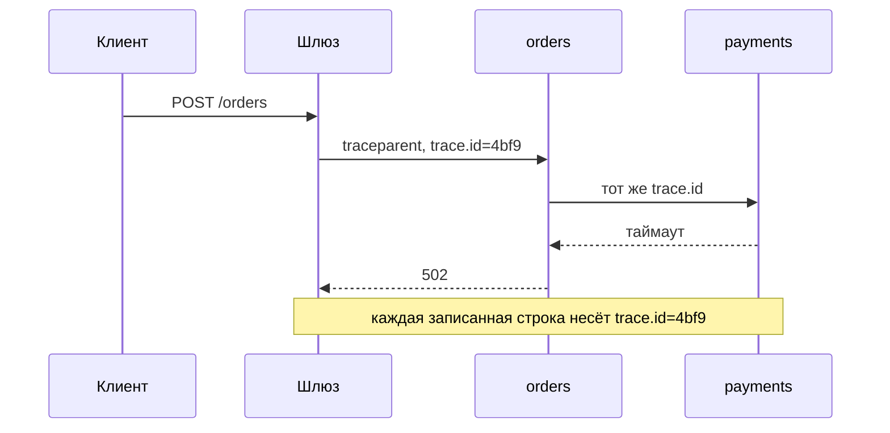

# Зачем нужна Kibana и откуда там логи

На одном сервере лог — это файл. Что-то выглядит не так: заходите по `ssh`,
делаете `tail -f app.log`, `grep ERROR` — и готово. Это по-настоящему хороший
рабочий процесс, и он живёт ровно до момента, когда машина перестаёт быть одна.

Дальше он ломается вполне конкретно:

- Шесть сервисов, двенадцать реплик. Какая из двенадцати обработала *этот* запрос?
- После падения под перезапустился. Файловая система контейнера ушла вместе с ним —
  нужного стектрейса больше нигде нет.
- Сбой прошёл через четыре сервиса. Теперь нужны четыре `grep` в четырёх
  терминалах, правильные часы и ручное сопоставление.
- Поддержка спрашивает: «а вчера это тоже падало?» Вчерашний файл уже ушёл по
  ротации.
- Те, кому логи нужнее всего — QA, поддержка, дежурный разработчик, — как раз те,
  у кого не должно быть shell-доступа в прод.

Kibana существует потому, что поиск по логам распределённой системы — это другая
задача, нежели чтение файла, и потому что доступ в прод и доступ к логам не должны
быть одним и тем же правом.

## Kibana — это окно, а не склад

Самая частая ошибка в этом ответе — сказать «приложение отправляет логи в Kibana».
Оно никогда этого не делает. Kibana ничего не хранит и ничего не собирает. Это
браузерный интерфейс, который шлёт запросы в **Elasticsearch** и рисует
результаты.

| Задача | Кто её делает |
| --- | --- |
| Породить строку | ваше приложение, nginx, база данных, ingress |
| Собрать, разобрать, обогатить, отправить | Filebeat, Fluent Bit, Fluentd, Vector, Logstash |
| Хранить и индексировать | Elasticsearch (или OpenSearch) |
| Искать и визуализировать | Kibana |

Четыре разные задачи — четыре разные части. Это и есть «стек ELK»
(Elasticsearch, Logstash, Kibana), сегодня чаще «Elastic Stack» — с Beats вместо
Logstash на каждом хосте.


Необязательный средний блок важен на собеседовании: коллектор может отправлять
прямо в Elasticsearch, и во многих установках так и сделано. Logstash добавляют,
когда нужен более тяжёлый разбор или обогащение; [Kafka](topic:kafka-vs-rabbitmq)
добавляют как буфер, чтобы всплеск логов или обновление Elasticsearch не приводили
к потере данных и не давили обратно на узлы.

## Откуда логи там берутся на самом деле

Проследим одну строку от `log.error(...)` до вашего браузера.

**1. Приложение пишет в stdout, а не в файл.** В контейнере это правило, а не
предпочтение: файл внутри контейнера не виден снаружи, исчезает при замене пода и
тихо забивает записываемый слой. Поэтому конфигурация Logback/Log4j2 в
[контейнеризованном Spring Boot приложении](topic:spring-boot-docker-image)
использует console appender, и единственная задача процесса — напечатать строку.

**2. Среда выполнения контейнеров складывает stdout в файл на узле.** containerd
или Docker пишет каждую строку, обёрнутую в собственный JSON-конверт с меткой
времени и потоком (`stdout`/`stderr`), примерно в
`/var/log/pods/<ns>_<pod>_<uid>/<container>/0.log`. Ровно это же читает и
`kubectl logs` — поэтому он способен показать только текущий и предыдущий
контейнер пода, который ещё существует.

**3. Коллектор читает эти файлы.** В [Kubernetes](topic:why-kubernetes) он
работает как DaemonSet: один агент на узел, с примонтированным каталогом логов
хоста. Он делает ту работу, которая превращает текстовую строку в документ,
пригодный для поиска: разбирает JSON-конверт, при необходимости разбирает ваше
собственное JSON-сообщение, склеивает многострочные стектрейсы обратно в одно
событие и обогащает каждую запись именем пода, namespace, контейнером, узлом и
метками пода. Именно из-за этого обогащения потом можно фильтровать по
`kubernetes.labels.app: orders`, хотя само приложение ничего не знает про
Kubernetes.

**4. Он отправляет данные в Elasticsearch** — напрямую или через Logstash/Kafka.

**5. Elasticsearch индексирует их** в индекс или data stream с привязкой ко
времени (`logs-orders-2026.07.28`), строя инвертированный индекс по полям, чтобы
полнотекстовый запрос по суткам логов возвращался за миллисекунды, а не сканировал
всё подряд.

**6. Kibana смотрит на эти индексы** через data view и даёт Discover,
KQL-запросы, фильтры, дашборды и алерты.



Эта картинка делает очевидными две вещи. Во-первых, один и тот же агент узла
подхватывает *всё* на узле — ваши сервисы, access-логи ingress-контроллера,
сайдкары, — поэтому access-лог ingress и ошибка приложения оказываются рядом в
одном поиске. Во-вторых, источники за пределами кластера (логи управляемой базы
данных, облачного балансировщика, journald на виртуалке) попадают в тот же
Elasticsearch через свои отправители; Kibana всё равно, откуда пришёл документ.

**Альтернатива — прямой appender.** Logstash TCP/HTTP appender умеет отправлять
прямо из JVM, без всякого файла. Это заманчиво и иногда уместно, но связывает ваши
запросные потоки с логовым бэкендом: когда сокет блокируется или переполняется
буфер, вы либо блокируете приложение, либо теряете логи, а всё, что не успело
уйти, умирает вместе с процессом. Путь через чтение файла разделяет эти две
стороны — поэтому он и является вариантом по умолчанию.

## Kibana полезна ровно настолько, насколько структурированы логи

Строка `2026-07-28 14:03:11 ERROR Order 42 failed for user 7` хороша для человека
и плоха для поисковой системы: всё это одна строка `message`, и поиск «все ошибки
сервиса orders» превращается в хрупкую grok-регулярку где-то в конвейере.

Логируйте JSON (`logstash-logback-encoder` или ECS-layout) — и каждая строка
приходит уже полями:

```json
{"@timestamp":"2026-07-28T14:03:11.412Z","log.level":"ERROR","service.name":"orders",
 "trace.id":"4bf92f3577b34da6","message":"Order 42 failed","error.type":"TimeoutException",
 "error.stack_trace":"..."}
```

Теперь фильтры в Kibana точные и дешёвые: `log.level: ERROR and service.name:
orders`. Всё, что вы положили в MDC — id пользователя, тенант, номер заказа, —
становится полем, по которому можно разворачивать выборку.

Классическая ловушка здесь — **многострочный стектрейс**. Каждый перевод строки —
отдельная строка в stdout, поэтому ненастроенный коллектор превращает одно
[исключение](topic:exception-basics) в сорок документов, у тридцати девяти из
которых нет ни уровня, ни имени сервиса, ни собственной метки времени. Либо
настройте у коллектора правило multiline, либо, что лучше, логируйте стектрейс
одним JSON-полем — тогда проблема просто не возникает.

## Correlation ID: один запрос через все сервисы

Одного централизованного поиска мало — нужно ещё понимать, *какие* строки
относятся друг к другу. Для этого и нужен correlation/trace id: он создаётся на
границе (обычно [API-шлюзом](topic:api-gateway) или первым сервисом), передаётся
в каждом исходящем вызове заголовком `traceparent` и кладётся в MDC, чтобы каждая
строка лога каждого сервиса несла один и тот же `trace.id`.



Один фильтр — `trace.id: "4bf9..."` — возвращает всю историю по трём сервисам в
порядке времени. Без него распределённые логи централизованы, но не
скоррелированы, и вы снова гадаете. Это та самая агрегация логов и распределённая
трассировка из [паттернов микросервисов](topic:microservice-patterns) и
практический ответ на вопрос «как вы отлаживаете
[микросервисы](topic:why-microservices)».

## Что вы реально делаете в Kibana

- **Discover** — представление для произвольных запросов: временной диапазон,
  KQL-выражение, набор фильтров по полям и подходящие документы. Это 90% работы
  на инциденте и причина, по которой
  [сломавшийся только в проде эндпоинт](topic:endpoint-broken-in-prod) вообще
  поддаётся расследованию.
- **Дашборды** — частота ошибок по сервисам, счётчики медленных запросов, отметки
  деплоев: то, что открываешь, когда сработал пейджер, вместо того чтобы
  сочинять запрос под давлением.
- **Алерты** — сохранённый запрос с порогом («больше 50 `ERROR` от `payments` за
  5 минут → Slack»).
- **Обмен ссылками** — URL, воспроизводящий чужой запрос и временное окно ровно
  таким, каким он был; благодаря этому поддержка и QA отвечают на свои вопросы
  сами, без shell-доступа в прод.

Обратите внимание, для чего Kibana *не* нужна. Логи — это события с высокой
кардинальностью и высокой стоимостью. Частоты, задержки и насыщение — это метрики
(Prometheus/Grafana); тайминги по запросу — это трейсы. Проблему с памятью,
например, диагностируют метриками и heap dump, а не чтением строк лога — см.
[диагностику роста памяти и утечек](topic:diagnosing-memory-leaks). Логи, метрики
и трейсы дополняют друг друга, а не заменяют.

## Издержки и ловушки

**Объём и хранение.** Каждая DEBUG-строка хранится, индексируется и оплачивается
вечно, пока вы не скажете иначе. Index Lifecycle Management (hot → warm → cold →
delete) и вменяемый уровень логирования в проде — не факультативные улучшения, а
то, что не даёт кластеру стать самым дорогим вашим компонентом.

**Секреты и персональные данные.** Логи читает больше людей, чем вашу базу, и
хранятся они месяцами. Записанный в лог заголовок `Authorization` утекает
[сессионным токеном или JWT](topic:jwt-vs-session-token) ко всем, у кого есть
доступ в Kibana; записанные номера карт или персональные данные создают проблему с
регуляторикой. Маскирование должно быть в приложении, до записи строки, — это тот
самый угол «Security Logging and Monitoring Failures» из
[OWASP Top 10](topic:owasp-top-ten).

**Log injection.** Склеивание неэкранированного пользовательского ввода со
строкой лога позволяет атакующему вставить переводы строк и подделать записи или
подсунуть разметку, которую отрисует просмотрщик, — это тот же класс мышления, что
и [другие инъекционные атаки](topic:injection-attacks). Структурированное
логирование, где значение лежит в отдельном поле, убирает всю категорию целиком.

**Доставка — best-effort.** Коллектор может лежать, буфер — переполниться, узел —
умереть до того, как последние строки прочитаны, конфликт маппинга — заставить
Elasticsearch отклонить документ. Логи нужны для диагностики и никогда не являются
источником истины: то, что нельзя терять, должно жить в базе данных, а если оно
должно дойти до другой системы — в [outbox](topic:outbox-pattern), а не в строке
лога.

**Метки времени.** `@timestamp` должен означать момент события, а не момент приёма;
расхождение часов между узлами и коллектор, ставящий время приёма, — обычные
причины того, что трасса выглядит идущей назад во времени.

**Взрыв числа полей.** Каждый новый JSON-ключ становится маппингом в индексе.
Положите уникальный id в *ключ* вместо значения — получите тысячи полей и кластер
в беде; держите схему стабильной, а изменчивость — в значениях.

**Синхронные appender'ы.** Вызов логирования, блокирующийся на I/O, находится на
пути вашего запроса. Асинхронные appender'ы с ограниченной очередью не дают
медленному приёмнику логов превратиться в медленные запросы.

## Ответ на собеседовании за 60 секунд

> Kibana — это интерфейс поиска и визуализации поверх Elasticsearch. Она нужна
> потому, что когда у вас много реплик многих сервисов в контейнерах, `ssh` плюс
> `grep` перестаёт работать: экземпляра, записавшего ошибку, может уже не быть,
> один запрос проходит через несколько сервисов, а тем, кому нужны логи, не
> положен shell-доступ в прод. Сама Kibana ничего не хранит. Логи попадают туда по
> конвейеру: приложение пишет в stdout, желательно JSON'ом с уровнем, именем
> сервиса и полями MDC; среда выполнения контейнеров складывает stdout в файл на
> узле; коллектор вроде Filebeat или Fluent Bit — DaemonSet, по одному на узел —
> читает эти файлы, склеивает многострочные стектрейсы, обогащает каждую запись
> подом, namespace и метками и отправляет в Elasticsearch, иногда через Logstash
> или Kafka для разбора и буферизации; Elasticsearch индексирует это в суточный
> индекс, а Kibana делает к нему запросы. На практике удобным всё это делают две
> вещи: структурированное JSON-логирование и correlation id, проброшенный через
> сервисы, чтобы один фильтр показывал весь запрос. А осторожным быть надо тоже с
> двумя вещами: со стоимостью хранения и с секретами в строках лога.

## Частые заблуждения

- **«Приложение отправляет логи в Kibana».** Приложение пишет в stdout. Коллектор
  отправляет в Elasticsearch. Kibana только читает. В Kibana никто и никогда
  ничего не пишет.
- **«Kibana хранит логи».** Удалите Kibana — данные не пропадут; удалите
  Elasticsearch — пропадёт всё. Kibana держит только сохранённые запросы, дашборды
  и правила алертов.
- **«`kubectl logs` и Kibana показывают одно и то же».** `kubectl logs` читает
  файл на узле для ещё существующего пода, только текущий или предыдущий
  контейнер. Как только под удалён, файла нет, и история остаётся только в Kibana.
  И наоборот: если сломан отправитель, `kubectl logs` может показывать строки,
  которых Kibana никогда не получала.
- **«Если этого нет в Kibana, значит, этого не было».** Возможно, это не было
  отправлено, или потеряно, или отклонено из-за конфликта маппинга, или ушло по
  сроку хранения, или просто лежит вне выбранного временного диапазона либо
  индексного шаблона.
- **«Логируйте всё на DEBUG, на всякий случай».** Вы платите за хранение и
  индексацию, замедляете приложение и делаете полезные строки труднее находимыми.
  Уровни логирования — проектное решение, а не остаточное явление.
- **«ELK — единственный вариант».** Loki с Grafana, OpenSearch с OpenSearch
  Dashboards, Datadog, Splunk и облачные сервисы логирования решают ту же задачу;
  меняются только детали. Kibana — один интерфейс над одним хранилищем, а не сама
  концепция.
- **«Централизованные логи — это и есть observability».** Без correlation id у вас
  все строки и ни одной истории; без метрик и трейсов у вас события, но нет ни
  частот, ни задержек.
- **«Писать в файл внутри контейнера нормально, агент найдёт».** Только если вы
  примонтируете том и нацелите на него агента. По умолчанию это забивает
  записываемый слой контейнера и исчезает вместе с подом.
