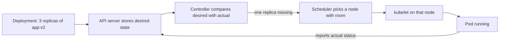
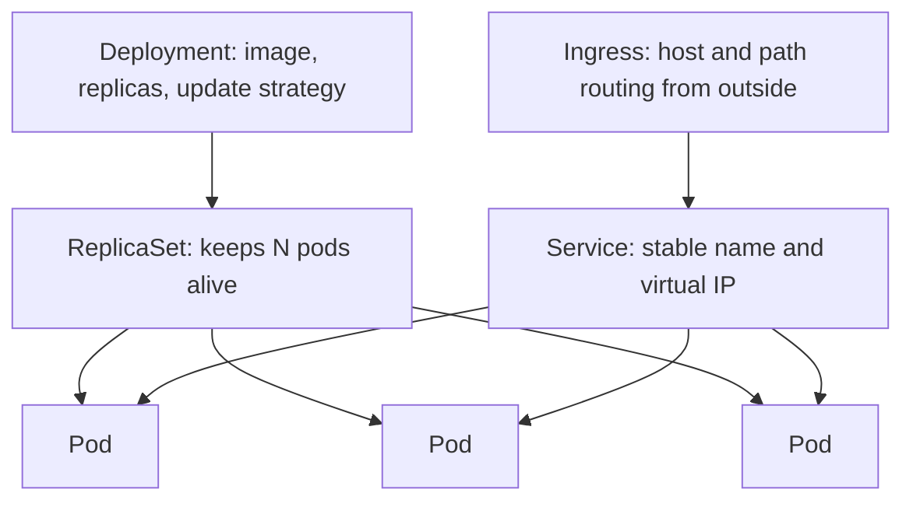
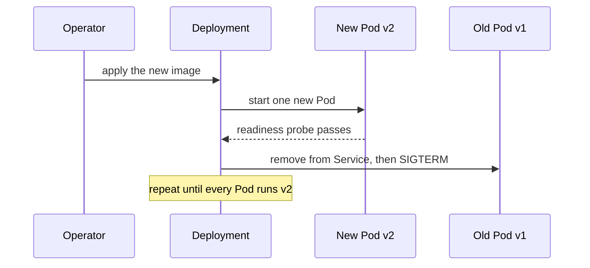

# Why Kubernetes Is Needed

Suppose you have already done the packaging work and produced a
[Docker image](topic:spring-boot-docker-image). You can now start that process on
any machine and get the same behaviour. That is a real win, and it is where the
container story stops.

It stops right before the questions that actually keep a system alive:

- The machine running your container reboots at 03:00. Who starts it again, and where?
- You want three replicas. Which of your six machines has room for them?
- Each replica gets a different IP, and they change on every restart. What does the caller connect to?
- v2 is ready. How do you replace v1 without dropping requests in flight?
- Black Friday is over. Who takes the extra replicas away?

Every team that runs containers answers these somehow — with shell scripts,
systemd units, a load balancer config updated by hand, a wiki page describing
which service lives on which VM. Kubernetes is what you get when that answer is
written once, as a product, instead of once per company.

## The One Idea: Declarative Desired State

Almost everything Kubernetes does follows from a single mechanism. You do not
tell it to *do* things ("start a container on node 4"). You tell it what should
be *true*: this image, three replicas, 512Mi of memory each, this health check.
That desired state goes into the API server, and a set of controllers runs an
endless loop — read desired state, read actual state, act on the difference.

This is the sentence to lead with in an interview, because the rest of the answer
is consequences of it. A crashed container is a difference between desired and
actual, so it is restarted. A dead node means its pods are gone, so they are
recreated elsewhere. Scaling from 3 to 10 is not an operation, it is an edit to a
number. Rollback is not a script, it is re-submitting the previous desired state.

## What You Actually Get

**Scheduling.** You stop deciding which service lives on which machine. You
declare what a pod needs (CPU, memory, a GPU, a node label) and the scheduler
packs pods onto nodes that can satisfy it. Adding a node adds capacity to
everything at once.

**Self-healing.** The kubelet restarts a container that exits or fails its
liveness probe. If the whole node disappears, the controller recreates its pods
somewhere else. Nobody is paged for a single crashed process.

**Service discovery and load balancing.** Pod IPs are ephemeral, so you never use
them. A Service gives a group of pods one stable DNS name (`orders`) and one
virtual IP, and spreads traffic over whichever pods are currently ready. This
matters far more once a system is split into
[microservices](topic:why-microservices) and the set of callable addresses stops
being something a human can maintain.

**Rolling updates and rollback.** A Deployment replaces pods gradually — start a
new one, wait for it to report ready, only then take an old one out of the
Service. If the new version never becomes ready, the rollout stalls instead of
taking the service down, and `kubectl rollout undo` puts the old spec back.

**Selective scaling.** A HorizontalPodAutoscaler adds and removes replicas based
on CPU or a custom metric, so the one hot service grows and the rest stay as they
are. This is the concrete mechanism behind most of what you would say when
[scaling an overloaded server](topic:scaling-an-overloaded-server) — and, like
there, it only works for a stateless service.

**Configuration and secrets.** ConfigMaps and Secrets are injected as environment
variables or mounted files, so the same image runs in dev, staging and prod with
different configuration. On the Spring side that lands in the ordinary property
resolution order — see
[which wins, properties or environment variables](topic:spring-config-property-precedence)
and [how a property name becomes an environment variable](topic:env-var-property-naming).

**Resource governance.** `requests` tell the scheduler how much a pod needs
(and reserve it); `limits` are the ceiling the runtime enforces. Two different
jobs, and confusing them is one of the classic traps below.

## The Vocabulary

You are expected to be fluent in a handful of objects, no more.

A **Pod** is the unit of scheduling: one or more containers that share a network
namespace and are always placed together. A **Deployment** describes the desired
version and replica count and owns a **ReplicaSet** per version — which is why
rollback is cheap. A **Service** is the stable front door for a changing set of
pods; an **Ingress** routes outside HTTP traffic to Services by host and path. A
**ConfigMap**/**Secret** carries configuration, a **Namespace** partitions a
cluster, and a **StatefulSet** is the variant for pods that need a stable
identity and their own storage — databases, brokers, anything where replica 0 is
not interchangeable with replica 1.

## Probes and Graceful Shutdown: Where Zero Downtime Really Comes From

The rollout guarantee is only as good as the signals the application gives.

- **Readiness probe** — "can I serve traffic right now?" Failing it removes the
  pod from the Service endpoints but does not restart it. This is what makes a
  rolling update safe: a Spring Boot app that needs 20 seconds to build its
  context must not receive requests during those 20 seconds.
- **Liveness probe** — "am I unrecoverably stuck?" Failing it restarts the
  container. Point it at something cheap; if you point it at a health check that
  touches the database, a slow database restarts every pod you have.
- **Startup probe** — protects a slow starter from the liveness probe until it
  has finished booting.

Shutdown is the mirror image. Kubernetes sends `SIGTERM`, waits
`terminationGracePeriodSeconds` (30 by default), then `SIGKILL`. If the process
exits immediately on `SIGTERM`, in-flight requests die with it — which is
precisely the "we have zero-downtime deploys" claim failing in production. Spring
Boot handles this with `server.shutdown=graceful` and the Actuator liveness and
readiness endpoints.

## What Kubernetes Does Not Do

This half of the answer is what separates a memorised list from experience.

It does not make an application correct under concurrency, and it does not give
you retries, timeouts or circuit breakers between your services — those stay an
application concern, or a service-mesh one; see
[timeouts, fallbacks and circuit breakers](topic:service-timeouts-fallbacks).

An Ingress is host/path routing and TLS termination. It is not an
[API gateway](topic:api-gateway): no auth, rate limiting, aggregation or protocol
translation unless you install something that provides them.

It does not fix your data layer. Ten replicas of a stateless service in front of
one Postgres instance move the bottleneck; they do not remove it.

And it does not choose how your services talk to each other — sync or async,
queue or broker, all of that is unchanged; see
[options for inter-service communication](topic:inter-service-communication-options)
and the broader [microservice patterns](topic:microservice-patterns).

## When You Do Not Need It

Kubernetes is an operational commitment, not just a runtime. You take on YAML and
templating, ingress and certificates, RBAC, cluster and node upgrades, an
observability stack, and a much larger failure surface — the cluster itself can
now be the thing that is broken.

For one or two services, a small team and no dedicated operations capacity, a
managed container platform, a PaaS, or two VMs behind a load balancer is very
often the better answer, and saying so is a stronger interview answer than
reciting features. The honest threshold is roughly: enough services or enough
release frequency that placement, discovery and rollout have become manual work
someone does by hand and occasionally gets wrong.

## 60-Second Interview Answer

> A container image makes one process reproducible, but it says nothing about
> where that process runs, what happens when its host dies, what address callers
> use, or how a new version replaces the old one. Kubernetes owns exactly that
> layer. Its core idea is declarative desired state: I describe the image,
> replica count, resources and health checks, and controllers continuously
> reconcile reality with that description. From that one mechanism I get
> scheduling onto nodes, self-healing, a stable Service name in front of
> ephemeral pod IPs, rolling updates gated by readiness probes with a one-command
> rollback, horizontal autoscaling of just the hot service, and configuration
> injected per environment. What it does not give me is application-level
> resilience, an API gateway, or a scalable database — and it costs real
> operational effort, so for a couple of services I would use a managed platform
> and reach for Kubernetes once placement, discovery and rollouts have become
> manual work.

## Common Misconceptions

- **"Kubernetes replaces Docker."** It orchestrates containers rather than
  building them. It dropped the dockershim in v1.24 and talks to containerd or
  CRI-O through the CRI, but those still run the OCI images your Docker build
  produces. Your Dockerfile is unaffected.
- **"Put it on Kubernetes and it scales."** The autoscaler adds pods. If all of
  them write to one database, or the service keeps session state in local memory,
  more pods make things worse. Statelessness is a prerequisite, not a result.
- **"Self-healing means the bug is handled."** A restart resets the symptom and
  hides the cause; `CrashLoopBackOff` and a pod restarting every eleven minutes is
  a diagnosis to make, not a system working as intended — see
  [diagnosing memory growth and leaks](topic:diagnosing-memory-leaks).
- **"requests and limits are the same knob."** `requests` are what the scheduler
  reserves; `limits` are what the runtime enforces. Requesting far less than you
  use gets you scheduled onto a node that cannot hold you; setting a limit too
  low gets the container killed under load.
- **"A JVM sees the container's memory limit as its heap."** Modern JVMs are
  container-aware, but the default is about a quarter of the limit, so most of
  your 1Gi sits unused. Exceeding the limit is not an `OutOfMemoryError` either —
  the kernel kills the process, and you see exit code 137 with no stack trace.
  Set `-XX:MaxRAMPercentage` and leave headroom for non-heap memory; the
  [garbage collector configuration](topic:gc-configuration) is still yours to
  choose.
- **"Rolling updates are zero-downtime by default."** Only with an honest
  readiness probe and a graceful `SIGTERM` handler. Without them the rollout
  swaps pods that are not ready yet and kills pods still serving requests.
- **"It is only for microservices."** A single monolith on Kubernetes still gets
  self-healing, rollouts, rollback and autoscaling. The value is deployment and
  operations automation, which is orthogonal to how many services you have.
