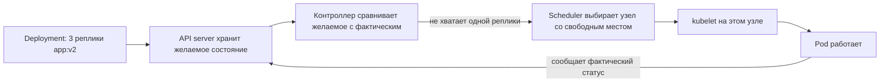
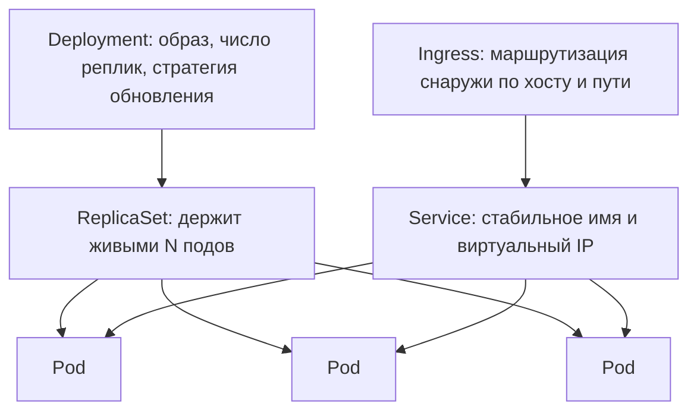
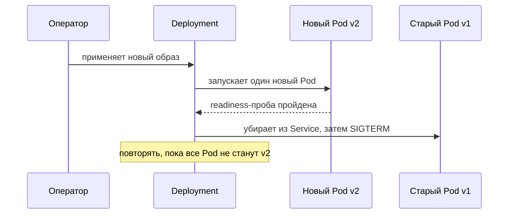

# Зачем нужен Kubernetes

Допустим, работа по упаковке уже сделана и есть готовый
[Docker-образ](topic:spring-boot-docker-image). Теперь этот процесс можно
запустить на любой машине и получить одинаковое поведение. Это настоящая победа —
и на этом история контейнера заканчивается.

Заканчивается ровно перед вопросами, от которых на самом деле зависит живучесть
системы:

- Машина с вашим контейнером перезагрузилась в 03:00. Кто и где запустит его снова?
- Вам нужны три реплики. На какой из шести машин для них есть место?
- У каждой реплики свой IP, и он меняется при каждом перезапуске. Куда подключается вызывающая сторона?
- v2 готова. Как заменить v1, не потеряв запросы в полёте?
- «Чёрная пятница» закончилась. Кто уберёт лишние реплики?

Каждая команда, которая работает с контейнерами, как-то на это отвечает:
shell-скриптами, юнитами systemd, конфигом балансировщика, который правят руками,
страницей в вики о том, какой сервис живёт на какой виртуалке. Kubernetes — это
то, что получается, когда такой ответ написан один раз как продукт, а не по разу
в каждой компании.

## Одна идея: декларативное желаемое состояние

Почти всё, что делает Kubernetes, вытекает из одного механизма. Вы не приказываете
ему *выполнить* действие («запусти контейнер на узле 4»). Вы описываете, что должно
быть *истинным*: этот образ, три реплики, по 512Mi памяти, такая проверка здоровья.
Это желаемое состояние попадает в API server, и набор контроллеров крутит
бесконечный цикл: прочитать желаемое состояние, прочитать фактическое, устранить
разницу.

Именно с этой фразы стоит начинать ответ на собеседовании, потому что всё
остальное — её следствия. Упавший контейнер — это расхождение между желаемым и
фактическим, поэтому он перезапускается. Смерть узла означает, что его подов
больше нет, поэтому они пересоздаются в другом месте. Масштабирование с 3 до 10 —
не операция, а правка числа. Откат — не скрипт, а повторная отправка предыдущего
желаемого состояния.

## Что вы получаете на практике

**Размещение (scheduling).** Вы перестаёте решать, какой сервис живёт на какой
машине. Вы объявляете, что нужно поду (CPU, память, GPU, метка узла), а scheduler
раскладывает поды по узлам, которые это могут дать. Добавление узла сразу
добавляет ёмкость всему.

**Самовосстановление.** kubelet перезапускает контейнер, который завершился или не
прошёл liveness-пробу. Если исчез весь узел, контроллер пересоздаёт его поды в
другом месте. Никого не поднимают ночью из-за одного упавшего процесса.

**Обнаружение сервисов и балансировка.** IP подов эфемерны, поэтому ими не
пользуются. Service даёт группе подов одно стабильное DNS-имя (`orders`) и один
виртуальный IP и распределяет трафик по тем подам, которые сейчас готовы. Это
становится куда важнее, когда система разбита на
[микросервисы](topic:why-microservices) и множество вызываемых адресов перестаёт
быть тем, что человек способен поддерживать вручную.

**Плавные обновления и откат.** Deployment заменяет поды постепенно: запустить
новый, дождаться его готовности и только потом вывести старый из Service. Если
новая версия так и не становится готовой, выкатка останавливается вместо того,
чтобы уронить сервис, а `kubectl rollout undo` возвращает прежнюю спецификацию.

**Выборочное масштабирование.** HorizontalPodAutoscaler добавляет и убирает
реплики по CPU или произвольной метрике, поэтому растёт один нагруженный сервис, а
остальные остаются как есть. Это конкретный механизм за большей частью того, что
говорят про [перегруженный сервер и его масштабирование](topic:scaling-an-overloaded-server), —
и, как и там, он работает только для сервиса без состояния.

**Конфигурация и секреты.** ConfigMap и Secret подставляются как переменные
окружения или смонтированные файлы, поэтому один и тот же образ работает в dev,
staging и prod с разной конфигурацией. Со стороны Spring это ложится в обычный
порядок разрешения свойств — см.
[что важнее: properties или переменные окружения](topic:spring-config-property-precedence)
и [как имя свойства превращается в переменную окружения](topic:env-var-property-naming).

**Управление ресурсами.** `requests` говорят планировщику, сколько поду нужно (и
резервируют это), `limits` — потолок, который принудительно соблюдает среда
выполнения. Это две разные задачи, и их путаница — одна из классических ловушек
ниже.

## Словарь

От вас ждут свободного владения небольшим набором объектов, не больше.

**Pod** — единица размещения: один или несколько контейнеров, которые делят
сетевое пространство имён и всегда размещаются вместе. **Deployment** описывает
желаемую версию и число реплик и владеет отдельным **ReplicaSet** на каждую
версию — поэтому откат и стоит так дёшево. **Service** — стабильная входная дверь
к меняющемуся набору подов; **Ingress** маршрутизирует внешний HTTP-трафик к
Service по хосту и пути. **ConfigMap**/**Secret** несут конфигурацию,
**Namespace** делит кластер на части, а **StatefulSet** — вариант для подов,
которым нужны устойчивая идентичность и собственное хранилище: базы данных,
брокеры, всё, где реплика 0 не взаимозаменяема с репликой 1.

## Пробы и корректное завершение: откуда на самом деле берётся zero downtime

Гарантия выкатки ровно настолько хороша, насколько честны сигналы, которые подаёт
приложение.

- **Readiness-проба** — «могу ли я обслуживать трафик прямо сейчас?». Её провал
  убирает под из endpoints Service, но не перезапускает его. Именно это делает
  плавное обновление безопасным: приложению Spring Boot, которому нужно 20 секунд
  на поднятие контекста, нельзя отдавать запросы эти 20 секунд.
- **Liveness-проба** — «я безнадёжно завис?». Её провал перезапускает контейнер.
  Направляйте её на что-то дешёвое: если направить её на health check, который
  ходит в базу, медленная база перезапустит вам все поды разом.
- **Startup-проба** — защищает медленно стартующее приложение от liveness-пробы,
  пока оно не закончило загрузку.

Завершение — зеркальная половина. Kubernetes посылает `SIGTERM`, ждёт
`terminationGracePeriodSeconds` (по умолчанию 30), затем шлёт `SIGKILL`. Если
процесс завершается по `SIGTERM` мгновенно, запросы в полёте умирают вместе с
ним — именно так заявление «у нас деплой без простоя» разваливается в проде.
В Spring Boot за это отвечают `server.shutdown=graceful` и эндпоинты liveness и
readiness в Actuator.

## Чего Kubernetes не делает

Эта половина ответа и отличает заученный список от опыта.

Он не делает приложение корректным при конкурентном доступе и не даёт вам
повторов, таймаутов и circuit breaker'ов между вашими сервисами — это остаётся
заботой приложения или service mesh; см.
[таймауты, запасные варианты и circuit breaker](topic:service-timeouts-fallbacks).

Ingress — это маршрутизация по хосту и пути плюс терминация TLS. Это не
[API gateway](topic:api-gateway): ни аутентификации, ни ограничения частоты
запросов, ни агрегации, ни трансляции протоколов, пока вы не поставите что-то,
что их предоставляет.

Он не чинит ваш слой данных. Десять реплик сервиса без состояния перед одним
экземпляром Postgres переносят узкое место, но не убирают его.

И он не выбирает за вас, как сервисы общаются между собой: синхронно или
асинхронно, очередь или брокер — всё это остаётся прежним; см.
[варианты настройки взаимодействия между сервисами](topic:inter-service-communication-options)
и более широкие [паттерны микросервисов](topic:microservice-patterns).

## Когда он вам не нужен

Kubernetes — это не только среда выполнения, но и эксплуатационное обязательство.
Вы берёте на себя YAML и шаблонизацию, ingress и сертификаты, RBAC, обновления
кластера и узлов, стек наблюдаемости и заметно большую поверхность отказа: теперь
сломанным может оказаться и сам кластер.

Для одного-двух сервисов, маленькой команды и без выделенных сил на эксплуатацию
управляемая контейнерная платформа, PaaS или две виртуалки за балансировщиком
очень часто оказываются лучшим ответом, и сказать это на собеседовании сильнее,
чем перечислить возможности. Честный порог примерно такой: сервисов или релизов
стало столько, что размещение, обнаружение и выкатка превратились в ручную работу,
которую кто-то делает руками и иногда ошибается.

## Ответ за 60 секунд

> Образ контейнера делает воспроизводимым один процесс, но ничего не говорит о
> том, где этот процесс работает, что будет при отказе его хоста, по какому
> адресу к нему обращаются и как новая версия сменит старую. Kubernetes отвечает
> ровно за этот слой. Его основная идея — декларативное желаемое состояние: я
> описываю образ, число реплик, ресурсы и проверки здоровья, а контроллеры
> непрерывно приводят реальность к этому описанию. Из одного этого механизма
> получаются размещение по узлам, самовосстановление, стабильное имя Service
> перед эфемерными IP подов, плавные обновления по readiness-пробам с откатом в
> одну команду, горизонтальное автомасштабирование именно нагруженного сервиса и
> конфигурация, подставляемая под окружение. Чего он не даёт — устойчивости на
> уровне приложения, API gateway и масштабируемой базы данных, — и он стоит
> реальных усилий на эксплуатацию, поэтому ради пары сервисов я взял бы
> управляемую платформу, а к Kubernetes пришёл бы тогда, когда размещение,
> обнаружение и выкатки стали ручной работой.

## Частые заблуждения

- **«Kubernetes заменяет Docker».** Он оркеструет контейнеры, а не собирает их. В
  версии 1.24 из него убрали dockershim, и он общается с containerd или CRI-O
  через CRI, но те по-прежнему запускают OCI-образы, собранные вашим Docker.
  Ваш Dockerfile это никак не затрагивает.
- **«Положили в Kubernetes — значит, масштабируется».** Автомасштабирование
  добавляет поды. Если все они пишут в одну базу или сервис держит состояние
  сессии в локальной памяти, от лишних подов станет только хуже. Отсутствие
  состояния — это предусловие, а не результат.
- **«Самовосстановление означает, что баг обработан».** Перезапуск сбрасывает
  симптом и прячет причину; `CrashLoopBackOff` и под, перезапускающийся каждые
  одиннадцать минут, — это диагноз, который надо поставить, а не система,
  работающая как задумано; см.
  [диагностику роста памяти и утечек](topic:diagnosing-memory-leaks).
- **«requests и limits — одна и та же ручка».** `requests` — то, что резервирует
  планировщик, `limits` — то, что принудительно соблюдает среда выполнения. Если
  запросить сильно меньше, чем потребляете, вас разместят на узле, который вас не
  вмещает; если поставить слишком низкий лимит, контейнер убьют под нагрузкой.
- **«JVM видит лимит памяти контейнера как свою кучу».** Современные JVM знают о
  контейнерах, но по умолчанию берут около четверти лимита, поэтому большая часть
  ваших 1Gi простаивает. И превышение лимита — это не `OutOfMemoryError`: процесс
  убивает ядро, а вы видите код выхода 137 без стектрейса. Задавайте
  `-XX:MaxRAMPercentage` и оставляйте запас на память вне кучи;
  [настройка сборщика мусора](topic:gc-configuration) при этом всё так же на вас.
- **«Плавные обновления по умолчанию идут без простоя».** Только при честной
  readiness-пробе и корректной обработке `SIGTERM`. Без них выкатка подставляет
  поды, которые ещё не готовы, и убивает поды, которые ещё обслуживают запросы.
- **«Это только для микросервисов».** Один монолит в Kubernetes точно так же
  получает самовосстановление, выкатки, откат и автомасштабирование. Ценность — в
  автоматизации деплоя и эксплуатации, а она не зависит от количества сервисов.
