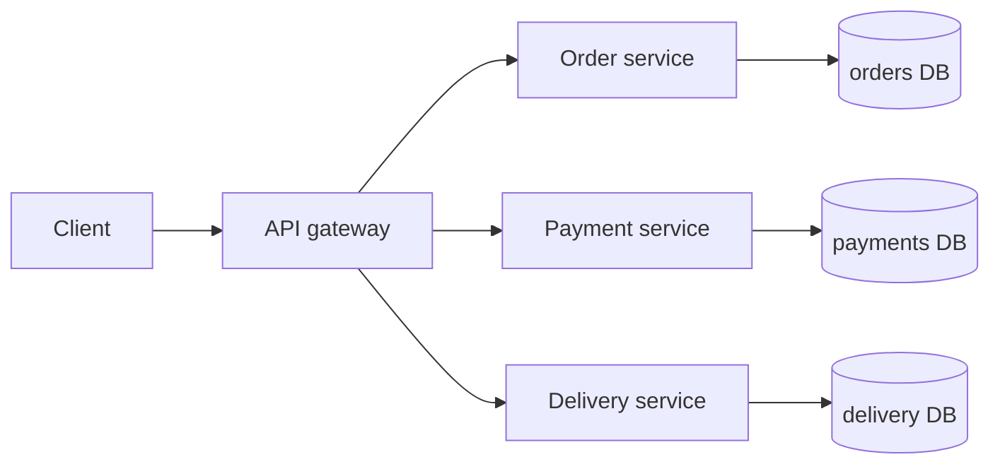
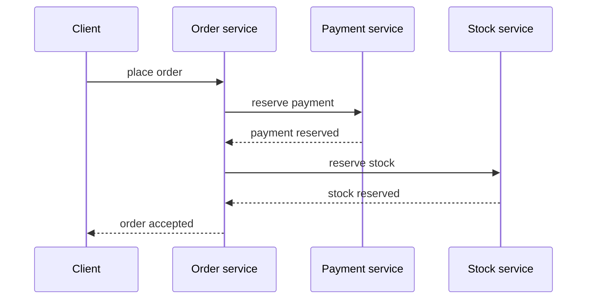

# Why Microservices Are Used

Microservices are an architectural style where one product is split into several
small services, each owning a clear business capability and deployed
independently. Think of a city post office: parcel sorting, address validation,
payments, and delivery are separate counters. Each counter has a clear job, but
the customer still expects one working service.

The goal is not "many small apps" by itself. The goal is to let different parts
of a system change, scale, fail, and be owned independently when the business has
grown enough for those separations to matter. In a restaurant kitchen, the grill
station and dessert station can work at different speeds without blocking every
plate, but the whole kitchen still needs coordination.

## What Microservices Buy You

**Independent deployment.** If the payment rules change, the payment service can
be released without rebuilding and redeploying the whole system. That reduces
release coordination when many teams work in parallel. It is like replacing one
checkout counter in a supermarket while the bakery and pharmacy stay open.

**Team autonomy.** A service can be owned by the team responsible for that
business area: orders, payments, delivery, notifications. This makes ownership
visible and reduces "everyone touches everything" conflicts. In a post office,
the parcel team improves parcel flow without asking the passport desk to change
its process.

**Selective scaling.** If search or order tracking receives much more traffic
than profile editing, only that service can get more instances. This helps when
load is uneven. It is like opening more coffee machines in the morning rush
instead of hiring more people for every station.

**Fault isolation.** A broken recommendation service should not necessarily take
down checkout. Good microservice systems use timeouts, retries, circuit breakers,
queues, and fallbacks so failure stays local. Like traffic lights, one blocked
street should slow a route, not freeze the whole city.

**Clear boundaries.** A service boundary can protect a domain model and database.
For example, an order service should not let every other service update its order
tables directly. This is similar to a warehouse: other departments request stock,
but they do not walk in and rearrange shelves themselves. If the topic is data
modeling, compare this with [database design](topic:database-request-product-service-design)
and [database normalization](topic:database-normalization).

## The Price You Pay

Microservices turn local method calls into network calls. Network calls can time
out, fail halfway, arrive twice, or arrive out of order. In a kitchen, shouting an
instruction across rooms is slower and easier to misunderstand than speaking to
the cook next to you.

Data consistency becomes harder. A monolith can often update several tables in
one local [ACID](topic:acid-principles) transaction. Microservices usually avoid
cross-service database writes and use messages, sagas, compensation, or eventual
consistency. Patterns such as the [Outbox pattern](topic:outbox-pattern) and
[Inbox pattern](topic:inbox-pattern) help make message delivery reliable. It is
like sending a registered letter: you need a receipt, and the receiver may process
it later, not at the exact moment you posted it.

Operations become more demanding. You need service discovery, configuration,
monitoring, tracing, log correlation, deployment automation, and clear API
versioning. A single food truck can run with a notebook; a chain of kitchens
needs inventory systems, shift schedules, and health checks.

Testing also changes. Unit tests are not enough because many bugs appear at
service boundaries: wrong JSON shape, timeout behavior, incompatible versions, or
duplicate messages. It is like testing each traffic light on a workbench and
still needing to test the intersection during rush hour.

## When Microservices Make Sense

Microservices make sense when the system is large enough that one deployable unit
slows teams down, business capabilities are reasonably clear, and different parts
have different scaling or reliability needs. A delivery marketplace, for example,
may need separate work streams for matching, payments, courier tracking, and
notifications. That is like a busy airport: check-in, baggage, security, and
boarding need separate teams because one giant desk would become the bottleneck.

They also help when teams can own production responsibility. A service team must
own its code, APIs, data, metrics, alerts, and incidents. Otherwise the system
gets the disadvantages of distribution without the ownership benefit. In a
restaurant, splitting stations only works if each station knows what "done" means
and can fix its own queue.

Messaging is common in microservice systems because services often communicate
asynchronously. Choosing between a log-style broker and a queue-style broker is a
separate design decision; see [Kafka vs RabbitMQ](topic:kafka-vs-rabbitmq). The
analogy is postal mail versus a dispatch desk: both move work, but they optimize
for different workflows.

## When a Monolith Is Better

A modular monolith is often better for a small team, a young product, or a domain
whose boundaries are still changing. You can keep strong module boundaries inside
one deployable application and split later when the boundaries prove stable. It
is like starting with one well-organized kitchen before renting five separate
kitchens across town.

Microservices are also a poor fit when the team lacks deployment automation,
observability, or experience operating distributed systems. Without those, every
small feature can become a coordination exercise. It is like opening many service
counters without queue numbers, signs, or radios.

## 60-Second Interview Answer

> Microservices are useful when a large system needs independently deployable,
> independently owned services around clear business capabilities. They help
> teams release separately, scale hot parts selectively, isolate failures, and
> keep domain boundaries explicit. But they are not a default upgrade from a
> monolith: they add network failures, distributed data consistency, observability,
> testing, deployment, and versioning complexity. For a small product or unclear
> domain, I would start with a modular monolith. I would choose microservices when
> team size, release cadence, scaling needs, and operational maturity justify the
> distributed-system cost.

## Common Misconceptions

- "Microservices are always faster." Often they are slower per request because a
  method call becomes a network call. They may scale better operationally, but
  individual flows can get more latency. Like using several counters in a post
  office: total throughput may improve, but a customer may stand in more than one
  line.
- "Each table should become a service." A service should represent a business
  capability, not a database table. Splitting by table is like giving every
  kitchen shelf its own manager.
- "Microservices remove coupling." They move coupling from code calls into APIs,
  events, schemas, deployment order, and data contracts. It is still coordination,
  just with written forms instead of hallway conversations.
- "A shared database is fine if services are small." Shared writes through one
  database often recreate a distributed monolith. It is like separate restaurant
  stations all editing the same order board with no ownership rules.
- "Eventual consistency means unreliable." It means different services may become
  consistent later through controlled messages and retries. Done well, it is like
  registered mail with tracking, not a lost note.
