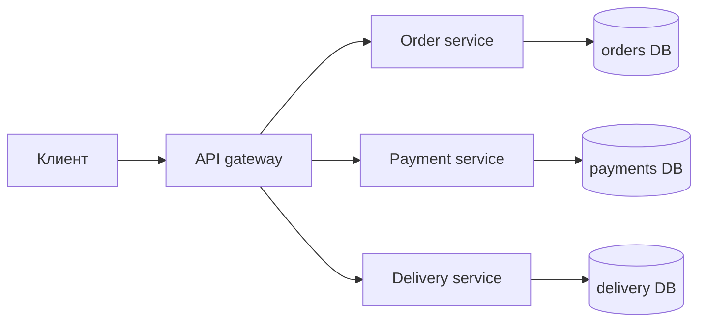
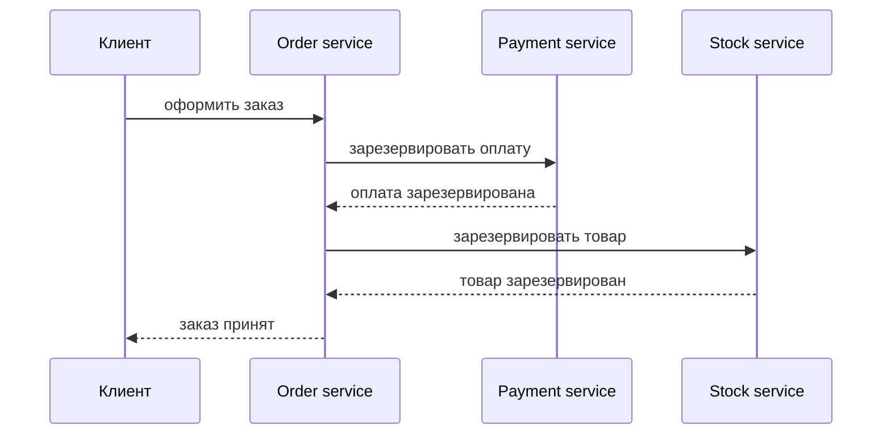

# Зачем нужны микросервисы

Микросервисы — это архитектурный стиль, в котором один продукт делят на несколько
небольших сервисов: каждый владеет понятной бизнес-возможностью и разворачивается
независимо. Представьте городское почтовое отделение: сортировка посылок,
проверка адресов, платежи и доставка работают как отдельные окна. У каждого окна
своя задача, но клиент всё равно ждёт один работающий сервис.

Цель не в том, чтобы получить «много маленьких приложений». Цель — позволить
разным частям системы меняться, масштабироваться, отказывать и принадлежать
разным командам независимо, когда бизнес уже вырос до такой необходимости. На
кухне ресторана гриль и десерты могут работать с разной скоростью и не блокировать
каждую тарелку, но всей кухне всё равно нужна координация.

## Что дают микросервисы

**Независимое развёртывание.** Если меняются правила оплаты, payment service
можно выпустить без пересборки и redeploy всей системы. Это снижает координацию
релизов, когда параллельно работают много команд. Это похоже на замену одного
кассового окна в супермаркете, пока пекарня и аптека продолжают работать.

**Автономия команд.** Сервисом может владеть команда, отвечающая за конкретную
бизнес-область: заказы, платежи, доставка, уведомления. Так владение становится
видимым и уменьшается конфликт «все трогают всё». На почте команда посылок
улучшает поток посылок, не заставляя паспортное окно менять свой процесс.

**Выборочное масштабирование.** Если поиск или трекинг заказа получает намного
больше трафика, чем редактирование профиля, больше instances можно дать только
этому сервису. Это полезно при неравномерной нагрузке. Как утром открыть больше
кофемашин, а не нанимать больше людей на каждую станцию.

**Изоляция отказов.** Сломанный сервис рекомендаций не должен обязательно
ронять checkout. Хорошая микросервисная система использует timeouts, retries,
circuit breakers, очереди и fallbacks, чтобы отказ оставался локальным. Как со
светофорами: одна перекрытая улица должна замедлить маршрут, а не остановить весь
город.

**Чёткие границы.** Граница сервиса защищает доменную модель и базу данных.
Например, order service не должен позволять всем остальным сервисам напрямую
обновлять свои таблицы заказов. Это похоже на склад: другие отделы запрашивают
товар, но не заходят внутрь переставлять полки. Если тема касается моделирования
данных, сравните это с [проектированием базы](topic:database-request-product-service-design)
и [нормализацией базы данных](topic:database-normalization).

## Цена, которую приходится платить

Микросервисы превращают локальные вызовы методов в сетевые вызовы. Сетевой вызов
может истечь по timeout, упасть на середине, прийти дважды или прийти не в том
порядке. На кухне крикнуть указание через несколько комнат медленнее и рискованнее,
чем сказать повару рядом.

Согласованность данных становится сложнее. Монолит часто может обновить несколько
таблиц в одной локальной [ACID](topic:acid-principles)-транзакции. Микросервисы
обычно избегают cross-service записей в базы данных и используют сообщения, sagas,
compensation или eventual consistency. Паттерны [Outbox](topic:outbox-pattern) и
[Inbox](topic:inbox-pattern) помогают сделать доставку сообщений надёжной. Это
как заказное письмо: нужна квитанция, а получатель может обработать его позже, не
ровно в момент отправки.

Эксплуатация становится требовательнее. Нужны service discovery, конфигурация,
monitoring, tracing, корреляция логов, автоматизация deploy и понятное
версионирование API. Один фудтрак может работать с блокнотом; сети кухонь нужны
системы учёта запасов, расписания смен и health checks.

Тестирование тоже меняется. Unit tests недостаточно, потому что много ошибок
появляется на границах сервисов: неправильная JSON-форма, поведение при timeout,
несовместимые версии или дубликаты сообщений. Это как проверить каждый светофор
на столе и всё равно протестировать перекрёсток в час пик.

## Когда микросервисы уместны

Микросервисы уместны, когда система достаточно большая, один deployable unit
замедляет команды, бизнес-возможности уже достаточно понятны, а разные части
имеют разные требования к масштабированию или надёжности. Например, маркетплейсу
доставки могут понадобиться отдельные потоки работ для matching, платежей,
трекинга курьеров и уведомлений. Это как загруженный аэропорт: регистрация, багаж,
безопасность и посадка требуют отдельных команд, потому что одна гигантская стойка
стала бы узким местом.

Они также помогают, когда команды способны владеть production-ответственностью.
Команда сервиса должна владеть кодом, API, данными, метриками, alerts и
инцидентами. Иначе система получает минусы распределённости без плюса владения.
В ресторане разделение на станции работает только тогда, когда каждая станция
понимает, что значит «готово», и умеет чинить свою очередь.

Сообщения часто встречаются в микросервисных системах, потому что сервисы
нередко общаются асинхронно. Выбор между log-style broker и queue-style broker —
отдельное проектное решение; см. [Kafka vs RabbitMQ](topic:kafka-vs-rabbitmq).
Аналогия — почтовая доставка и диспетчерская стойка: обе передают работу, но
оптимизированы под разные процессы.

## Когда монолит лучше

Модульный монолит часто лучше для маленькой команды, молодого продукта или домена,
чьи границы ещё меняются. Можно держать строгие границы модулей внутри одного
deployable application и разделить систему позже, когда границы докажут
стабильность. Это как сначала построить одну хорошо организованную кухню, а не
сразу арендовать пять кухонь по всему городу.

Микросервисы также плохо подходят, если у команды нет автоматизации deploy,
observability или опыта эксплуатации распределённых систем. Без этого каждая
маленькая фича превращается в упражнение по координации. Это как открыть много
окон обслуживания без электронных талонов, указателей и раций.

## Ответ на собеседовании за 60 секунд

> Микросервисы полезны, когда большой системе нужны независимо разворачиваемые и
> независимо принадлежащие командам сервисы вокруг понятных бизнес-возможностей.
> Они помогают командам выпускаться отдельно, выборочно масштабировать нагруженные
> части, изолировать отказы и явно держать доменные границы. Но это не улучшение
> монолита «по умолчанию»: они добавляют сетевые сбои, распределённую
> согласованность данных, observability, тестирование, deployment и сложность
> версионирования. Для маленького продукта или неясного домена я бы начал с
> модульного монолита. Я бы выбрал микросервисы, когда размер команд, темп
> релизов, требования к масштабированию и операционная зрелость оправдывают цену
> распределённой системы.

## Частые заблуждения

- «Микросервисы всегда быстрее.» Часто один запрос становится медленнее, потому
  что вызов метода превращается в сетевой вызов. Они могут лучше масштабироваться
  операционно, но отдельные сценарии получают больше latency. Как с несколькими
  окнами на почте: общая пропускная способность может вырасти, но клиент может
  постоять не в одной очереди.
- «Каждая таблица должна стать сервисом.» Сервис должен представлять
  бизнес-возможность, а не таблицу базы данных. Делить по таблицам — всё равно
  что назначить отдельного менеджера на каждую полку кухни.
- «Микросервисы убирают связанность.» Они переносят связанность из вызовов кода в
  API, events, schemas, порядок deployment и контракты данных. Это всё ещё
  координация, просто с письменными формами вместо разговоров в коридоре.
- «Общая база данных допустима, если сервисы маленькие.» Общие записи в одну
  базу часто снова создают распределённый монолит. Это как отдельные станции
  ресторана, которые все правят одну доску заказов без правил владения.
- «Eventual consistency означает ненадёжность.» Это значит, что разные сервисы
  могут стать согласованными позже через контролируемые сообщения и retries. При
  правильной реализации это заказное письмо с трекингом, а не потерянная записка.
