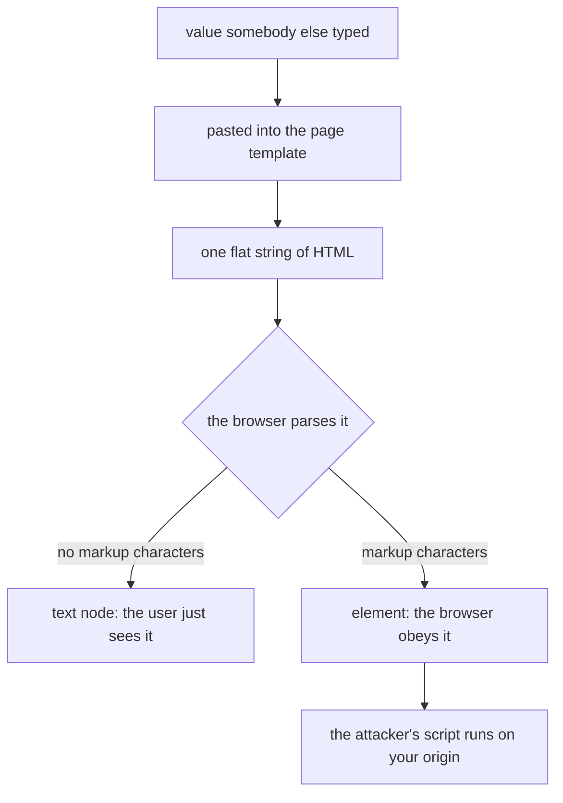
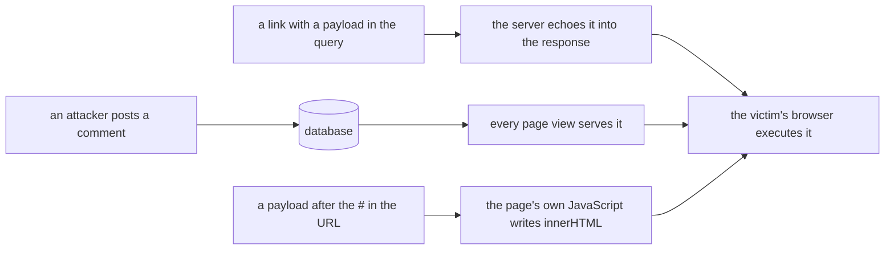
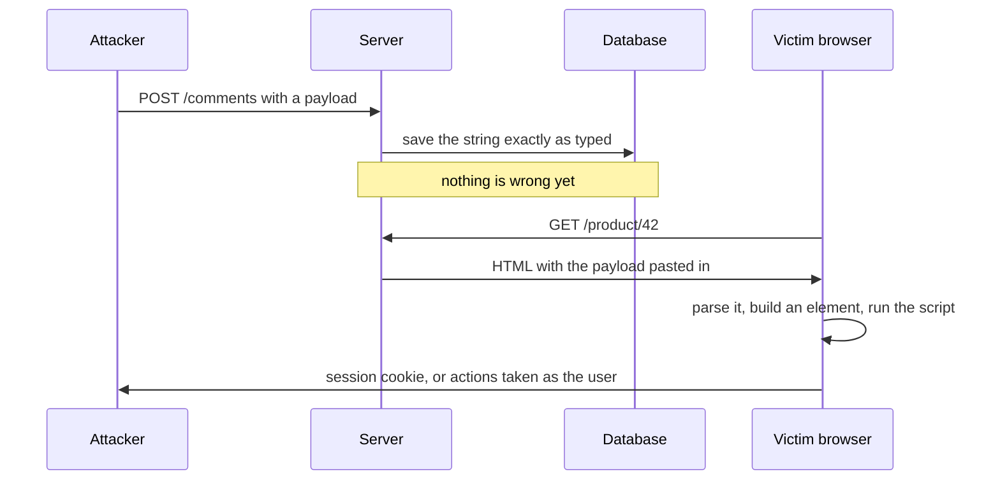

# What is cross-site scripting (XSS)

**XSS is what happens when a value somebody else typed ends up in your page as
code instead of as data.** The browser receives one flat string of HTML and has
no way to tell which characters came from your template and which came from an
attacker, so it obeys all of them equally. The result is JavaScript of the
attacker's choosing running inside your page, on your origin, in your user's
session.

That last sentence is the whole impact. It is not "someone can put a popup on
the page" — it is "someone else's code has the same powers your own code has".

## Where the bug actually is

Nothing is wrong with receiving markup from a user, and nothing is wrong with
storing it. The bug happens at the moment the value is **written into an
output**, because that is where a string stops being data and starts being
parsed.

This is the same shape of bug as SQL injection, and it is worth saying out loud
because the fix rhymes: in both cases untrusted data is concatenated into a
language, and the parser cannot tell the two apart afterwards.
[Prepared statements](topic:prepared-statements) fix SQL injection by keeping
data out of the query text; output encoding fixes XSS by keeping data out of the
document's structure.

## The three kinds

They differ only in how the payload reaches the sink — the consequence is
identical.

- **Reflected** — the payload is in the request and the same response prints it
  back. Nothing is stored, so the attacker needs the victim to open a prepared
  link: phishing mail, a chat message, an ad.
- **Stored** (persistent) — the payload is saved: a comment, a profile name, a
  support ticket, a filename. The attacker submits once and the site then serves
  it to every reader, forever, with no link to click. This is the expensive one,
  and it is the one that can hit an administrator looking at a moderation queue.
- **DOM-based** — the payload never reaches the server at all. The page's own
  JavaScript reads something from the URL (classically `location.hash`, which is
  not sent over the network) and writes it into `innerHTML`. Your access log,
  your template engine and your WAF all see a perfectly ordinary page load.

Stored XSS in a comment on a product page:

## What the attacker actually gets

The injected script is indistinguishable from your own, so it inherits
everything your origin has:

- **read the page** — anything on screen, including data the user is mid-way
  through typing, and anything reachable from an API the session can call;
- **rewrite the page** — swap the payment details on a checkout form, add a
  fake login prompt that posts elsewhere;
- **act as the user** — call any endpoint; the browser attaches the session
  cookie automatically, and the server sees a request it cannot distinguish from
  a real click. This is why an [endpoint security scheme](topic:endpoint-security-design)
  does not save you: every check passes, because it really is the user's session;
- **take the session** — `document.cookie` unless the cookie is `HttpOnly`,
  plus anything in `localStorage`, which is readable by definition.

Note what is *not* a defence here. [HTTPS](topic:http-vs-https) protects the
bytes in transit and the payload arrives perfectly encrypted. The
[same-origin policy and CORS](topic:cors) restrict what *other* origins may do,
and this script is not on another origin — it is on yours.

## The fix: encode on output, chosen by the sink

Encoding does not delete anything and does not validate anything. It replaces
characters that would carry meaning to the parser with characters that only mean
themselves, so the value renders exactly as typed and changes nothing about the
document's structure.

The critical part is **which** encoding, because "inside an HTML page" is not
one language. The same payload is inert in one place and executable in the next:

| Where the value lands | What the attacker needs | What you must do |
|---|---|---|
| Between tags | `<` to open a tag | HTML-entity encode `& < > " '` |
| Inside a quoted attribute | the matching quote | HTML-entity encode, and always quote attributes |
| Inside a `<script>` block | a quote to close the string literal | JavaScript encoding (`\uXXXX`), or better: do not put data in script — serialize it as JSON |
| In `href` / `src` | nothing at all — `javascript:alert(1)` has no special characters | check the **scheme** against an allowlist (`http`, `https`, relative) |
| In `innerHTML` (client side) | `<` to open a tag | use `textContent`, or sanitize first |

This is why "we escape user input" is not an answer: escaping is one operation
*per context*, not one operation. Apply the HTML escaper everywhere and the
`javascript:` link and the script block stay exactly as open as before.

The practical version of this rule is: **let the template engine do it**.
Thymeleaf's `th:text`, JSP's `<c:out>`, React's `{value}` and Angular's
interpolation all encode by default and pick the context for you. What you audit
for is the escape hatches — `th:utext`, `<%= %>` with escaping off,
`dangerouslySetInnerHTML`, `v-html`, `bypassSecurityTrustHtml`, and string
concatenation into `innerHTML`.

## When the value must stay HTML: sanitize

Sometimes the value genuinely has to remain markup — a rich-text review, a
formatted description. Encoding would show the tags instead of applying them, so
this is the one case for a **sanitizer**: parse the HTML, keep the small set of
tags and attributes you explicitly allow, drop everything else.

Two rules, both learned the hard way:

- it must be an **allowlist**. A blocklist ("strip the word `script`") loses to
  the first payload nobody thought of, and there are a lot of them;
- use a real library (OWASP Java HTML Sanitizer, DOMPurify), never a regex.
  Browsers accept far more broken markup than any regex models.

And remember that dangerous ≠ script tag: ``,
`<svg onload=...>` and `<a href="javascript:...">` all execute without one.

## The layers that limit damage but do not fix it

- **Content-Security-Policy** — the injection still happens; the browser simply
  refuses to run the script it finds. A genuinely valuable second line of
  defence for the bug you have not found yet, and it is neutralised by
  `'unsafe-inline'`, which is exactly what an injected inline script is.
- **`HttpOnly` cookies** — `document.cookie` no longer sees the session. Worth
  doing, and it changes nothing about the vulnerability: the script still runs
  and the browser still attaches the cookie to every request the script makes.
  It never needed to read it.
- **`SameSite`, CSRF tokens, WAF rules** — none of these are about XSS. A CSRF
  token in particular is useless once XSS exists, because the injected script
  can simply read the token off the page.

## Why input validation is not the fix

Validation is worth doing, but it cannot be the answer, for one structural
reason: **whether a string is dangerous depends on where it will be printed,
and the input layer does not know that.** `O'Brien` is a legal name and a script
block breakout. `<b>` is dangerous in a page and meaningless in a JSON field.
The same value is safe in one sink and fatal in the next, so the only place that
can make the right decision is the sink itself.

The corollary is uncomfortable and true: data already in your database may
contain payloads, and encoding on output is what makes that harmless.

## The 60-second interview answer

> XSS is when untrusted data ends up in a page as code instead of data, so
> attacker-controlled JavaScript runs on my origin, in the victim's session.
> There are three kinds: reflected, where the payload comes in the request and is
> echoed back; stored, where it is saved and served to every reader afterwards;
> and DOM-based, where the page's own JavaScript writes it into the document and
> the server never sees it. The impact is the same for all three — the script can
> read and rewrite the page, call any endpoint as the user, and take the session.
> The fix is output encoding chosen by the context: HTML entities between tags
> and in attributes, JavaScript encoding inside a script block, a scheme
> allowlist for URLs, `textContent` instead of `innerHTML`. Where the value must
> stay HTML, an allowlist sanitizer replaces the encoder. CSP and `HttpOnly`
> cookies reduce the damage but do not fix the bug, and input validation cannot,
> because the same string is safe in one sink and dangerous in another.

## Why it matters in production

XSS has been in the OWASP Top Ten for its entire existence, and it is usually
found not in exotic code but in the one page that built HTML with a string
concatenation. It is also the vulnerability that scales worst: a stored XSS in a
support ticket runs in the support agent's session, and support agents have
admin panels.

What this buys you in practice:

- pick a template engine that escapes by default, and treat every escape hatch
  as a code-review trigger;
- keep untrusted data out of `innerHTML` and out of `<script>` blocks — the two
  sinks where the default tools do not help you;
- add a Content-Security-Policy without `'unsafe-inline'` and set `HttpOnly` on
  session cookies, knowing exactly what each one is for;
- when a report arrives, remember that fixing the template is only half of it —
  stored payloads are still in the database, and sessions taken before the fix
  are still valid until you rotate them.

## Common misconceptions

- **"We validate input, so we are safe."** Validation happens where nobody knows
  which parser will read the value. Encoding happens where it is known.
- **"There is no `<script>` tag in the payload, so it is harmless."** Event
  handlers (`onerror`, `onload`, `onmouseover`), `javascript:` URLs and
  `<iframe srcdoc>` all execute without one.
- **"Our cookies are `HttpOnly`, so XSS is low severity."** The script still
  acts as the user; it just does not have to see the cookie to do it.
- **"CSP protects us."** Only if it forbids inline script. Most policies that
  ship with `'unsafe-inline'` stop nothing.
- **"It is a frontend problem."** Reflected and stored XSS are produced by
  server-rendered HTML. See how the two sides split the work in
  [frontend and backend interaction](topic:frontend-backend-interaction).
- **"Our API only returns JSON, so we cannot have XSS."** You can, if the
  response is echoed into a page by the client, or served with a `text/html`
  content type, or if the client writes it into `innerHTML`.
- **"CORS stops it."** [CORS](topic:cors) governs what other origins may read.
  The injected script is on your origin.
- **"We escape user input."** Which escaper, and for which of the five places a
  value can land? That question is the whole topic.
