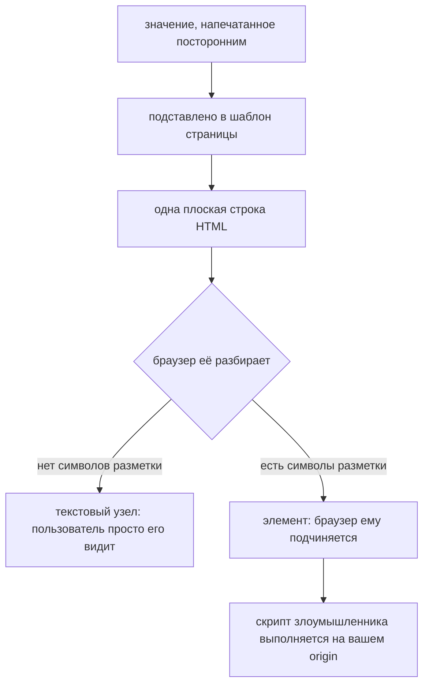
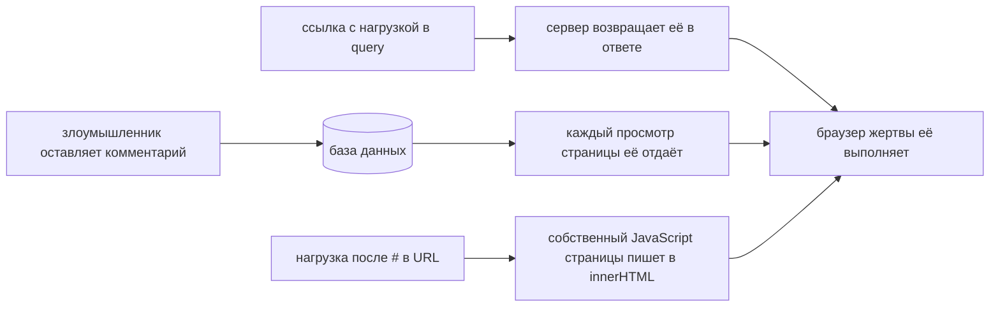
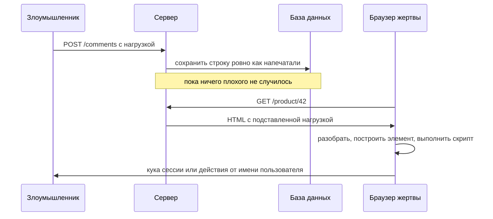

# Что такое межсайтовый скриптинг (XSS)

**XSS — это когда значение, напечатанное посторонним, попадает в вашу страницу
как код, а не как данные.** Браузер получает одну плоскую строку HTML и никак не
может определить, какие символы пришли из вашего шаблона, а какие от
злоумышленника, поэтому подчиняется всем одинаково. В результате внутри вашей
страницы, на вашем origin, в сессии вашего пользователя выполняется JavaScript,
выбранный злоумышленником.

Последняя фраза — это и есть весь ущерб. Речь не о том, что «кто-то может
показать всплывающее окно», а о том, что «чужой код получил ровно те же
возможности, что и ваш собственный».

## Где на самом деле ошибка

Нет ничего плохого в том, чтобы принять разметку от пользователя, и нет ничего
плохого в том, чтобы её сохранить. Ошибка происходит в момент **записи значения
в вывод**, потому что именно там строка перестаёт быть данными и начинает
разбираться парсером.

По форме это та же ошибка, что и SQL-инъекция, и это стоит проговорить вслух,
потому что решения рифмуются: в обоих случаях недоверенные данные склеиваются с
текстом на некотором языке, и потом парсер уже не отличает одно от другого.
[Prepared statements](topic:prepared-statements) чинят SQL-инъекцию тем, что
держат данные вне текста запроса; экранирование вывода чинит XSS тем, что держит
данные вне структуры документа.

## Три вида

Отличаются они только тем, как нагрузка добирается до места вывода, — последствия
одинаковые.

- **Отражённый** — нагрузка приходит в запросе, и этот же ответ печатает её
  обратно. Нигде не сохраняется, поэтому злоумышленнику нужно, чтобы жертва
  открыла подготовленную ссылку: фишинговое письмо, сообщение в чате, реклама.
- **Хранимый** (постоянный) — нагрузка сохранена: комментарий, имя в профиле,
  обращение в поддержку, имя файла. Злоумышленник отправляет её один раз, а сайт
  потом отдаёт её каждому читателю, бесконечно, и кликать никуда не надо. Это
  самый дорогой вид, и именно он может попасть в администратора, который смотрит
  очередь модерации.
- **DOM-based** — нагрузка вообще не доходит до сервера. Собственный JavaScript
  страницы читает что-то из URL (классика — `location.hash`, который по сети не
  отправляется) и записывает это в `innerHTML`. И лог доступа, и шаблонизатор, и
  WAF видят совершенно обычную загрузку страницы.

Хранимый XSS в комментарии на странице товара:

## Что реально получает злоумышленник

Внедрённый скрипт неотличим от вашего собственного, поэтому наследует всё, что
есть у вашего origin:

- **читать страницу** — всё, что на экране, включая данные, которые пользователь
  как раз печатает, и всё, что доступно через API этой сессии;
- **переписывать страницу** — подменить платёжные реквизиты в форме оформления
  заказа, добавить поддельную форму входа, отправляющую данные на сторону;
- **действовать от имени пользователя** — вызвать любой эндпоинт; браузер сам
  прикрепит куку сессии, и сервер увидит запрос, который не отличить от
  настоящего клика. Поэтому и
  [схема безопасности эндпоинтов](topic:endpoint-security-design) здесь не
  спасает: все проверки проходят, ведь это действительно сессия пользователя;
- **забрать сессию** — `document.cookie`, если кука не помечена `HttpOnly`, плюс
  всё, что лежит в `localStorage`, — оно читаемо по определению.

Обратите внимание, что защитой здесь *не* является. [HTTPS](topic:http-vs-https)
защищает байты в пути, и нагрузка приезжает прекрасно зашифрованной. Правило
одного источника и [CORS](topic:cors) ограничивают то, что могут делать *другие*
origin, а этот скрипт не на другом origin — он на вашем.

## Починка: экранирование на выводе, выбранное по месту вывода

Экранирование ничего не удаляет и ничего не проверяет. Оно заменяет символы,
которые несли бы смысл для парсера, символами, которые значат только самих себя,
поэтому значение отображается ровно так, как было напечатано, и никак не меняет
структуру документа.

Ключевое — **какое именно** экранирование, потому что «внутри HTML-страницы» —
это не один язык. Одна и та же нагрузка в одном месте безобидна, а в соседнем
исполняется:

| Куда попадает значение | Что нужно злоумышленнику | Что нужно сделать |
|---|---|---|
| Между тегами | `<`, чтобы открыть тег | HTML-сущности для `& < > " '` |
| Внутри атрибута в кавычках | закрывающая кавычка | HTML-сущности, и всегда закавычивать атрибуты |
| Внутри блока `<script>` | кавычка, чтобы закрыть строковый литерал | экранирование JavaScript (`\uXXXX`), а лучше не класть данные в скрипт — сериализовать в JSON |
| В `href` / `src` | вообще ничего — в `javascript:alert(1)` нет спецсимволов | проверять **схему** по белому списку (`http`, `https`, относительная) |
| В `innerHTML` (на клиенте) | `<`, чтобы открыть тег | использовать `textContent` или сначала санитайзить |

Поэтому «мы экранируем пользовательский ввод» — не ответ: экранирование — это по
одной операции *на каждый контекст*, а не одна операция. Примените везде
HTML-вариант — и ссылка `javascript:` вместе с блоком script останутся ровно так
же открыты.

Практическая формулировка этого правила: **пусть это делает шаблонизатор**.
`th:text` в Thymeleaf, `<c:out>` в JSP, `{value}` в React и интерполяция в
Angular экранируют по умолчанию и выбирают контекст за вас. На ревью надо искать
лазейки — `th:utext`, `<%= %>` с выключенным экранированием,
`dangerouslySetInnerHTML`, `v-html`, `bypassSecurityTrustHtml` и склейку строк в
`innerHTML`.

## Когда значение обязано остаться HTML: санитайзер

Иногда значение действительно должно остаться разметкой — форматированный отзыв,
оформленное описание. Экранирование показало бы теги вместо того, чтобы их
применить, — это единственный случай для **санитайзера**: разобрать HTML,
оставить тот небольшой набор тегов и атрибутов, который вы явно разрешили,
остальное выбросить.

Два правила, оба выученных на болезненном опыте:

- список должен быть **белым**. Чёрный («вырезаем слово `script`») проигрывает
  первой же нагрузке, о которой никто не подумал, а таких много;
- берите настоящую библиотеку (OWASP Java HTML Sanitizer, DOMPurify), а не
  регулярку. Браузеры принимают куда более сломанную разметку, чем моделирует
  любая регулярка.

И помните, что «опасный» ≠ «тег script»: ``,
`<svg onload=...>` и `<a href="javascript:...">` выполняются и без него.

## Уровни, которые уменьшают ущерб, но не чинят ошибку

- **Content-Security-Policy** — внедрение всё равно происходит; браузер просто
  отказывается выполнять найденный скрипт. По-настоящему ценная вторая линия
  обороны для ещё не найденной ошибки, и она обнуляется директивой
  `'unsafe-inline'` — а внедрённый скрипт как раз встроенный.
- **Куки `HttpOnly`** — `document.cookie` больше не видит сессию. Делать так
  стоит, и на саму уязвимость это не влияет никак: скрипт по-прежнему
  выполняется, и браузер по-прежнему прикрепляет куку к каждому его запросу.
  Читать её ему было и не нужно.
- **`SameSite`, CSRF-токены, правила WAF** — всё это не про XSS. CSRF-токен, в
  частности, бесполезен при наличии XSS: внедрённый скрипт просто прочитает его
  со страницы.

## Почему валидация ввода — не решение

Валидация полезна, но ответом быть не может по структурной причине: **опасна
строка или нет, зависит от того, куда её напечатают, а на слое ввода это
неизвестно.** `O'Brien` — законное имя и одновременно выход из строки в блоке
script. `<b>` опасен в странице и ничего не значит в поле JSON. Одно и то же
значение безопасно в одном месте вывода и смертельно в соседнем, поэтому принять
правильное решение может только само место вывода.

Отсюда неприятный, но верный вывод: в вашей базе уже могут лежать нагрузки, и
безобидными их делает именно экранирование на выводе.

## Ответ на собеседовании за 60 секунд

> XSS — это когда недоверенные данные попадают в страницу как код, а не как
> данные, и на моём origin, в сессии жертвы, выполняется JavaScript
> злоумышленника. Видов три: отражённый, когда нагрузка приходит в запросе и
> возвращается в ответе; хранимый, когда она сохраняется и потом отдаётся каждому
> читателю; и DOM-based, когда её записывает в документ собственный JavaScript
> страницы, а сервер её вообще не видит. Последствия у всех трёх одинаковые —
> скрипт может читать и переписывать страницу, вызывать любой эндпоинт от имени
> пользователя и забрать сессию. Чинится экранированием вывода, выбранным по
> контексту: HTML-сущности между тегами и в атрибутах, экранирование JavaScript
> внутри блока script, белый список схем для URL, `textContent` вместо
> `innerHTML`. Там, где значение обязано остаться HTML, вместо экранирования
> нужен санитайзер с белым списком. CSP и куки `HttpOnly` уменьшают ущерб, но
> ошибку не чинят, а валидация ввода не может её починить, потому что одна и та
> же строка безопасна в одном месте вывода и опасна в другом.

## Почему это важно в продакшене

XSS входит в OWASP Top Ten всё время его существования, и находят его обычно не
в экзотическом коде, а на той единственной странице, где HTML собрали склейкой
строк. Это ещё и уязвимость с худшим масштабированием: хранимый XSS в обращении
в поддержку выполнится в сессии сотрудника поддержки, а у сотрудников поддержки
есть админки.

Что это даёт на практике:

- выберите шаблонизатор, который экранирует по умолчанию, и считайте каждую его
  лазейку поводом для внимательного ревью;
- держите недоверенные данные подальше от `innerHTML` и от блоков `<script>` —
  это два места вывода, где стандартные средства вам не помогают;
- добавьте Content-Security-Policy без `'unsafe-inline'` и поставьте `HttpOnly`
  на куки сессии, понимая, зачем нужно каждое из двух;
- когда приходит отчёт, помните, что починка шаблона — только половина дела:
  сохранённые нагрузки всё ещё в базе, а сессии, угнанные до починки, действуют,
  пока вы их не отзовёте.

## Частые заблуждения

- **«Мы валидируем ввод, значит мы в безопасности».** Валидация происходит там,
  где неизвестно, какой парсер прочитает значение. Экранирование — там, где это
  известно.
- **«В нагрузке нет тега `<script>`, значит она безобидна».** Обработчики
  событий (`onerror`, `onload`, `onmouseover`), URL со схемой `javascript:` и
  `<iframe srcdoc>` выполняются и без него.
- **«У нас куки `HttpOnly`, поэтому XSS низкой критичности».** Скрипт всё равно
  действует от имени пользователя; ему просто не нужно для этого видеть куку.
- **«Нас защищает CSP».** Только если она запрещает встроенные скрипты.
  Большинство политик, которые едут с `'unsafe-inline'`, не останавливают ничего.
- **«Это проблема фронтенда».** Отражённый и хранимый XSS порождает HTML,
  собранный на сервере. Как обязанности делятся между сторонами — см.
  [взаимодействие фронтенда и бэкенда](topic:frontend-backend-interaction).
- **«Наш API отдаёт только JSON, значит XSS у нас быть не может».** Может — если
  ответ печатается клиентом в страницу, или отдаётся с типом содержимого
  `text/html`, или если клиент записывает его в `innerHTML`.
- **«От этого защищает CORS».** [CORS](topic:cors) определяет, что могут читать
  другие origin. Внедрённый скрипт находится на вашем.
- **«Мы экранируем пользовательский ввод».** Каким экранированием и для какого
  из пяти мест, куда может попасть значение? В этом вопросе вся тема.
